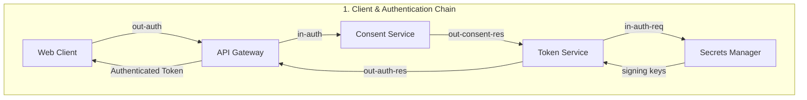
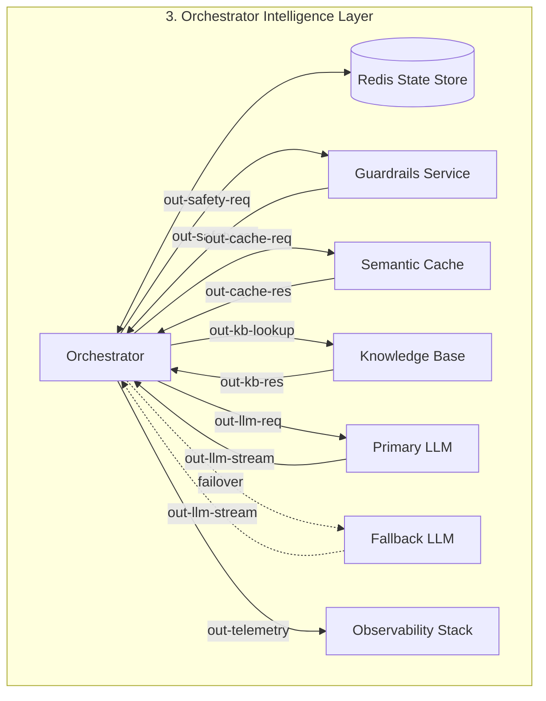
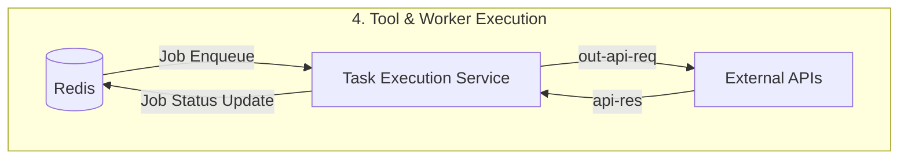

# 🧠 Project Memory: Pivot (Interruption-Aware Voice Agent)

> [!NOTE]  
> This file serves as the single concise reference for the project's architecture, conventions, and key decisions. Use it to keep context loaded without repeatedly reading multiple documentation files.

---

## 🗺️ System Architecture & Data Flow

Pivot is designed around a clean separation of concerns between client endpoints, gateways, media stream processing, and FSM/orchestration brains.

### 🔄 Interactive Data Flow Visualizations



```mermaid
graph TD
  subgraph HotPath [2. Real-Time Audio Pipeline (Hot Path)]
    Client[Web Client] -- "out-audio (Raw Mic)" --> LiveKit[LiveKit Server]
    LiveKit -- "out-audio-stt" --> Deepgram[Deepgram STT]
    Deepgram -- "out-transcript" --> Orchestrator[Orchestrator]
    LiveKit -- "out-events" --> Orchestrator
    Orchestrator -- "out-tts-text" --> Cartesia[Cartesia TTS]
    Orchestrator -- "out-tts-ctrl (Kill Signal)" --> Cartesia
    Cartesia -- "out-audio" --> LiveKit
    Cartesia -- "out-word-ts" --> Orchestrator
    LiveKit -- "out-audio-client (Speaker)" --> Client
  end
```





---

## 📂 Directory Layout Target

```
pivot/
├── client/
│   ├── phase1_minimal_harness/  # Canonical voice client UI (Primary Production App)
│   └── src/                     # React app shell
│
├── services/
│   ├── edge/
│   │   ├── api-gateway/
│   │   ├── consent-service/
│   │   ├── token-service/
│   │   └── secrets-manager/
│   │
│   ├── media/
│   │   ├── media-gateway/       # LiveKit integration
│   │   ├── stt-adapter/         # Deepgram wrapper
│   │   └── tts-adapter/         # Cartesia wrapper
│   │
│   ├── orchestration/
│   │   └── orchestrator/        # LangGraph / FSM
│   │
│   ├── intelligence/
│   │   ├── guardrails/
│   │   ├── semantic-cache/
│   │   ├── knowledge-base/
│   │   ├── primary-llm/
│   │   └── fallback-llm/
│   │
│   ├── workers/
│   │   └── task-worker/
│   │
│   ├── integrations/
│   │   └── external-apis/
│   │
│   └── observability/
│       ├── telemetry/
│       └── dashboards/
...
```

---

## ⚙️ Development & Coding Conventions

### 🔒 Environment & Secrets Management
> [!IMPORTANT]  
> - Never check raw secrets or `.env` files into Git. Use `.env.example` as a template.
> - Run all local credential checks programmatically or pull from the Secrets Manager backend.
> - **Secret Scrubbing:** Structured logs must scrub any field named in `.env.example` ending with `_API_KEY` or `_SECRET`.

### 🐍 Python & Code Quality
- **Python Version:** 3.12 (standard for all backend/orchestration services).
- **Typing:** Strict type hinting must be used on all new components and modules.

### 🧪 Test Gates & Regression Discipline
- **Test Runner:** `pytest tests/`
- **Determinism:** STT/TTS tests must run against fixed WAV fixtures (rather than a live microphone) to maintain CI independence.
- **Strict Progression:** A phase is not complete unless the *cumulative regression suite* (all tests for phases $\le N$) passes with zero skips or failures.

### 📊 Structured Logging Schema
Every component must log structured JSON lines containing:
```json
{
  "ts": "ISO8601 Timestamp",
  "session_id": "string",
  "turn_id": "string",
  "phase": "string",
  "component": "string",
  "event": "string",
  "latency_ms": "int | null",
  "detail": "dict"
}
```

---

## 🏛️ Key Decisions & Audits

1. **Port Direction Audit:** Rectified 22 out of 35 direction-reversed or generic-mapped ports in the legacy schema. Validated continuously in CI via `scripts/validate_architecture.py`.
2. **Canonical Voice Client UI:** The canonical frontend under `client/phase1_minimal_harness/` is the primary production application, supporting WebRTC, LiveKit, local VAD, interruption classification, and latency monitoring dashboards.
3. **Feature Flags for Sponsor Tech:** Mastra, Qdrant, and Enkrypt are integrated behind toggles (`*_ENABLED` env vars) to avoid late-stage stability issues.
4. **Reference Architecture JSON:** `rules/architecture-1784240202633.json` is provided as a reference baseline but contains uncorrected legacy edges. Implementations must follow the corrected data flow (section 1 above) rather than using the raw JSON blindly.
