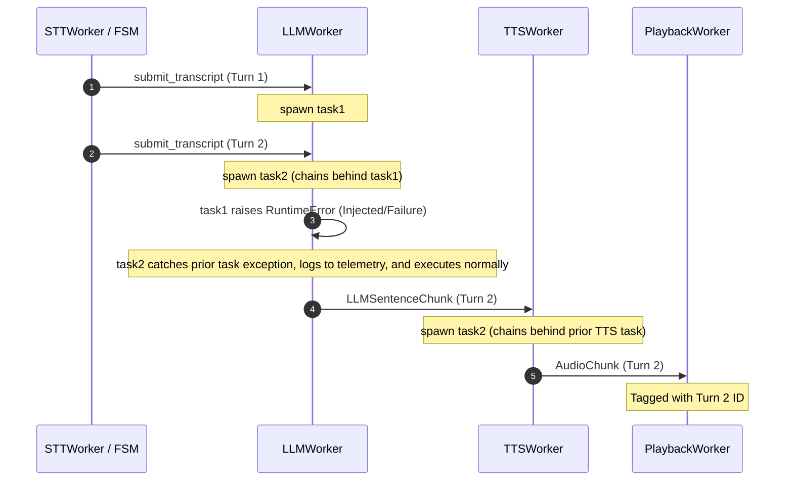

# Concurrency Task Chaining Flow

This diagram illustrates the per-session execution flow of the voice pipeline orchestration services during concurrent requests, task chaining, and error isolation.

