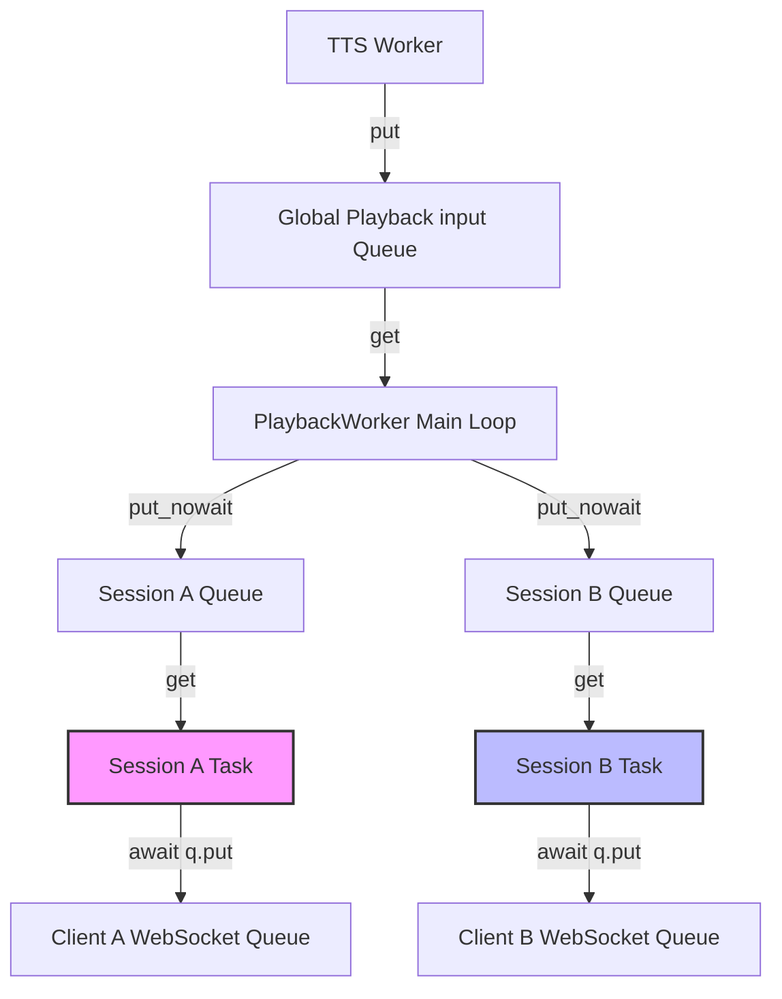

# Per-Session Playback Isolation Diagram

This diagram visualizes the isolated, concurrent playback worker routing pattern implemented to prevent client Head-of-Line blocking.

```mermaid
graph TD
    TTS[TTS Worker] -->|put| GlobalInput[Global Playback input Queue]
    GlobalInput -->|get| PlaybackRun[PlaybackWorker Main Loop]
    PlaybackRun -->|put_nowait| SessionQ1[Session A Queue]
    PlaybackRun -->|put_nowait| SessionQ2[Session B Queue]
    
    SessionQ1 -->|get| SessionTask1[Session A Task]
    SessionQ2 -->|get| SessionTask2[Session B Task]
    
    SessionTask1 -->|await q.put| ClientWS1[Client A WebSocket Queue]
    SessionTask2 -->|await q.put| ClientWS2[Client B WebSocket Queue]
    
    style SessionTask1 fill:#f9f,stroke:#333,stroke-width:2px
    style SessionTask2 fill:#bbf,stroke:#333,stroke-width:2px
```
