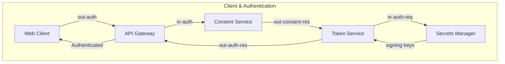
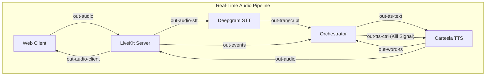
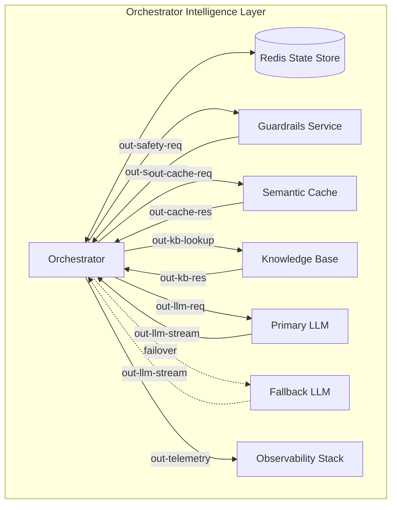
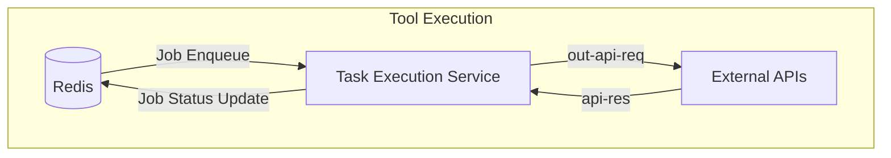

# Pivot — Phased Build Plan

Interruption-aware voice agent. This doc is the single source of truth for the build order, test gates, and the corrected architecture. Update it in the same commit whenever a port/edge changes — that discipline is *why* the original graph rotted.

---

## 0. Architecture Audit — Read Before Writing Any Code

The uploaded `architecture-*.json` (and the PDF/PNG renders of it) is **not** the "verified" graph the project summary describes. 22 of 35 edges still exhibit the exact bug classes the summary claims were fixed. Do not implement against the literal edges in that file — implement against the corrected flow below.

### Confirmed bugs (edge id → problem → fix)

| Edge ID | Problem | Correct wiring |
|---|---|---|
| `orch-to-worker-job` | The kill-signal port `orchestrator.out-tts-ctrl` is wired to `task-execution-service`, not TTS | `orchestrator.out-tts-ctrl → cartesia-tts.in-tts-ctrl` |
| `orch-to-tts-ctrl-signal` | Labeled "Kill Signal" but sources from `in-llm-stream` (an input port, used backwards) into `in-tts-text` (text channel, not control) | Delete this edge; it's the phantom stand-in for the missing kill signal above |
| `guard-to-orch-res` | Targets `orchestrator.in-media-events` instead of `in-safety-res` | `guardrails-service.out-safety-res → orchestrator.in-safety-res` |
| `cache-to-orch-res` | Targets `orchestrator.in-transcript` instead of `in-cache-res` | `llm-semantic-cache.out-cache-res → orchestrator.in-cache-res` |
| `stt-to-orch-transcript` | Targets generic `left-5` instead of `in-transcript` (which is occupied by the bug above) | `deepgram-stt.out-transcript → orchestrator.in-transcript` |
| `livekit-to-orch-events` | Targets generic `left-6` instead of `in-media-events` (occupied by bug above) | `livekit-server.out-events → orchestrator.in-media-events` |
| `llm-to-orch-stream` / `fallback-to-orch-stream` | Both target generic ports instead of `in-llm-stream` (occupied by the reversed kill-signal edge) | Both `→ orchestrator.in-llm-stream` (single shared inbound channel; only one LLM is active per turn) |
| `tts-to-orch-ts` | Sources from generic `right-2` instead of named `out-word-ts`; targets generic `left-9` instead of `in-word-ts` | `cartesia-tts.out-word-ts → orchestrator.in-word-ts` |
| `orch-to-cache-req` | Sources from `in-safety-res` (input port, used backwards) | `orchestrator.out-cache-req → llm-semantic-cache.in-cache-req` |
| `orch-to-kb-req` | Sources from `out-cache-req`; targets generic `left-2` instead of `in-kb-req` | `orchestrator.out-kb-lookup → knowledge-base-memory-db.in-kb-req` |
| `orch-to-llm-req` | Sources from `in-cache-res` (input port, used backwards) | `orchestrator.out-llm-req → primary-llm.in-llm-req` |
| `orch-to-fallback-req` | Uses `out-llm-req` (already claimed above) to reach the *fallback* LLM | Fallback is invoked programmatically by the orchestrator's failover logic, not a separate static edge — see Phase 7 |
| `orch-to-redis-state` | Sources from `out-tts-text` (this port belongs to Cartesia, not Redis) | `orchestrator.out-state-update → app-state-store-db.in` |
| — (missing) | `orchestrator.out-tts-text` has no correct outgoing edge to Cartesia | `orchestrator.out-tts-text → cartesia-tts.in-tts-text` |
| `web-to-gw-auth` | Sources from `out-audio` (audio) to request auth | `web-voice-client.out-auth → api-gateway.in` |
| `gw-to-web-auth` | Targets `in-audio` instead of `in-auth` | `api-gateway.right-2 → web-voice-client.in-auth` |
| `web-to-livekit-audio` | Sources from `out-auth`; targets `out-audio-client` (an output port, used backwards) | `web-voice-client.out-audio → livekit-server.in-audio-client` |
| `livekit-to-web-audio` | Sources from `out-audio-stt` (belongs to Deepgram) into the client's `in-auth` | `livekit-server.out-audio-client → web-voice-client.in-audio` |
| `livekit-to-stt-audio` | Sources from `in-audio-tts` (input port, used backwards) | `livekit-server.out-audio-stt → deepgram-stt.in-audio` |
| `tts-to-livekit-audio` | Targets generic `left-3` instead of named `in-audio-tts` | `cartesia-tts.out-audio → livekit-server.in-audio-tts` |
| `worker-to-api-req` | Sources from `in-api-res` (input port, used backwards) | `task-execution-service.out-api-req → external-apis-integration.in-api` |
| `orch-to-obs-telemetry` | Sources from `in-word-ts` (input port, used backwards) | `orchestrator.out-telemetry → observability-stack.in-telemetry` |

Edges **not** flagged (auth/consent/secrets chain, Redis↔worker job queue) are directionally sound and can be built as-is.









```mermaid
graph TD
  %% Layered Architecture
  ClientLayer[Client Layer: Web Client]
  --> EdgeLayer[Edge / Auth Layer: API Gateway / Consent / Token / Secrets]
  --> MediaLayer[Media Pipeline: LiveKit / Deepgram / Cartesia]
  --> OrchLayer[Orchestrator]
  
  OrchLayer <--> IntelLayer[Intelligence: Guardrails / Cache / KB / LLMs]
  OrchLayer <--> Redis[(Redis)]
  Redis <--> TaskLayer[Task Worker / External APIs]
```--───────┐
│      MEDIA PIPELINE           │
│ LiveKit                       │
│ Deepgram STT                  │
│ Cartesia TTS                  │
└──────────────┬────────────────┘
               │
┌──────────────▼────────────────┐
│      ORCHESTRATOR             │
└──────────────┬────────────────┘
               │
      ┌────────┼─────────────┐
      ▼        ▼             ▼
 Guardrails  Cache      Knowledge Base
      │        │             │
      └────────┼─────────────┘
               ▼
          Primary LLM
               │
         (Fallback LLM)
               │
               ▼
            Redis
               │
               ▼
     Task Execution Service
               │
               ▼
         External APIs

## 1. Ground Rules

Your five, plus what I'm adding and why:

1. **No breaks between phases.** Operationalized as: a phase isn't done until the *full cumulative regression suite* (every prior phase's tests, not just the new one) passes in a single run. Never move on with a known-red test.
2. **Each phase is fully specified before you start it** (goal, files touched, explicit non-goals, test, definition of done — all below).
3. **Each phase has a named test that proves the feature works**, runnable independently.
4. **Additive, visible progress** — start with a minimal live agent, then add one capability per phase, in the order the PRD's dependencies actually require.
5. **Structured logging everywhere**, defined once in Phase 0, extended (not reinvented) in every later phase.
6. **Follow the PRD; deviate only with a stated reason**, logged inline in this doc (see Phase 1's client-simplification note for an example of the format).
7. *(Added)* **Git discipline:** one branch per phase, merge only after the phase test + full regression suite pass, tag a release per phase (`v0-phase0`, `v0-phase1`, ...). This is the actual rollback mechanism behind rule #1.
8. *(Added)* **Config/secrets never hardcoded.** `.env.example` checked in from Phase 0; real secrets local-only or in the Secrets Manager, never in code, never in logs.
9. *(Added)* **Deterministic tests for audio components.** STT/TTS tests run against fixed fixture WAV files and fixture transcripts, not a live mic — so CI doesn't depend on a human speaking. A separate manual "live demo smoke test" checklist covers the real mic/speaker path before demo day.
10. *(Added)* **Latency is instrumented from Phase 1**, not bolted on at the end. Every hop logs its own duration even before a phase enforces a budget against it — so regressions are caught the day they're introduced, not during eval week.
11. *(Added)* **Sponsor tech behind feature flags.** Mastra, Qdrant, and Enkrypt are added in Phase 8 as toggleable — if any destabilizes things close to demo day, flip an env var and fall back to the pre-Phase-8 path rather than reverting code.
12. *(Added)* **This doc is versioned with the code.** Any change to a port, edge, event schema, or phase boundary gets a matching edit here in the same commit.

---

## 2. Repo & Environment Conventions
pivot/
├── client/
│   ├── phase1_minimal_harness/  # Canonical voice client UI (Primary Production App)
│   └── src/                     # React app shell
│
├── services/
│   ├── edge/
│   │   ├── api-gateway/
│   │   ├── consent-service/
│   │   ├── token-service/
│   │   └── secrets-manager/
│   │
│   ├── media/
│   │   ├── media-gateway/       # LiveKit integration
│   │   ├── stt-adapter/         # Deepgram wrapper
│   │   └── tts-adapter/         # Cartesia wrapper
│   │
│   ├── orchestration/
│   │   └── orchestrator/        # LangGraph / FSM
│   │
│   ├── intelligence/
│   │   ├── guardrails/
│   │   ├── semantic-cache/
│   │   ├── knowledge-base/
│   │   ├── primary-llm/
│   │   └── fallback-llm/
│   │
│   ├── workers/
│   │   └── task-worker/
│   │
│   ├── integrations/
│   │   └── external-apis/
│   │
│   └── observability/
│       ├── telemetry/
│       └── dashboards/
│
├── infrastructure/
│   ├── docker/
│   ├── compose/
│   │   └── docker-compose.yml
│   ├── redis/
│   ├── livekit/
│   └── monitoring/
│
├── common/
│   ├── config/
│   ├── logging/
│   ├── events/
│   ├── models/
│   ├── schemas/
│   ├── types/
│   ├── utils/
│   └── constants/
│
├── tests/
│   ├── phase00/
│   ├── phase01/
│   ├── ...
│   ├── integration/
│   ├── e2e/
│   ├── performance/
│   └── fixtures/
│
├── docs/
│   ├── architecture/
│   │   ├── architecture.md
│   │   ├── architecture.json
│   │   ├── ports.md
│   │   └── diagrams/
│   │
│   ├── decisions/              # ADRs
│   ├── api/
│   ├── phases/
│   └── pivot-build-plan.md
│
├── scripts/
│   ├── validate_architecture.py
│   ├── generate_diagram.py
│   ├── lint_ports.py
│   └── bootstrap.py
│
├── .github/
│   └── workflows/
│
├── .env.example
├── .gitignore
├── pyproject.toml
├── requirements.txt
├── README.md
└── PROJECT.md

All 19 nodes from the original architecture graph now have a corresponding
file in this structure — see PHASE_PROMPTS.md for exactly which phase
implements each one.

- **Language/runtime:** Python 3.12 for orchestrator/backend services (per PRD), React for client.
- **Test runner:** `pytest`, one regression command: `pytest tests/ -q`. This must be green before starting the next phase.
- **Branch naming:** `phase-N-<short-desc>`.

---

## 3. Logging Standard (defined once, Phase 0)

Every service logs structured JSON lines with at minimum:

```json
{"ts": "...", "session_id": "...", "turn_id": "...", "phase": "3", "component": "orchestrator", "event": "tts_kill_signal_sent", "latency_ms": 214, "detail": {...}}
```

- `session_id` — one per call/room.
- `turn_id` — increments per user turn.
- `event` — a fixed vocabulary per component, extended (never renamed) as phases add capability. Phase sections below list the events each phase introduces.
- Every cross-service hop logs its own `latency_ms` so a full-turn timeline can be reconstructed from logs alone.

---

## 4. Phase Plan

### Phase 0 — Foundations & Architecture Lock-In
**Goal:** A repo that runs, logs, and has a correct architecture reference — before any voice code exists.

**Build:**
- Repo scaffold above, `docker-compose.yml` with Redis.
- Shared structured logger (`common/logging`) used by a trivial `/health` endpoint on each planned service stub.
- `.env.example` with every credential the PRD's tech stack needs (LiveKit, Deepgram, Cartesia, Groq, OpenAI, later Qdrant/Mastra/Enkrypt keys — blank placeholders now).
- This doc committed at `docs/pivot-build-plan.md`.
- A small `scripts/validate_architecture.py` that (once you have a real architecture JSON) asserts every edge's source port is an output and target port is an input — turns today's audit into a permanent CI check instead of a one-time fix.

**Not yet:** anything audio, LLM, or orchestrator-logic related.

**Test:** `tests/phase0/test_health.py` — every stub service starts, `/health` returns 200, and a structured log line with `event: "service_started"` is emitted for each.

**Definition of done:** `pytest tests/` green; `docker-compose up` brings up Redis + stub services cleanly; log lines are valid JSON with all required fields.

---

### Phase 1 — Minimal Single-Turn Voice Agent
**Goal:** Prove the full audio round-trip once, with a dumb agent. This is "adding the agent."

**Deviation from PRD (rule #6, logged):** the PRD's client is React+WebRTC+Silero VAD. Building that fully now would block the audio-pipeline proof behind UI work. Phase 1 uses a minimal LiveKit test-page client (mic in, speaker out, no VAD, no interruption handling). It gets promoted to the full React/Silero client in Phase 3, when VAD ducking is actually needed. Reason: isolate "does the pipe work" from "does the UI work," per your rule 4 (see changes one at a time).

**Build:**
- `media-gateway`: client → LiveKit room → Deepgram STT (`in-audio → out-transcript`).
- `orchestrator` v0: on transcript, call `primary-llm.in-llm-req` directly (no cache, no guardrails, no memory — single canned system prompt), forward the reply text to `cartesia-tts.in-tts-text`.
- `cartesia-tts.out-audio → livekit.in-audio-tts → client speaker`.
- Log every hop's latency: `stt_partial`, `stt_final`, `llm_first_token`, `llm_complete`, `tts_first_audio`, `tts_complete`, `turn_total_ms`.

**Not yet:** interruption handling of any kind, multi-turn memory, guardrails, cache, tools, failover.

**Test:** `tests/phase1/test_single_turn.py` — feeds a fixture WAV ("What's the weather like on Mars?") through the STT stub, asserts a transcript is produced, an LLM reply is generated, TTS audio bytes come back non-empty, and every expected log event fires in order with `turn_total_ms` recorded (no assertion on the number yet — just that it's captured).

**Definition of done:** one full voice turn works end-to-end from a fixture; full regression green; you can also run it live (manual smoke) and hear a reply.

---

### Phase 2 — Multi-Turn Conversation State
**Goal:** The agent remembers the conversation across turns.

**Build:**
- `app-state-store-db` (Redis): session/turn history keyed by `session_id`.
- `orchestrator.out-state-update → redis`, `redis → orchestrator.in-state-update` on each turn.
- LLM prompt now includes prior turns from Redis, not just the current transcript.

**Not yet:** interruptions, tools.

**Test:** `tests/phase2/test_multiturn.py` — scripted 3-turn fixture conversation (e.g., turn 2 references "it" from turn 1); asserts the LLM request payload sent on turn 2/3 contains turn-1 content pulled from Redis (verified by direct Redis read in the test, not just by trusting the reply).

**Definition of done:** conversation state survives a process restart of the orchestrator (state lives in Redis, not memory); regression green.

---

### Phase 3 — Client-Side VAD + Barge-In Kill Switch
**Goal:** The single most important missing piece from the audit — the agent can actually be interrupted and stop talking.

**Build:**
- Promote client to full React + WebRTC + Silero VAD (local ducking on speech detection).
- Implement the literal missing edge: `orchestrator.out-tts-ctrl → cartesia-tts.in-tts-ctrl`.
- Barge-in detection: sustained user speech → orchestrator sends kill signal → Cartesia stops streaming audio → LiveKit stops relaying.
- New log events: `vad_local_duck`, `barge_in_detected`, `tts_kill_signal_sent`, `tts_stopped`, with `latency_ms` = time from detection to stopped.

**Not yet:** understanding *why* the user interrupted (that's Phase 4) — for now, any sustained interruption just stops TTS immediately (basic barge-in only, matching the PRD's description of what existing assistants already do).

**Test:** `tests/phase3/test_barge_in_latency.py` — scripted scenario: TTS is mid-stream, inject simulated user speech, assert `tts_stopped` fires and `latency_ms` from `barge_in_detected → tts_stopped` is captured and logged. Start asserting against the PRD's <300ms p95 target from this phase onward (don't wait until the end to check it).

**Definition of done:** live demo can interrupt the agent mid-sentence and it goes silent; kill latency logged and trending toward budget; regression green.

---

### Phase 4 — Interruption Classification + Backchannel Filtering
**Goal:** Distinguish real interruptions from backchanneling, and classify real ones into the 5 PRD types.

**Build:**
- 200ms sustained-speech threshold to filter backchannels ("mm-hm", "yeah") from true interruptions.
- Classifier (LLM-assisted or rule-based first pass) sorting true interruptions into: correction, topic-change, clarification, stop/cancel, add-on.
- Each type logged with `event: "interruption_classified"`, `detail.type`, `detail.confidence`.

**Not yet:** actually *acting* on the classification (that's Phase 5) — this phase only proves classification accuracy.

**Test:** `tests/phase4/test_classification_eval.py` — runs the PRD's 20 scripted interruption scenarios, asserts ≥85% classification accuracy, logs a per-scenario pass/fail table. This becomes a standing eval you re-run every later phase to catch regressions in classification quality.

**Definition of done:** ≥85% on the 20-scenario suite; backchannel fixtures correctly ignored (no false barge-in); regression green.

---

### Phase 5 — Context Capture & Resolution Strategy
**Goal:** Track exactly what the agent was saying when cut off, and act correctly per interruption type (resume, pivot, or abandon).

**Build:**
- Use `cartesia-tts.out-word-ts → orchestrator.in-word-ts` to know precisely which words were spoken vs. unspoken when killed.
- Resolution strategy per type (distinct behavior, not one generic pivot):
  - *correction* → merge correction into context, regenerate from the corrected point.
  - *topic-change* → abandon current response, start fresh on new topic.
  - *clarification* → pause, answer the clarification, then resume original response.
  - *stop/cancel* → abandon, no resume.
  - *add-on* → finish or fold in the addition, continue naturally.
- New event: `interruption_resolved`, `detail.strategy`, `detail.merged_context`.

**Test:** `tests/phase5/test_context_merge.py` — for each of the 5 types, assert the merged context handed to the next LLM call matches the expected resolution (e.g., a "correction" scenario's next prompt contains the corrected fact and the un-spoken remainder is discarded, not duplicated).

**Definition of done:** live 3+ interruption multi-turn demo behaves distinctly per type; regression + Phase 4 eval both green.

---

### Phase 6 — Tool-Calling + Mid-Call Interruption Policy
**Goal:** Agent can call tools, with a defined (not accidental) behavior when interrupted mid-call.

**Build:**
- `task-execution-service` wired per corrected flow (`out-api-req → external-apis.in-api`).
- Explicit policy table for "user interrupts while a tool call is in flight" per interruption type (e.g., stop/cancel aborts the call if cancelable, add-on queues after it completes) — write this policy into this doc once decided.
- Event: `tool_call_interrupted`, `detail.policy_applied`.

**Test:** `tests/phase6/test_tool_interrupt_policy.py` — scenario with an interruption injected mid-tool-call for each defined policy branch; asserts the documented behavior actually occurs.

**Definition of done:** policy table exists in this doc and every branch is covered by a passing test; regression green.

---

### Phase 7 — LLM Failover + Semantic Cache
**Goal:** Silent Groq→OpenAI failover with matching persona; cache hits reduce latency.

**Build:**
- `orchestrator.out-llm-req → primary-llm`; on failure/timeout, orchestrator calls `fallback-llm.in-llm-req` instead (same downstream `in-llm-stream` handling — this is the programmatic failover the corrected diagram notes in section 0).
- Shared persona/system-prompt module so failover output is indistinguishable in tone.
- `llm-semantic-cache` wired per corrected flow; cache-hit path returns without a primary/fallback call.

**Test:** `tests/phase7/test_failover.py` — fault-inject primary-LLM unreachable, assert fallback is used, output still passes a persona-consistency check, and the failover is not user-visible in the transcript (no "switching models" leakage). `tests/phase7/test_cache_hit.py` — repeat query, assert lower latency and a `cache_hit` log event.

**Definition of done:** failover is silent and logged; cache hit measurably faster; regression green.

---

### Phase 8 — Guardrails, RAG, Sponsor Tech
**Goal:** Safety filtering, knowledge retrieval, and the late-discovered sponsor requirements — added with minimal footprint, feature-flagged (ground rule #11).

**Build:**
- `guardrails-service` wired per corrected flow (`out-safety-req/in-safety-res`), Enkrypt behind `ENKRYPT_ENABLED` flag.
- `knowledge-base-memory-db` (Qdrant) wired per corrected flow for RAG context.
- Mastra layered in for tool-calling orchestration behind `MASTRA_ENABLED`, only if Phase 6's hand-rolled policy needs it — don't replace working code speculatively.

**Test:** `tests/phase8/test_guardrails.py` — unsafe input fixture is blocked/filtered, logged. `tests/phase8/test_rag_grounding.py` — a KB-seeded fact is correctly retrieved and cited in the reply. `tests/phase8/test_no_latency_regression.py` — re-runs Phase 3's barge-in and Phase 1's turnaround timings, asserts no regression from the new layers.

**Definition of done:** all three pass; flags can each be flipped off independently without breaking the core loop; regression green.

---

### Phase 9 — Resilience, Failure Modes, Concurrency, Observability
**Goal:** Implement the PRD's failure-mode table for real, and prove 2–3 concurrent sessions behave correctly.

**Build:**
- Explicit handling for: STT drop, double interruption, both LLMs down, VAD false positive (with smooth resume), and any others in the PRD's failure-mode table.
- `observability-stack` (Prometheus/Grafana/Loki/OpenTelemetry) wired per corrected flow, dashboards for the two headline non-functional metrics (barge-in kill latency, end-to-end turnaround).
- `load-testing-eval` service for concurrent-session load.

**Test:** `tests/phase9/test_failure_modes.py` — one test per failure-mode row, asserting the documented behavior (not a crash). `tests/phase9/test_concurrency.py` — 2–3 simulated concurrent sessions via the load-testing service, asserting no cross-session state leakage and latency budgets hold under load.

**Definition of done:** every failure-mode row has a passing test; concurrency test green; dashboards show live p95s; regression green.

---

### Phase 10 — Security, Consent/Privacy, Secrets Hardening
**Goal:** Production-ready edge, not just a working demo.

**Build:**
- Consent gate actually blocks recording/processing without consent (per `consent-service`).
- Secrets fully routed through Secrets Manager, none in env files committed to the repo, none in logs (add a log-scrubbing test).
- Auth required on every endpoint that should have it; rate limiting on the API Gateway.
- GDPR-applicability items from the PRD addressed (data retention, deletion path).

**Test:** `tests/phase10/test_security_checklist.py` — asserts unauthenticated requests are rejected, secrets never appear in captured log output, consent-denied sessions don't reach STT.

**Definition of done:** checklist test green; regression green.

---

### Phase 11 — Eval Suite, Load Test, Demo-Day Readiness
**Goal:** Final production-readiness pass and the actual demo script.

**Build:**
- Full 20-scenario eval re-run with final accuracy number reported.
- Final latency report: barge-in kill p95, end-to-end turnaround p95, against the PRD's <300ms / <1.5s targets.
- Written demo script: a live multi-turn conversation scripted with 3+ natural interruptions across different types, for demo day.
- Docs pass: this file updated to reflect final as-built architecture (re-run `scripts/validate_architecture.py` one last time).

**Test:** `tests/phase11/test_full_eval.py` runs the complete suite and asserts both PRD non-functional targets are met; full `pytest tests/` regression run is green end to end.

**Definition of done:** demo script rehearsed against the real system at least once, all targets met or gaps explicitly documented with a reason (rule #6).

---

## 5. Non-Functional Target Tracker

| Metric | Target | First measured | Enforced (gate) |
|---|---|---|---|
| Barge-in kill latency (p95) | <300ms | Phase 3 | Phase 3 onward |
| End-to-end turnaround (p95) | <1.5s | Phase 1 | Phase 8 onward (post-guardrails/RAG) |
| Interruption classification accuracy | ≥85% on 20 scenarios | Phase 4 | Phase 4 onward |
| Concurrent sessions without degradation | 2–3 | Phase 9 | Phase 9 |
| LLM failover | silent, persona-matched | Phase 7 | Phase 7 |

---

## 6. Open Decisions to Pin Down Before Phase 6

- Exact mid-tool-call interruption policy per type (Phase 6) — needs a decision, not just an implementation; write it into this doc once chosen.
- Whether Mastra is actually needed given Phase 6's hand-rolled FSM, or only added if a concrete gap appears (keep the "minimal footprint" PRD requirement honest).
