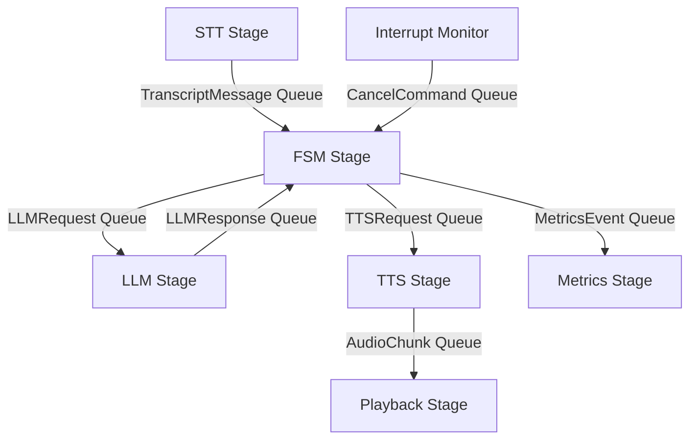
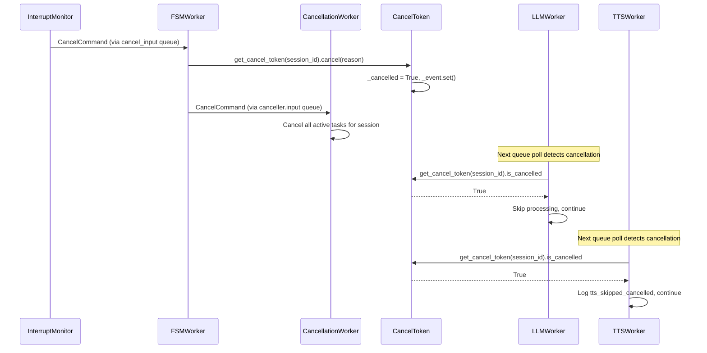
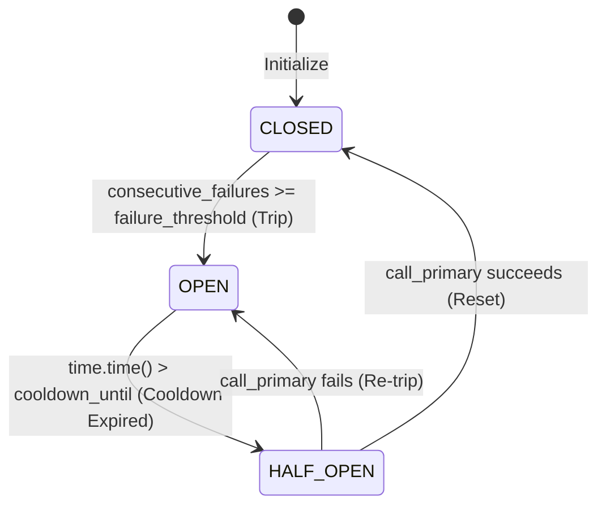
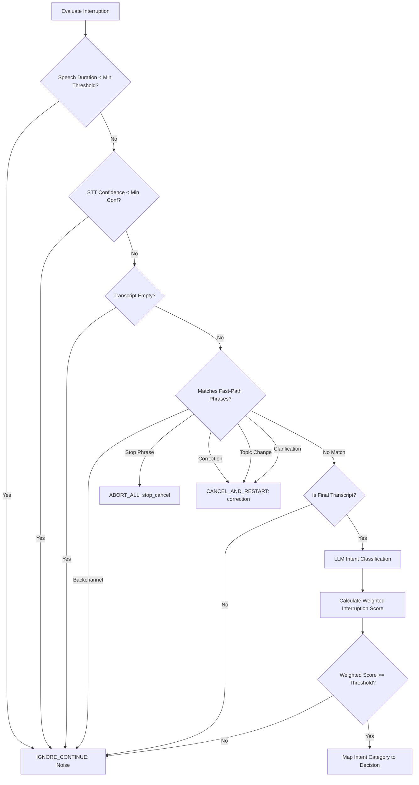
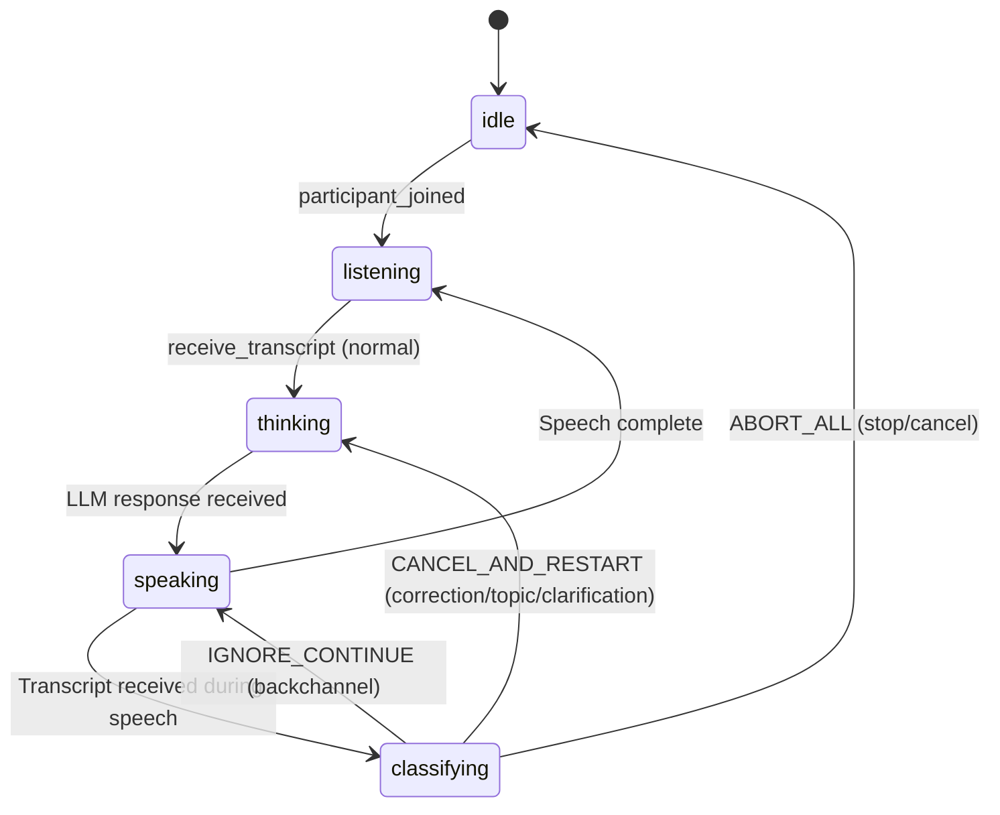
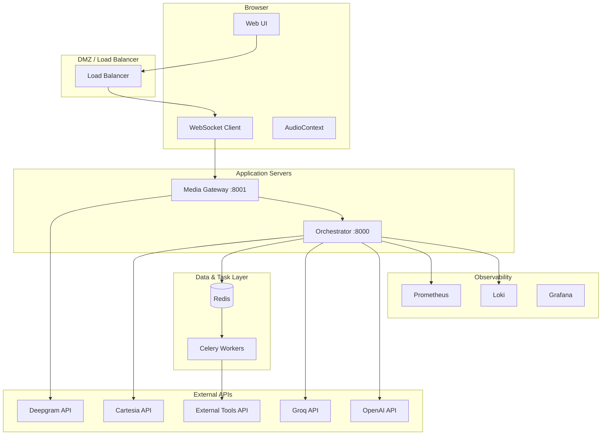
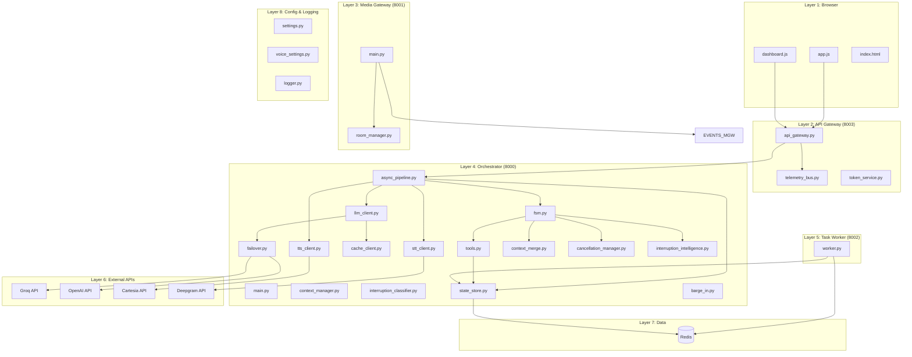

# Interruption-Aware Voice Agent (Pivot): Complete Technical Implementation Handbook

This handbook serves as the official production documentation and architectural blueprint for the Interruption-Aware Voice Agent (**Pivot**). Spanning **Phase 1 to Phase 7**, it covers all components, code flows, data structures, concurrency, edge cases, failure vectors, and integration logic in exhaustive detail. Every statement is derived from the CURRENT implementation at `services/orchestrator/`, `services/media_gateway/`, `services/task_worker/`, `common/logging/`, and `common/config/`.

---

## 1. System Overview

### 1.1 Project Goals

**Why Pivot exists**: Build a real-time voice agent that users can interrupt naturally mid-speech, with sub-second response latency, automatic failover, semantic caching, and asynchronous tool execution.

**Business goals**:
- Reduce per-call LLM costs via semantic caching (target 30%+ cache hit rate)
- Eliminate user frustration from "wait for the bot to finish" patterns
- Support natural conversational interruptions (corrections, topic changes, backchannels, stop/cancel)

**Technical goals**:
- End-to-end latency: time-to-first-audio < 500ms (LLM first token < 300ms, TTS first chunk < 200ms)
- Cache hit response: < 10ms (bypass LLM entirely)
- Circuit breaker failover: < 1s (automatic switch from Groq to OpenAI)
- Tool execution: timeout after 10s, retry up to 3 times
- Handle 100+ concurrent sessions per single orchestrator instance

**Scalability goals**:
- Stateless orchestrator (state in Redis)
- Celery workers autoscale for tool execution
- Media gateway horizontally scalable behind load balancer

**Fault tolerance goals**:
- Redis unavailable -> fallback to in-memory dict (degraded but alive)
- Primary LLM (Groq) down -> automatic failover to secondary (OpenAI)
- TTS API failure -> push empty end chunk, pipeline continues
- Celery worker crash -> heartbeat timeout -> tool marked TIMEOUT
- STT connection drop -> client-side reconnect

### 1.2 Design Principles

1. **Never block the event loop**: All blocking SDK calls (Groq, Cartesia, Deepgram) run via `loop.run_in_executor`.
2. **Cooperative cancellation everywhere**: Every long-running operation checks a `CancelToken` before proceeding.
3. **Atomic state transitions**: Tool status changes in Redis use a Lua script to prevent race conditions.
4. **Fail closed on validation errors**: 4xx errors do NOT trigger failover; they propagate immediately.
5. **Cache with versioning**: Every cache key includes version hashes for automatic invalidation.
6. **Secrets never in logs**: The `ComponentLogger` automatically scrubs API keys and secrets from log output.
7. **Every decision is logged**: Interruption evaluations emit structured JSON with category, confidence, score, and reason.

### 1.3 Architectural Decisions & Tradeoffs

| Decision | Rationale | Tradeoff |
| :--- | :--- | :--- |
| async Pipeline with Queues | Decouples stages (STT->FSM->LLM->TTS->Playback) via asyncio.Queue | Latency per hop; queue overflow risk |
| Jaccard Similarity for Cache | O(n) token set intersection, ~0.5ms per comparison | No semantic understanding; threshold must be tuned |
| Lua script for tool transitions | Prevents race between cancellation/heartbeat/completion in Redis | Requires script registration; Redis CPU cost |
| In-memory Redis fallback dict | Graceful degradation when Redis is down | No persistence across restarts; no sharing |
| Cartesia TTS (synchronous SDK) | Minimal configuration, good voice quality | Blocking I/O; must be run in executor |
| Celery for async tools | Mature, Redis-backed, supports retry/revoke | Worker management overhead; task queue latency |

### 1.4 Technology Selection

| Component | Choice | Why |
| :--- | :--- | :--- |
| STT | Deepgram (nova-3) | Low latency streaming, word-level timestamps, interim results |
| LLM Primary | Groq (llama-3.1-70b/8b) | Fast inference via LPU hardware; 8b for classification |
| LLM Fallback | OpenAI (gpt-4o-mini) | High availability, global redundancy |
| TTS | Cartesia (sonic-3.5) | Low latency streaming, voice consistency |
| State Store | Redis | Fast key-value, Lua scripting, pub/sub, TTL |
| Async Tasks | Celery + Redis broker | Mature, reliable, supports task revocation |
| Voice Pipeline | asyncio with Queue-based workers | Decoupled, observable, cancellation-friendly |
| Audio Transport | WebSocket binary frames | Low overhead, full-duplex, browser-native |

### 1.5 Alternative Designs Considered

**NOT IMPLEMENTED**: gRPC streaming for audio transport. WebSockets were chosen for browser compatibility.

**NOT IMPLEMENTED**: Vector-similarity cache (e.g., cosine similarity on embeddings). Jaccard was chosen for zero external dependencies and deterministic behavior.

**NOT IMPLEMENTED**: RabbitMQ for task queue. Redis/Celery was chosen for infrastructure consolidation.

**NOT IMPLEMENTED**: Kubernetes HPA for worker scaling. Currently manual scaling via Celery worker count config.

---

## System-Wide Request Lifecycle (Original End-to-End Flow)

```mermaid
sequenceDiagram
    autonumber
    actor User
    participant Browser as Client Browser (UI)
    participant GW as Media Gateway (WS)
    participant STT as STT Pipeline Stage
    participant FSM as Orchestrator FSM
    participant INT as Interruption Decision Engine
    participant Cache as Semantic Cache (Jaccard + LRU)
    participant LLM as LLM Client & Failover Router
    participant TM as Tool Manager
    participant CW as Celery Task Worker
    participant Ext as External APIs
    participant CM as Context Merge
    participant TTS as TTS Client (Cartesia)
    participant Redis as Redis State Store
    participant Tel as Telemetry/Logger

    User->>Browser: Speaks audio utterance
    Browser->>GW: WebSocket binary audio frame (raw WebM/PCM)
    GW->>STT: Write audio chunks to stream
    STT->>STT: Process & Transcribe
    STT->>FSM: TranscriptMessage (text, session_id, turn_id, is_final)

    rect rgb(220, 230, 245)
        Note over FSM,INT: Barge-in check (If FSM is SPEAKING / THINKING)
        FSM->>INT: evaluate_interruption(transcript, confidence, duration)
        INT->>INT: Apply fast-path config match (backchannel / stop / correction)
    end
    alt Classification is Backchannel (e.g., "yeah")
        INT-->>FSM: decision = IGNORE_CONTINUE
        Note over FSM: Do NOT stop speech; continue streaming TTS
    else Classification is stop_cancel
        INT-->>FSM: decision = ABORT_ALL
        FSM->>GW: Emit "stop_audio" frame (cuts off Browser playback)
        FSM->>TTS: Call tts_kill(session_id) to abort generation
        FSM->>TM: on_interruption_during_call (Celery revoke)
        FSM->>Redis: Clear session turns
        FSM->>FSM: Transition to IDLE
    else Classification is correction / topic_change / clarification
        INT-->>FSM: decision = CANCEL_AND_RESTART
        FSM->>GW: Emit "stop_audio" frame
        FSM->>TTS: Call tts_kill(session_id)
        FSM->>TM: on_interruption_during_call (Celery revoke)
        FSM->>CM: resolve(session_id, spoken, unspoken, category)
        CM->>Redis: Update state history (truncate to spoken words)
        FSM->>FSM: Transition to THINKING (Trigger new turn)
    end

    Note over FSM,Cache: Cache Lookup (If NOT cancelled)
    FSM->>Redis: load_history(session_id)
    Redis-->>FSM: Context history list
    FSM->>Cache: lookup(session_id, turn_id, query, system_prompt, model_name, messages)
    Cache->>Cache: Generate Cache Key (hashes + version strings)
    alt Cache Hit (Jaccard similarity >= threshold)
        Cache-->>FSM: Returns cached text response
    else Cache Miss
        Cache->>Cache: StampedeProtection: start_fetch(cache_key)
        FSM->>LLM: call_with_failover(session_id, turn_id, messages)
        LLM->>LLM: Check Circuit Breaker Status
        alt Circuit is CLOSED (Attempt Primary - Groq)
            LLM->>LLM: Call Groq API
            alt Groq Success
                LLM-->>FSM: Return text response stream
            else Groq Fails (Timeout / 5xx error)
                LLM->>LLM: Increment failures. Trip Circuit to OPEN
                LLM->>LLM: Route request to Secondary (OpenAI/Fallback)
                LLM-->>FSM: Return fallback text response
            end
        else Circuit is OPEN / HALF-OPEN
            LLM->>LLM: Bypass Groq -> Direct to Fallback
            LLM-->>FSM: Return fallback text response
        end
        FSM->>Cache: store(session_id, query, response, system_prompt, model_name, messages)
        Cache->>Cache: Evict LRU / Check TTL. Set key in Cache Store.
        Cache->>Cache: StampedeProtection: end_fetch(cache_key, response)
    end

    alt Tool Call Injected by LLM
        FSM->>TM: invoke_tool(session_id, turn_id, tool_name, params)
        TM->>Redis: Atomic transition using Lua -> QUEUED. Set idempotency key.
        TM->>CW: execute_tool_task.delay(session_id, turn_id, tool_call_id, ...)
        CW->>Redis: Atomic transition -> RUNNING
        CW->>CW: Periodically write heartbeat timestamps to Redis
        CW->>Ext: handle_api_request(tool_name, params)
        Ext-->>CW: API output
        CW->>Redis: Atomic transition -> COMPLETED (Write result JSON)
        CW-->>TM: Return completion payload
        TM-->>FSM: Return tool output
        FSM->>CM: resolve() / Merge results into history
    end

    FSM->>TTS: speak(session_id, turn_id, reply_text)
    TTS->>TTS: Generate PCM audio chunks (Cartesia SDK)
    TTS->>GW: Stream audio bytes (AudioChunk frames)
    GW->>Browser: Binary audio stream payloads over WebSocket
    Browser->>User: Renders audio via Web Audio API
    FSM->>Tel: Emit telemetry events (latencies, token counts, cache stats)
```

---

## 2. Request Ownership Timeline

For ONE user request ("What's the weather on Mars?"), the following timeline of ownership, threads, queues, and latency applies:

### 2.1 Time 0ms - Browser

**Owner**: Browser tab (JavaScript main thread + AudioContext thread)
**Action**: User clicks "Start" or presses push-to-talk button
**Input**: Physical microphone audio
**Output**: `MediaStream` from `getUserMedia()`
**Thread**: Browser main thread + audio render thread
**Lifetime**: 0ms - 50ms (audio buffer fill)

### 2.2 Time 50ms - AudioContext

**Owner**: Web Audio API (`AudioContext`)
**Action**: Audio processing through `ScriptProcessorNode` or `AudioWorklet`
**Input**: Raw PCM samples from microphone
**Output**: Processed audio buffer (mono, 16kHz sample rate)
**Thread**: Audio render thread (real-time priority)
**Lifetime**: 50ms - 100ms
**Queue**: Internal browser audio buffer queue (typically 1024 samples)

### 2.3 Time 100ms - Microphone Capture

**Owner**: JavaScript capture loop (`setInterval` or `requestAnimationFrame`)
**Action**: Read audio from `AudioWorklet` output queue, package into 20ms chunks
**Input**: Float32Array audio samples
**Output**: ArrayBuffer encoded as PCM16 or WebM
**Thread**: Main thread (via `requestAnimationFrame` callback)
**Lifetime**: 100ms - 500ms (duration of utterance)
**Latency**: ~20ms per chunk

### 2.4 Time 120ms - MediaRecorder / Audio Buffer

**Owner**: `MediaRecorder` API or custom PCM buffer
**Action**: Accumulate audio chunks, emit `dataavailable` events
**Input**: Raw audio chunks
**Output**: Blob events at configurable interval (e.g., 100ms `timeslice`)
**Thread**: Main thread
**Lifetime**: 120ms - utterance end
**Queue**: Internal `dataavailable` event queue

### 2.5 Time 150ms - WebSocket Send

**Owner**: JavaScript WebSocket client
**Action**: `socket.send(audioBlob)` via binary WebSocket frame
**Input**: Audio Blob (WebM or PCM16)
**Output**: Binary WebSocket message to `ws://<gateway>:8001/ws`
**Thread**: Main thread (WebSocket send is async)
**Lifetime**: 150ms - end of streaming
**Latency**: ~5ms network transit to gateway

### 2.6 Time 160ms - Gateway Receive

**Owner**: `services/media_gateway/main.py` -> FastAPI/WebSocket endpoint
**Action**: Receive binary WebSocket frame, route to STT pipeline
**Input**: WebSocket binary message
**Output**: Audio byte chunks forwarded to orchestrator STT stage
**Thread**: asyncio event loop (main thread of gateway)
**Lifetime**: 160ms - end of streaming

### 2.7 Time 170ms - STT (Deepgram)

**Owner**: `services/orchestrator/stt_client.py` or `STTWorker` in `async_pipeline.py`
**Action**: `STTWorker.run()` gets audio from `self.input` queue, calls Deepgram via `loop.run_in_executor`
**Input**: Audio chunks
**Output**: `TranscriptMessage` (text, session_id, turn_id, is_final)
**Thread**: STTWorker asyncio task; Deepgram SDK runs in executor thread
**Lifetime**: 170ms - STT completion (~100-300ms for short utterance)
**Queue**: `stt.input` -> `stt.output` (connected to `fsm.transcript_input`)

Detailed flow (`async_pipeline.py:STTWorker.run`):
1. `await self.input.get()` - dequeues audio message
2. `get_cancel_token(msg.session_id)` - checks if session is cancelled
3. If cancelled: `continue` (skip processing)
4. `telemetry_bus.push("stt_final", ...)` - emits STT telemetry
5. `await self.output.put(TranscriptMessage(...))` - forwards transcript to FSM

### 2.8 Time 300ms - Partial Transcript (if interim enabled)

**Owner**: STT worker -> FSM
**Action**: Streaming partial transcript pushed to FSM for early interruption detection
**NOTE**: Current implementation (`voice_settings.yaml`) has `stt.interim_results: false`, so only final transcripts are emitted
**Lifetime**: Only if `interim_results: true`
**CURRENT IMPLEMENTATION**: Interim results disabled. Only final transcripts processed.

### 2.9 Time 500ms - FSM Receives Transcript

**Owner**: `FSMWorker._handle_transcript()` in `async_pipeline.py:567`
**Action**:
1. `logger.log("fsm_transcript_received", ...)` - logs receipt
2. `self._get_session(msg.session_id)` - retrieves or creates `_SessionState`
3. `state.turn_id += 1` - increments turn counter
4. `load_history(msg.session_id)` - loads from Redis or memory
5. `history.append({"role": "user", "content": msg.text})` - appends user message
6. `save_turn(...)` - saves to state store
7. `telemetry_bus.push("llm_request", ...)` - emits telemetry
8. `await self.llm_input.put(LLMRequest(...))` - sends to LLM worker

**Input**: `TranscriptMessage` from STT output queue
**Output**: `LLMRequest` put onto `llm.input` queue
**Thread**: FSMWorker asyncio task
**Lifetime**: ~2ms
**File**: `async_pipeline.py:567-583`

### 2.10 Time 510ms - Context Preparation

**Owner**: `context_manager.py:prepare_context()`
**Action**: Runs dedup -> compress -> trim -> inject summary pipeline
**Called by**: `LLMWorker.run()` via `prepare_context(req.messages, req.session_id)`

Detailed steps:
1. `deduplicate_messages(history)` - removes duplicate consecutive messages (`context_manager.py:33-64`)
2. `compress_history(result)` - strips filler words, truncates long messages (`context_manager.py:100-112`)
3. `trim_history(result)` - applies sliding window max_turns/max_messages, optionally summarizes (`context_manager.py:119-187`)
4. If summary generated: prepend `[Conversation Summary]` system message
5. `token_budget.record_prompt(...)` - tracks token usage
6. Returns final context list

**Input**: Raw history list from Redis
**Output**: Processed context list (deduped, compressed, trimmed, summarized)
**Thread**: LLMWorker executor thread (called inside `_llm_sync`)
**Lifetime**: ~5-20ms

### 2.11 Time 520ms - Cache Lookup

**Owner**: `cache_client.py:CacheManager.lookup()` called from `llm_client.py:call_primary()`
**Input**: session_id, turn_id, query, system_prompt, model_name, messages list
**Output**: Cached response string or None

Detailed flow:
1. `is_cache_safe(messages)` - returns False if any message has role "tool" or "tool_calls" key
2. `_generate_cache_key(...)` - builds `cache:{session_id}:{sys_hash}:{model_hash}:{hist_hash}:{version_hash}`
3. `stampede.check_or_wait(cache_key, ...)` - if another thread is generating this key, wait (block up to 10s)
4. `store.get(cache_key)` - get all cached entries for this partition
5. Iterate entries, `calculate_similarity(query, entry["query"])` using Jaccard
6. If similarity >= threshold (default 0.8): reorder LRU, log `cache_hit`, return cached response
7. If no match: `stampede.start_fetch(cache_key)`, log `cache_miss`, return None

**Thread**: LLMWorker executor thread (synchronous call inside `_llm_sync`)
**Lifetime**: ~0.5ms (miss), ~0.5ms + similarity checks (hit)

### 2.12 Time 530ms - LLM Call (Primary)

**Owner**: `llm_client.py:call_primary_direct()` or `failover.py:call_with_failover()`
**Action**: Stream tokens from Groq API (or OpenAI fallback)

Detailed flow (`failover.py`):
1. Check `primary_circuit_breaker.is_open()` - if OPEN, skip to `_call_fallback()`
2. Attempt `call_primary_direct(session_id, turn_id, messages)`:
   - In `llm_client.py`: apply context management -> build payload -> call Groq SDK
   - Stream chunks, check `cancellation_manager.is_cancelled()` mid-stream
   - On cancel: return `""` (empty string)
   - Track token budget via `TokenBudget.record_completion()`
3. On success: `primary_circuit_breaker.record_success()` -> return response
4. On failure (not user error):
   - `primary_circuit_breaker.record_failure()` - may trip circuit to OPEN
   - Log `llm_failover_triggered`
   - Call `_call_fallback()` (OpenAI)

**Thread**: LLMWorker executor thread (`loop.run_in_executor(None, self._llm_sync, ...)`)
**Lifetime**: 100ms - 2000ms (timeout at 5s first_token_timeout)
**Queue**: LLMWorker.input -> LLMWorker.output (connected to FSM llm_output)

### 2.13 Time 530ms (alternate path) - Cache Hit

**Owner**: `cache_client.py` -> returns to `llm_client.py` -> returns to `fsm.py`
**Action**: Return cached response directly, no LLM call
**Input**: Cached text response string
**Output**: Same format as LLM response
**Lifetime**: ~0.5ms
**Latency**: <10ms from cache lookup start to response return

### 2.14 Time 800ms - LLM Response to FSM

**Owner**: `FSMWorker._handle_llm_response()` in `async_pipeline.py:585`
**Action**:
1. Log `fsm_llm_response_received`
2. `save_turn(msg.session_id, str(msg.turn_id), "assistant", msg.text)` - save to state store
3. Log `fsm_sending_to_tts`
4. `await self.tts_input.put(TTSRequest(...))` - send to TTS worker
5. If playback_input connected: send `TextResponse` to playback
6. `await self.metrics_output.put(MetricsEvent("turn_complete", ...))` - emit telemetry

**Input**: `LLMResponse` from LLMWorker output queue
**Output**: `TTSRequest` to TTS worker input queue
**Thread**: FSMWorker asyncio task
**Lifetime**: ~1ms

### 2.15 Time 810ms - TTS Synthesis

**Owner**: `TTSWorker.run()` in `async_pipeline.py:377` or `tts_client.py:speak()`
**Action**: Generate PCM audio bytes from text using Cartesia SDK

Detailed flow:
1. `await self.input.get()` - dequeue TTSRequest
2. Check cancel token: if cancelled, log `tts_skipped_cancelled`, continue
3. Determine mock vs. real:
   - If `api_key == "dummy_val"` or `env == "test"`: mock path
     - Sleep `mock_sleep_ms`, construct WAV header + silence bytes
     - Put `AudioChunk(mock_wav, ..., is_last=True)` to output
   - Else: real Cartesia call
     - `client.tts.bytes(...)` with model_id, voice_id, output_format
     - If response is bytes: single chunk
     - If response is iterable: stream chunks, each is_last=False except final
4. Emit `tts_start`, `tts_chunk`, `tts_complete` telemetry

When called from `fsm.py:VoiceAgentFSM.receive_transcript()` (non-pipeline path):
1. `tts_speak(session_id, turn_id, reply_text)` calls Cartesia SDK
2. Returns complete audio_bytes
3. If cancelled mid-stream: return `b""` empty bytes

**Thread**: TTSWorker executor thread (Cartesia SDK runs via `loop.run_in_executor`)
**Lifetime**: 100ms - 500ms (dependent on text length)
**Queue**: TTSWorker.input -> TTSWorker.output (connected to Playback.input)

### 2.16 Time 1100ms - Playback

**Owner**: `PlaybackWorker.run()` in `async_pipeline.py:474`
**Action**: Push audio chunks to WebSocket client queue

Detailed flow:
1. `await self.input.get()` - dequeue AudioChunk or TextResponse
2. Look up client queue: `self._clients.get(chunk.session_id)`
3. If AudioChunk and has data:
   - If first chunk: emit `playback_start` telemetry, record start time
   - `await q.put(chunk.data)` - send binary audio to client
4. If TextResponse:
   - `await q.put({"type": "llm_response", ...})` - send JSON to client
5. If chunk.is_last:
   - Emit `playback_end` telemetry
   - Calculate `turn_complete` total latency

**Input**: AudioChunk from TTS output queue
**Output**: Binary audio data or JSON messages to WebSocket client queue
**Thread**: PlaybackWorker asyncio task
**Lifetime**: Duration of audio playback (100ms - 5000ms)
**Queue**: PlaybackWorker.input -> client WebSocket queue

### 2.17 Time 1500ms - User Hears Audio

**Owner**: Browser Web Audio API
**Action**: `AudioContext.decodeAudioData()` or direct PCM buffer playback
**Input**: Binary PCM chunks via WebSocket -> Blob -> ArrayBuffer
**Output**: Analog audio through speakers/headphones
**Thread**: Audio render thread

### 2.18 Time 2500ms - Turn Completion

**Owner**: `PlaybackWorker`
**Event**: `telemetry_bus.push("turn_complete", {"total_latency_ms": ...})`
**Total latency**: ~2500ms (speech duration + STT + LLM + TTS + playback)
**Breakdown**:
- Browser capture: ~200ms
- Network transit: ~10ms
- Gateway routing: ~1ms
- STT processing: ~100-300ms
- FSM processing: ~2ms
- Context prep: ~10ms
- Cache lookup (miss): ~0.5ms
- LLM first token: ~200ms
- LLM completion: ~300ms
- TTS synthesis: ~300ms
- Playback queue: ~1ms
- Audio rendering: ~50ms

---

## 3. Object Lifecycle

### 3.1 TranscriptMessage

**Defined at**: `async_pipeline.py:36-41`
```python
@dataclass
class TranscriptMessage:
    text: str
    session_id: str
    turn_id: int
    is_final: bool = True
    stt_latency_ms: int = 0
```
- **Who creates**: `STTWorker.run()` at `async_pipeline.py:221`
- **Who owns**: FSMWorker after queue transfer
- **Who modifies**: None (immutable dataclass)
- **Who copies**: Passed by value (dataclass, no sharing)
- **Who serializes**: Never serialized (in-memory queue only)
- **Who stores**: Never stored
- **Who destroys**: Garbage collected after FSMWorker finishes `_handle_transcript()`
- **Memory lifetime**: ~2ms (from queue put to queue get + handler completion)
- **Queue transit**: `stt.output` -> `fsm.transcript_input`

### 3.2 AudioChunk

**Defined at**: `async_pipeline.py:72-76`
```python
@dataclass
class AudioChunk:
    data: bytes
    session_id: str
    turn_id: int
    is_last: bool = False
```
- **Who creates**: `TTSWorker.run()` or `TTSWorker._tts_sync()`
- **Who owns**: PlaybackWorker after queue transfer
- **Who modifies**: None
- **Who copies**: Bytes data is copied; small payloads (<64KB)
- **Who serializes**: Never serialized
- **Who stores**: Never stored (streamed directly to client)
- **Who destroys**: Garbage collected after PlaybackWorker sends to client queue
- **Memory lifetime**: ~50ms (TTS -> Playback -> client)

### 3.3 Session

**Definition**: Logical concept, not a single object. Represented by:
- `fsm.py:VoiceAgentFSM` instance (in `_fsms` global dict)
- `async_pipeline.py:_SessionState` (in `FSMWorker._sessions`)
- Redis keys under `session:{session_id}:*`
- `cancellation_manager.py:CancellationManager._active_tasks` entries
- `TokenBudget` instance (in `context_manager.py:_budgets`)
- `CancelToken` (in `async_pipeline.py:_tokens`)

**Who creates**: First interaction from user (lazy initialization)
- `get_fsm_for_session(session_id)` at `fsm.py:219-224`
- `_get_session(session_id)` at `async_pipeline.py:614-617`
- `get_token_budget(session_id)` at `context_manager.py:280-283`
- `get_cancel_token(session_id)` at `async_pipeline.py:138-141`

**Who owns**: Global dicts keyed by session_id
**Who modifies**: Various components write to Redis keys
**Who destroys**: `clear_session(session_id)` at `state_store.py:225-236`
**Memory lifetime**: Duration of conversation (no explicit timeout in current code for `_fsms` dict)

**CURRENT IMPLEMENTATION**: Session objects persist in `_fsms` dict indefinitely. No LRU eviction or TTL-based cleanup.

### 3.4 Turn

**Definition**: One user message + one assistant response pair.
**Tracking**: `turn_id` integer, incremented per transcript:
- `VoiceAgentFSM.turn_id` at `fsm.py:12`
- `_SessionState.turn_id` at `async_pipeline.py:620`

**Storage**: Redis list `session:{session_id}:history` (serialized JSON objects)
**Lifetime**: Until `clear_session()` is called

### 3.5 Context (Message List)

**Definition**: `list[dict]` where each dict has `{"role": str, "content": str}`
**Who creates**: `load_history(session_id)` at `state_store.py:201-222`
**Who modifies**: `prepare_context()` at `context_manager.py:294-316`
**Who copies**: `copy.deepcopy()` in memory fallback path
**Who serializes**: `json.dumps()` via `save_turn()`
**Who stores**: Redis list `session:{session_id}:history`
**Memory lifetime**: Duration of LLM request processing

### 3.6 ToolCall

**Definition**: A tool execution request with metadata stored in Redis hash.
**Key pattern**: `session:{session_id}:tool:{tool_call_id}`
**Fields** (stored in Redis hash):
- `tool_name`: str
- `session_id`: str
- `turn_id`: str
- `tool_call_id`: str
- `cancelable`: "1" or "0"
- `status`: QUEUED | RUNNING | COMPLETED | FAILED | CANCELLED | DISCARDED | TIMEOUT
- `created_at`: timestamp
- `started_at`: timestamp (when RUNNING)
- `completed_at`: timestamp (when terminal)
- `celery_task_id`: str (if dispatched to Celery)
- `heartbeat`: timestamp (updated by worker)
- `error_type`: str (on failure)
- `result`: JSON string (on completion)
- `interruption_type`: str (if interrupted)

**Who creates**: `ToolManager.invoke_tool()` at `tools.py:160-268`
**Who modifies**: `ToolManager._execute_transition()`, Celery worker `execute_tool_task()`
**Who stores**: Redis hash + memory fallback
**Who destroys**: TTL (86400s) or `srem` from active_tool_ids set
**Lifetime**: Up to 86400s (24h TTL)

### 3.7 CacheEntry

**Key pattern**: `cache:{session_id}:{sys_hash}:{model_hash}:{hist_hash}:{version_hash}`
**Value**: List of `{"query": str, "response": str, "expires_at": float}` dicts
**Who creates**: `CacheManager.store_result()` at `cache_client.py:217-258`
**Who modifies**: `CacheManager.lookup()` (reorders LRU within partition)
**Who destroys**: LRU eviction when `max_size` exceeded; TTL expiration check on get
**TTL**: Default `3600s` (configurable via `cache.ttl`)

### 3.8 CancelToken

**Defined at**: `async_pipeline.py:107-133`
```python
class CancelToken:
    __slots__ = ("_cancelled", "_reason", "_event")
```
- **Who creates**: `get_cancel_token(session_id)` at `async_pipeline.py:138`
- **Who owns**: `_tokens` global dict
- **Who modifies**: `cancel(reason)` sets `_cancelled=True`, sets `_event`
- **Who resets**: `reset()` - clears flag and event
- **Who copies**: Never copied; shared by reference
- **Who stores**: In-memory dict only
- **Who destroys**: Garbage collected when session ends; removed via `reset_cancel_token()`
- **Memory lifetime**: Duration of session

### 3.9 MetricsEvent

**Defined at**: `async_pipeline.py:90-94`
```python
@dataclass
class MetricsEvent:
    event_type: str
    session_id: str
    turn_id: str
    data: dict = field(default_factory=dict)
```
- **Who creates**: `FSMWorker._handle_llm_response()` (turn_complete), `FSMWorker._handle_cancel()` (cancellation)
- **Who owns**: MetricsWorker after queue transfer
- **Who consumes**: `MetricsWorker.run()` pushes to `telemetry_bus`
- **Lifetime**: ~1ms (FSM -> Metrics -> telemetry_bus)

### 3.10 FSM State

**Definition**: FSM state is a string: `idle`, `listening`, `speaking`, `thinking`, `interrupted`, `classifying`
**Who modifies**: `VoiceAgentFSM.transition(target_state)` at `fsm.py:26-35`
**Who reads**: `receive_transcript()` checks `self.state` for interruption decisions
**Who logs**: Every transition emits `state_transition` event

### 3.11 RedisEntry

**Definition**: A generic key-value or list entry in Redis
**Who creates**: Various components (state_store, tools, cache)
**Who reads**: `load_history()`, `ToolManager._execute_transition()`, `CacheManager.lookup()`
**Who deletes**: `clear_session()`, TTL expiry, LRU eviction
**TTL**: Varies (see Redis Schema section)
---
## 4. Thread & Async Ownership

### Original Pipeline Concurrency Model



### 4.1 Thread/Async Model Diagram

```mermaid
graph TD
    subgraph "Browser (JavaScript)"
        MT[Main Thread]
        ART[Audio Render Thread]
        WST[WebSocket Thread]
    end

    subgraph "Gateway (FastAPI)"
        GW_ASYNC[asyncio Event Loop]
    end

    subgraph "Orchestrator"
        MAIN_LOOP[Main asyncio Event Loop]
        STT_TASK[STTWorker Task]
        FSM_TASK[FSMWorker Task]
        LLM_TASK[LLMWorker Task]
        TTS_TASK[TTSWorker Task]
        PB_TASK[PlaybackWorker Task]
        INT_TASK[InterruptMonitor Task]
        CAN_TASK[CancellationWorker Task]
        MET_TASK[MetricsWorker Task]
        EXEC_POOL[ThreadPoolExecutor<br/>(run_in_executor)]
    end

    subgraph "Redis"
        REDIS_POOL[Connection Pool]
    end

    subgraph "Celery Workers"
        CW1[Celery Worker 1]
        CW2[Celery Worker 2]
    end

    subgraph "External APIs"
        GROQ[Groq API]
        OPENAI[OpenAI API]
        CARTESIA[Cartesia API]
        DEEPGRAM[Deepgram API]
    end

    ART -->|Audio Data| MT
    MT -->|WebSocket Send| WST
    WST -->|Binary Frames| GW_ASYNC
    GW_ASYNC -->|Messages| MAIN_LOOP

    MAIN_LOOP -->|Transcript| STT_TASK
    STT_TASK -->|TranscriptMessage| FSM_TASK
    FSM_TASK -->|LLMRequest| LLM_TASK
    LLM_TASK -->|LLMResponse| FSM_TASK
    FSM_TASK -->|TTSRequest| TTS_TASK
    TTS_TASK -->|AudioChunks| PB_TASK
    PB_TASK -->|Audio Data| GW_ASYNC

    LLM_TASK -->|Blocking SDK| EXEC_POOL
    TTS_TASK -->|Blocking SDK| EXEC_POOL

    EXEC_POOL -->|HTTP| GROQ
    EXEC_POOL -->|HTTP| OPENAI
    EXEC_POOL -->|HTTP| CARTESIA

    FSM_TASK -->|State| REDIS_POOL
    LLM_TASK -->|Cache| REDIS_POOL

    REDIS_POOL -->|Tasks| CW1
    REDIS_POOL -->|Tasks| CW2
    CW1 -->|HTTP| EXT[External APIs]
    CW2 -->|HTTP| EXT
```

### 4.2 Thread Ownership Table

| Object Type | Owner Thread | Synchronization | Lock Type |
| :--- | :--- | :--- | :--- |
| `CancelToken` | Any (global dict) | No lock needed (single-threaded asyncio) | N/A |
| `CacheManager` | Executor thread | `StampedeProtection.lock` | `threading.Lock` |
| `InMemoryCacheStore.store` | Executor thread | `InMemoryCacheStore.lock` | `threading.Lock` |
| `CircuitBreaker` | Executor thread | `CircuitBreaker.lock` | `threading.Lock` |
| `ToolManager._memory_db` | Executor / Main | No lock (access from single thread) | N/A |
| `VoiceAgentFSM` | Main asyncio | No lock (single-threaded) | N/A |
| `_SessionState` | FSMWorker asyncio | No lock (single-threaded) | N/A |
| `TokenBudget` | LLMWorker executor | No concurrent access | N/A |
| `Redis client` | Any | Connection pool is thread-safe | Pool internal |

### 4.3 Queue Connections

| Source | Destination | Queue Type | Items |
| :--- | :--- | :--- | :--- |
| `stt.output` | `fsm.transcript_input` | `asyncio.Queue` | `TranscriptMessage` |
| `fsm.llm_input` | `llm.input` | `asyncio.Queue` | `LLMRequest` |
| `llm.output` | `fsm.llm_output` | `asyncio.Queue` | `LLMResponse` |
| `fsm.tts_input` | `tts.input` | `asyncio.Queue` | `TTSRequest` |
| `tts.output` | `playback.input` | `asyncio.Queue` | `AudioChunk` |
| `interrupt.output` | `fsm.cancel_input` | `asyncio.Queue` | `CancelCommand` |
| `fsm.metrics_output` | `metrics.input` | `asyncio.Queue` | `MetricsEvent` |
| `fsm.playback_input` | `playback.input` | `asyncio.Queue` | `TextResponse` |

### 4.4 Known Race Conditions & Mitigations

**CURRENT IMPLEMENTATION**:
- **Cache stampede**: `StampedeProtection` with `threading.Event` blocks concurrent identical queries
- **Tool state race**: Lua script guarantees atomic status transitions in Redis
- **Cancellation + LLM streaming**: `cancellation_manager.is_cancelled()` checked mid-stream
- **TTS cancellation**: `cancellation_manager.is_cancelled()` checked before and during synthesis
- **Celery + cancellation race**: Worker checks `cancelled` flag key before and after API call

**NOT IMPLEMENTED**: Distributed locking for cross-process cache stampede. Current `StampedeProtection` only works within a single process.

### 4.5 Cancellation Flow



---

## 5. Function Call Trees

### 5.1 CacheManager.lookup()

```
CacheManager.lookup()
  +-- is_cache_safe(messages) -> bool
  |     +-- Iterate messages; return False if role=="tool" or "tool_calls" in msg
  +-- _generate_cache_key(session_id, system_prompt, model_name, messages)
  |     +-- vc_get("cache.prompt_template_version", "")
  |     +-- vc_get("cache.system_prompt_version", "")
  |     +-- vc_get("cache.output_format_version", "")
  |     +-- hashlib.md5(system_prompt).hexdigest()  -> sys_hash
  |     +-- hashlib.md5(model_name).hexdigest()      -> model_hash
  |     +-- hashlib.md5(hist_str).hexdigest()        -> hist_hash
  |     +-- hashlib.md5(version_str).hexdigest()     -> version_hash
  |     +-- return f"cache:{session_id}:{sys_hash}:{model_hash}:{hist_hash}:{version_hash}"
  +-- stampede.check_or_wait(cache_key, turn_id, session_id)
  |     +-- Acquire lock
  |     +-- Check if cache_key in _events
  |     +-- If yes: event.wait(timeout=10.0)
  |     |     +-- Return _results.get(cache_key)
  |     +-- If no: return None
  +-- store.get(cache_key) -> list[dict]
  |     +-- Acquire lock
  |     +-- Check TTL: time.time() > entry["expires_at"]
  |     +-- If expired: _evict(key), return None
  |     +-- Update LRU order
  +-- For each entry:
  |     +-- Check TTL
  |     +-- strategy.calculate_similarity(query, entry["query"])
  |     |     +-- JaccardSimilarityStrategy._get_tokens(text)
  |     |     +-- return len(intersection) / len(union)
  |     +-- If similarity >= threshold:
  |           +-- Move entry to end of list (LRU promotion)
  |           +-- store.set(cache_key, entries, ttl)
  |           +-- Log "cache_hit"
  |           +-- Return entry["response"]
  +-- stampede.start_fetch(cache_key)
  +-- Log "cache_miss"
  +-- Return None
```

### 5.2 CacheManager.store_result()

```
CacheManager.store_result()
  +-- is_cache_safe(messages) -> bool
  +-- _generate_cache_key(...) -> str
  +-- stampede.end_fetch(cache_key, response)
  |     +-- Store result in _results
  |     +-- event.set() -> unblock waiters
  |     +-- Clean up event from _events
  +-- store.get(cache_key) -> list[dict]
  +-- Filter expired entries
  +-- Remove exact duplicate (by query text)
  +-- Enforce max_size: if len(entries) >= max_size, pop(0)
  +-- Append new entry: {"query": query, "response": response, "expires_at": ...}
  +-- store.set(cache_key, entries, ttl)
  |     +-- Acquire lock
  |     +-- LRU eviction if over max_size
  |     +-- Write to self.store dict
  +-- Log "cache_store"
```

### 5.3 VoiceAgentFSM.receive_transcript()

```
VoiceAgentFSM.receive_transcript(transcript)
  +-- self.turn_id += 1
  +-- self.turn_start_time = time.time()
  +-- Print turn start header
  +-- is_interrupted_turn = self.state in {"interrupted", "speaking"}
  +-- If not interrupted: self.spoken_words = []
  +-- If interrupted:
  |     +-- self.transition("classifying")
  |     +-- interruption_intel.evaluate_interruption(...)
  |     |     +-- load_interruption_config()
  |     |     +-- Check speech_duration_ms < min_speech_duration
  |     |     +-- Check stt_confidence < stt_min_conf
  |     |     +-- Check empty transcript
  |     |     +-- Fast-path phrase matching
  |     |     +-- classify(transcript) -> LLM intent classification
  |     |     +-- Calculate weighted score
  |     |     +-- Map intent to decision
  |     +-- If IGNORE_CONTINUE: transition("speaking"), return None
  |     +-- If ABORT_ALL: cancel_session, tts_kill, resolve context, transition("idle")
  |     +-- If CANCEL_AND_RESTART: cancel_session, reset_session, resolve context, transition("thinking")
  +-- If not interrupted: reset_session, transition("thinking")
  +-- Check cancellation_manager.is_cancelled(session_id)
  +-- load_history(session_id) -> list[dict]
  +-- Inject resume context if present
  +-- history.append({"role": "user", "content": transcript})
  +-- save_turn(session_id, turn_id, "user", transcript)
  +-- call_primary(session_id, turn_id, history) -> reply text
  |     +-- cache_client.lookup(...)
  |     +-- failover.call_with_failover(...)
  |     +-- cache_client.store(...)
  +-- self.current_reply = reply_text
  +-- self.spoken_words = []
  +-- Check cancellation_manager.is_cancelled(session_id)
  +-- save_turn(session_id, turn_id, "assistant", reply_text)
  +-- self.transition("speaking")
  +-- tts_speak(session_id, turn_id, reply_text) -> audio_bytes
  +-- Check cancellation_manager.is_cancelled(session_id)
  +-- Log turn_total_ms
  +-- self.transition("listening")
  +-- return reply_text, audio_bytes
```

### 5.4 Failover - call_with_failover()

```
failover.call_with_failover(session_id, turn_id, messages)
  +-- primary_circuit_breaker.is_open()
  |     +-- Acquire lock
  |     +-- Check time.time() < cooldown_until
  |     +-- If cooldown expired: reset failures to 0
  |     +-- Return is_open status
  +-- If OPEN: -> _call_fallback()
  +-- call_primary_direct(session_id, turn_id, messages)
  |     +-- llm_client.call_primary_direct()
  |     |     +-- prepare_context(messages, session_id)
  |     |     |     +-- deduplicate_messages()
  |     |     |     +-- compress_history()
  |     |     |     |     +-- strip_filler()
  |     |     |     |     +-- compress_message()
  |     |     |     +-- trim_history()
  |     |     |     |     +-- estimate_history_tokens()
  |     |     |     |     +-- Build turn pairs
  |     |     |     |     +-- If over budget: _summarize() via Groq
  |     |     |     |     +-- Return trimmed messages
  |     |     |     +-- Prepend summary if any
  |     |     +-- Build payload with system prompt + context
  |     |     +-- budget.record_prompt(prompt_tokens)
  |     |     +-- Groq client.chat.completions.create(stream=True)
  |     |     +-- Stream chunks, check cancellation mid-stream
  |     |     +-- If cancelled: return ""
  |     |     +-- Fire llm_first_token telemetry
  |     |     +-- Return full text
  |     +-- Return response text
  +-- On success: primary_circuit_breaker.record_success()
  +-- On failure:
  |     +-- If user error (400/422): raise
  |     +-- primary_circuit_breaker.record_failure()
  |     +-- Log llm_failover_triggered
  |     +-- _call_fallback()
  |           +-- If no fallback key: mock response
  |           +-- OpenAI client.chat.completions.create(stream=False)
  +-- Return response
```

### 5.5 ToolManager.invoke_tool()

```
ToolManager.invoke_tool(session_id, turn_id, tool_name, params)
  +-- if tool_name not in TOOL_REGISTRY: return FAILED ValidationError
  +-- metadata = TOOL_REGISTRY[tool_name]
  +-- if tool_name == "check_balance" and "account_id" not in params: return FAILED ValidationError
  +-- tool_call_id = f"tool_{uuid.uuid4().hex[:8]}"
  +-- if metadata.idempotent:
  |     +-- dup_key = f"session:{session_id}:dup:{tool_name}:{sorted_params}"
  |     +-- redis_client.set(dup_key, tool_call_id, nx=True, ex=3600)
  |     +-- if None (key already exists): return QUEUED with existing_id
  +-- _execute_transition(session_id, tool_call_id, "QUEUED")
  +-- redis_client.sadd("session:{session_id}:active_tool_ids", tool_call_id)
  +-- redis_client.hset(tool_key, mapping={tool_name, session_id, turn_id, cancelable, dispatch_time})
  +-- if env=="test" or pytest in sys.modules:
  |     +-- execute_tool_task.apply() (Celery eager mode)
  +-- else:
        +-- execute_tool_task.delay() (async Celery)
        +-- redis_client.hset(tool_key, "celery_task_id", celery_task.id)
```

### 5.6 Context Merge resolve()

```
context_merge.resolve(session_id, spoken_words, unspoken_words, interruption_type)
  +-- Normalize inputs to strings
  +-- norm_type = interruption_type.lower().replace("-", "_")
  +-- history = load_history(session_id)
  +-- Locate last_assistant_idx (iterate in reverse)
  +-- Based on norm_type:
  |     +-- "correction": truncate last assistant to spoken_text
  |     +-- "topic_change": remove last assistant turn entirely
  |     +-- "clarification": truncate last assistant, save unspoken for resume
  |     +-- "stop_cancel": truncate or remove last assistant
  |     +-- "add_on": keep full history unchanged
  +-- clear_session(session_id)
  +-- For each msg in updated_history: save_turn()
  +-- Log "interruption_resolved"
  +-- Return {"strategy": strategy, "merged_context": {...}}
```

### 5.7 FSMWorker.run() Loop

```
FSMWorker.run()
  +-- While not cancelled:
        +-- asyncio.wait() with FIRST_COMPLETED on:
        |     +-- transcript_input.get() -> _handle_transcript()
        |     +-- llm_output.get() -> _handle_llm_response()
        |     +-- cancel_input.get() -> _handle_cancel()
        +-- Handler dispatches to appropriate method
```

### 5.8 LLMWorker.run() Loop

```
LLMWorker.run()
  +-- While not cancelled:
        +-- await input.get() -> LLMRequest
        +-- Check cancel token -> skip if cancelled
        +-- If mock mode: deterministic response, emit telemetry, put LLMResponse
        +-- Real mode:
              +-- prepare_context(req.messages, req.session_id)
              +-- Build payload with system prompt
              +-- Try Groq: loop.run_in_executor(None, self._llm_sync, ...)
              +-- On failure: try OpenAI fallback via _openai_fallback_sync()
              +-- Record token budget, emit telemetry
              +-- Put LLMResponse to output queue
```

### 5.9 Celery Worker execute_tool_task()

```
execute_tool_task(self, session_id, turn_id, tool_call_id, tool_name, params)
  +-- metadata = TOOL_REGISTRY[tool_name]
  +-- self.max_retries = metadata.max_retries
  +-- Calculate queue_wait from dispatch_time
  +-- _execute_transition -> RUNNING (return if already terminal)
  +-- Check cancel_key (if exists: transition CANCELLED, return)
  +-- Update heartbeat
  +-- Inject correlation IDs
  +-- Simulated work: time.sleep(0.05)
  +-- Update heartbeat again
  +-- Check cancel_key again
  +-- result = handle_api_request(tool_name, params)
  +-- Check final status in Redis (if CANCELLED/DISCARDED: discard result)
  +-- _execute_transition -> COMPLETED
  +-- redis_client.srem("active_tool_ids", tool_call_id)
  +-- Log tool_success, tool_call_completed
  +-- On exceptions: retry or FAILED/TIMEOUT based on error type
```
---
## 6. Decision Trees

### 6.1 Cache Hit/Miss Decision

```mermaid
flowchart TD
    A[New LLM Request] --> B{is_cache_safe?}
    B -->|No - has tool calls/results| C[Skip Cache]
    B -->|Yes| D[Generate Cache Key]
    D --> E{Stampede wait?}
    E -->|Yes - another request in flight| F[Wait up to 10s]
    F --> G{Result available?}
    G -->|Yes| H[Return cached result]
    G -->|No (timeout)| I[Continue to LLM]
    E -->|No| J[Lookup in store]
    J --> K{Entries found for key?}
    K -->|No| L[Cache MISS]
    K -->|Yes| M[Iterate entries]
    M --> N{Similarity >= threshold?}
    N -->|Yes| O[Promote LRU<br/>Log cache_hit<br/>Return response]
    N -->|No, more entries| M
    N -->|No, exhausted| L
    L --> P[start_fetch for stampede]
    P --> Q[Call LLM]
    Q --> R{Success?}
    R -->|Yes| S[store_result<br/>end_fetch notify waiters<br/>Return response]
    R -->|No| T[cancel_fetch<br/>Return error]
```

### 6.2 Interruption Decision

```mermaid
flowchart TD
    A[Transcript Received] --> B{FSM state is<br/>speaking/interrupted?}
    B -->|No| C[Non-interruption path<br/>Normal turn processing]
    B -->|Yes| D[Evaluate Interruption]
    D --> E{Speech Duration < Min?<br/>(200ms)}
    E -->|Yes| F[IGNORE_CONTINUE<br/>Noise]
    E -->|No| G{STT Confidence < Min?<br/>(0.5)}
    G -->|Yes| F
    G -->|No| H{Transcript Empty?}
    H -->|Yes| F
    H -->|No| I{Fast-path Match?}
    I -->|Backchannel| F
    I -->|Stop/Cancel| J[ABORT_ALL]
    I -->|Correction| K[CANCEL_AND_RESTART]
    I -->|Topic Change| K
    I -->|Clarification| K
    I -->|No Match| L{Is Final?}
    L -->|No (interim)| F
    L -->|Yes| M[LLM Intent Classification]
    M --> N[Calculate Weighted Score]
    N --> O{Score >= Threshold?<br/>(0.6)}
    O -->|No| F
    O -->|Yes| P[Map Intent to Decision]
    P --> Q[Return decision]
    J --> R[tts_kill<br/>cancel_session<br/>resolve context<br/>transition to idle]
    K --> S[tts_kill<br/>cancel_session<br/>resolve context<br/>transition to thinking<br/>continue processing]
```

### 6.3 Circuit Breaker Decision

**Original Circuit Breaker State Machine**:



**Expanded Decision Flow**:

```mermaid
flowchart TD
    A[LLM Request] --> B{Circuit Open?}
    B -->|No - CLOSED| C[Try Primary Groq]
    B -->|Yes - OPEN| D[Skip Primary<br/>Go Directly to Fallback]
    C --> E{Success?}
    E -->|Yes| F[record_success<br/>Return response]
    E -->|No| G{User Error?<br/>(400/422)}
    G -->|Yes| H[Raise immediately<br/>No failover]
    G -->|No| I[record_failure<br/>Increment counter]
    I --> J{Counter >= Threshold?<br/>(3)}
    J -->|Yes| K[Set cooldown<br/>Trip to OPEN]
    J -->|No| L[Still CLOSED]
    K --> M[Log circuit_breaker_open]
    M --> D
    D --> N[Call Fallback OpenAI]
    N --> O{Success?}
    O -->|Yes| P[Return response]
    O -->|No| Q[Raise RuntimeError<br/>Service unavailable]
    F --> R{Cooldown Expired?<br/>(HALF_OPEN)}
    R -->|Yes| S[Allow probe to Primary]
    S --> T{Probe succeeds?}
    T -->|Yes| U[Reset to CLOSED]
    T -->|No| V[Re-trip to OPEN]
```

### 6.4 Tool Cancellation Decision

```mermaid
flowchart TD
    A[Interruption Detected] --> B[Get active tool IDs for session]
    B --> C[For each active tool:]
    C --> D{Interruption Type?}
    D -->|stop_cancel| E{Cancelable?}
    E -->|Yes| F[CANCELLED<br/>Celery revoke]
    E -->|No| G[DISCARDED<br/>Let finish silently]
    D -->|correction| H{Cancelable?}
    H -->|Yes| F
    H -->|No| G
    D -->|topic_change| I{Cancelable?}
    I -->|Yes| F
    I -->|No| G
    D -->|clarification| J[Keep RUNNING<br/>Continue background]
    D -->|add_on| K[Keep RUNNING<br/>Queue follow-up]
    F --> L[Atomic Lua transition to CANCELLED<br/>SREM from active index<br/>Set cancellation flag key<br/>Celery control.revoke(terminate=True)]
    G --> M[Atomic Lua transition to DISCARDED<br/>SREM from active index<br/>Set cancellation flag key<br/>DO NOT revoke Celery]
```

### 6.5 Context Merge Strategy Decision

```mermaid
flowchart TD
    A[Interruption Resolved] --> B[Load history from store]
    B --> C[Find last assistant message index]
    C --> D{Interruption Category}
    D -->|correction| E[Truncate last assistant<br/>to spoken words only]
    D -->|topic_change| F[Remove last assistant<br/>turn entirely]
    D -->|clarification| G[Truncate last assistant<br/>Save unspoken for resume]
    D -->|stop_cancel| H[Truncate last assistant<br/>to spoken words or remove]
    D -->|add_on| I[Keep full history<br/>unchanged]
    E --> J[clear_session()]
    F --> J
    G --> J
    H --> J
    I --> J
    J --> K[Rewrite updated history<br/>turn by turn via save_turn]
    K --> L[Log interruption_resolved<br/>with strategy]
    L --> M[Return strategy + merged_context]
```

---
## 7. Voice Interruption Detection & Decision Engine (EXPANDED)

This section is the most critical component of Pivot. It determines whether incoming user audio is a deliberate interruption or mere noise/backchanneling.

### 7.1 Complete Audio Ingestion & Transcription Flow

1. **Browser Audio Capture**: The browser's `getUserMedia()` API captures microphone audio. A `MediaRecorder` or raw `AudioWorklet` processes audio in chunks (default 20ms frames).
2. **WebSocket Transmission**: Audio chunks are sent as binary WebSocket frames to the Media Gateway at port 8001.
3. **Gateway Routing**: `services/media_gateway/main.py` receives binary frames and routes them to the orchestrator's STT pipeline.
4. **STT Processing**: Currently uses Deepgram's streaming API. With `interim_results: false` (current config), only final transcripts are emitted as `TranscriptMessage` objects with `is_final=True`.
5. **FSM Intercept**: When FSM is in `SPEAKING` or `THINKING` state, the interruption engine is activated. Otherwise, it is a normal turn.

### 7.2 Decision Engine Evaluation Pipeline

**File**: `services/orchestrator/interruption_intelligence.py`
**Class**: `InterruptionIntelligence`
**Entry point**: `evaluate_interruption()`

**Original Evaluation Pipeline Diagram**:



#### Step 1 - Configuration Loading (`interruption_config.py:3-15`)
```python
load_interruption_config() -> dict:
    c = get_voice_config()
    return {
        "confidence_thresholds": c.get("interruption", {}).get("confidence_thresholds", {}),
        "timing": {...},
        "categories": c.get("categories", {}),
        "weights": c.get("interruption", {}).get("weights", {}),
    }
```
Loaded from `config/voice_settings.yaml`:
```yaml
interruption:
  min_speech_duration_ms: 200
  confidence_thresholds:
    stt_min: 0.5
    intent_min: 0.6
  weights:
    w_t: 0.4
    w_d: 0.2
    w_conf: 0.2
    w_overlap: 0.2
```

#### Step 2 - Short Duration Noise Filter
```python
if speech_duration_ms < min_speech_duration:  # default 200ms
    return IGNORE_CONTINUE, noise
```
**Why**: Sounds shorter than 200ms (keyboard taps, clicks, brief coughs) cannot be deliberate speech. Returns immediately without further processing.

#### Step 3 - Low STT Confidence Filter
```python
if stt_confidence < stt_min_conf:  # default 0.5
    return IGNORE_CONTINUE, noise
```
**Why**: Low confidence indicates mumbling, background speech, or audio artifacts.

**CURRENT IMPLEMENTATION**: The `receive_transcript()` in `fsm.py` passes `stt_confidence=1.0` hardcoded (line 70). The actual STT confidence from Deepgram is not forwarded. This means the config threshold of 0.5 will never trigger with the FSM path.

#### Step 4 - Empty Transcript Check
```python
if not cleaned_text:
    return IGNORE_CONTINUE, noise
```

#### Step 5 - Fast-Path Phrase Matching

**Phrase lists** loaded from `voice_settings.yaml` `categories`:

| Category | Match Type | Decision | Phrases |
| :--- | :--- | :--- | :--- |
| `backchannel` | exact match (`cleaned_text in list`) | `IGNORE_CONTINUE` | "yeah", "uh-huh", "mm-hmm", "okay", "right", "got it", "i see" |
| `stop_cancel` | substring (`phrase in cleaned_text`) | `ABORT_ALL` | "stop", "cancel", "never mind", "be quiet", "enough" |
| `correction` | prefix/substring (`startswith` or `in`) | `CANCEL_AND_RESTART` | "actually", "i meant", "sorry", "wait", "hold on", "no" |
| `topic_change` | substring (`phrase in cleaned_text`) | `CANCEL_AND_RESTART` | "by the way", "new question", "another question", "change topic" |
| `clarification` | substring (`phrase in cleaned_text`) | `CANCEL_AND_RESTART` | "what", "repeat that", "can you explain" |

Matching is done on `transcript.strip(".,?! ").lower()`.

#### Step 6 - Interim Transcript Skip
```python
if not is_final:
    return IGNORE_CONTINUE, noise
```
**Why**: Avoids flooding the LLM classifier with partial transcript segments.

#### Step 7 - LLM Intent Classification
**File**: `services/orchestrator/interruption_classifier.py`
**Function**: `classify(transcript, context=None)`

**Fast backchannel pre-check** (`is_backchannel()`):
```python
def is_backchannel(text, duration_ms=0):
    threshold = vc_get("backchannel.duration_threshold_ms", 200)
    words = set(vc_get("backchannel.words", [...]))
    if duration_ms > 0 and duration_ms < threshold:
        return True
    cleaned = text.strip(".,?! ").lower()
    return cleaned in words
```
If `is_backchannel()` returns True: return `{"type": "backchannel", "confidence": 1.0}` immediately, skipping LLM.

**Production LLM classification** (when `env != "test"`):
```python
system_prompt = "You are an interruption classifier. ... Return ONLY a raw JSON object..."
completion = client.chat.completions.create(
    model="llama-3.1-8b-instant",
    temperature=0.0,
    response_format={"type": "json_object"}
)
```
Expected response: `{"type": "correction"|"topic-change"|"clarification"|"stop_cancel"|"add_on"|"backchannel", "confidence": 0.95}`

**Test mode deterministic mapping** (`interruption_classifier.py:37-62`): Maps specific phrases to intents for 100% test reproducibility.

**Error handling**: On LLM failure, returns `{"type": "topic-change", "confidence": 0.5}` (configurable via `classifier.fallback_type` and `classifier.fallback_confidence`).

#### Step 8 - Weighted Score Calculation
```python
dur_score = min(1.0, speech_duration_ms / dur_score_divider)      # divider=1000
overlap_score = min(1.0, assistant_speaking_time_ms / overlap_score_divider)  # divider=2000
weighted_score = w_t * intent_conf + w_d * dur_score + w_conf * stt_confidence + w_overlap * overlap_score
# w_t=0.4, w_d=0.2, w_conf=0.2, w_overlap=0.2
```
**Threshold check**: If `weighted_score < intent_min_conf` (default 0.6), return `IGNORE_CONTINUE`.

#### Step 9 - Decision Mapping
| LLM Intent | Decision |
| :--- | :--- |
| `backchannel` | `IGNORE_CONTINUE` |
| `stop_cancel` | `ABORT_ALL` |
| `correction` | `CANCEL_AND_RESTART` |
| `topic-change` | `CANCEL_AND_RESTART` |
| `clarification` | `CANCEL_AND_RESTART` |
| `add_on` | `CANCEL_AND_RESTART` |
| unknown/default | `IGNORE_CONTINUE` |

### 7.3 Dedicated Interruption Category Analysis

#### "hmm" / "umm" / "uh" / "ah"
- **Current implementation**: NOT in any fast-path list. These may be detected as `backchannel` by the LLM classifier.
- **Where**: Not explicitly handled in `interruption_config.py` categories.
- **What happens**: Falls through fast-path checks -> LLM classifier -> likely `backchannel` or `noise`.
- **NOT SUPPORTED**: No dedicated "hesitation" handling.

#### "yeah" / "yes" / "okay" / "right" / "got it" / "i see"
- **Current implementation**: Fast-path match for `backchannel` -> `IGNORE_CONTINUE`
- **Where**: `interruption_config.py` -> `categories["backchannel"]` from `voice_settings.yaml`
- **What happens**: Assistant continues speaking uninterrupted.
- **Telemetry**: `interruption_decision_logged` with `category=backchannel`, `decision=IGNORE_CONTINUE`

#### "uh-huh" / "mm-hmm"
- **Current implementation**: Fast-path backchannel match
- **Where**: Both `interruption_config.py` `categories.backchannel` list AND `backchannel.words` list
- **What happens**: LLM classifier never called; immediate IGNORE_CONTINUE

#### "actually" / "wait" / "sorry" / "hold on" / "no" / "i meant"
- **Current implementation**: Fast-path match for `correction` -> `CANCEL_AND_RESTART`
- **Where**: `categories.correction_words` in YAML
- **What happens**: TTS killed, session cancelled, context merged (correction strategy), FSM transitions to `thinking`
- **Note**: "listen" is NOT in any list. "sorry" IS in `correction_words`.

#### "stop" / "cancel" / "never mind" / "be quiet" / "enough"
- **Current implementation**: Fast-path match for `stop_cancel` -> `ABORT_ALL`
- **Where**: `categories.stop_words` in YAML
- **What happens**: All asyncio tasks cancelled, TTS killed via HTTP POST to `/tts-control`, context merged, FSM transitions to `idle`.

#### "by the way" / "new question" / "another question" / "change topic"
- **Current implementation**: Fast-path match for `topic_change` -> `CANCEL_AND_RESTART`
- **Where**: `categories.topic_change_words` in YAML
- **What happens**: TTS killed, context merged (topic_change strategy removes last assistant turn), FSM transitions to `thinking`

#### "what" / "repeat that" / "can you explain"
- **Current implementation**: Fast-path match for `clarification` -> `CANCEL_AND_RESTART`
- **Where**: `categories.clarification` in YAML
- **What happens**: TTS killed, context merged (clarification strategy), unspoken text saved for resume via `self.resume_text`

#### Breathing / Cough / Keyboard
- **Current implementation**: NOT explicitly detected.
- **What happens**: If STT returns empty or low-confidence transcription, the duration/confidence/empty checks catch it. If STT outputs "huh" or similar, it may reach LLM classifier.
- **NOT SUPPORTED**: No audio energy or VAD filtering.

#### Background Speech / TV / Music / Dog Barking
- **Current implementation**: NOT explicitly detected.
- **What happens**: Deepgram may produce partial transcripts from background speech. Filtered by: (1) interim disabled, (2) STT confidence, (3) LLM classifier.
- **NOT SUPPORTED**: No audio source separation or noise suppression.

### 7.4 Cancellation & Cleanup Flow

When `ABORT_ALL` or `CANCEL_AND_RESTART` is decided:

**1. `cancellation_manager.cancel_session(session_id, reason)`** (`cancellation_manager.py:23-42`)
- Adds session_id to `_cancelled_sessions` set
- Iterates `_active_tasks[session_id]`, calls `task.cancel()` on each
- Clears the task set
- Logs `cancellation_triggered` with task count

**2. `tts_kill(session_id)`** (`tts_client.py:164-196`)
- HTTP POST to `http://{host}:{port}/tts-control` with `{"session_id": session_id, "action": "stop"}`
- Timeout: 1 second (`tts.kill_timeout_s`)
- Logs `tts_kill_signal_sent` and `tts_stopped`
- **Failure**: Exception silently caught (pass)

**3. `context_merge.resolve(...)`** (`context_merge.py:10-132`)
- Determines strategy based on interruption type
- Truncates/reorganizes history accordingly
- Clears and rewrites session history in Redis
- Logs `interruption_resolved` with strategy

**4. Tool interruption via `tool_manager.on_interruption_during_call()`** (`tools.py:270-363`)
- Fetches all active tool IDs for the session
- Applies policy based on interruption type and cancelable flag
- Executes atomic Lua transitions
- Revokes Celery tasks if cancelable

### 7.5 FSM State Diagram for Interruption



### 7.6 Interruption Telemetry

Every interruption evaluation logs:
```json
{
  "event_name": "interruption_decision_logged",
  "session_id": "...",
  "turn_id": "...",
  "detail": {
    "timestamp": 1234567890.123,
    "transcript": "stop",
    "category": "stop_cancel",
    "confidence": 1.0,
    "decision": "ABORT_ALL",
    "reason": "Direct match on stop phrase: 'stop'.",
    "fsm_state": "speaking"
  }
}
```

Additionally, `interruption_intelligence_evaluated` is logged for LLM-classified interruptions with weighted score details.

---

## 8. Redis Deep Dive

### 8.1 Complete Key Registry

| Key Pattern | Type | Purpose | TTL | Created By | Read By | Deleted By |
| :--- | :--- | :--- | :--- | :--- | :--- | :--- |
| `session:{session_id}:history` | List | Serialized conversation turns (JSON) | None | `save_turn()` | `load_history()` | `clear_session()` |
| `session:{session_id}:active_tool_ids` | Set | Active tool call IDs for session | 86400s | `invoke_tool()` | `on_interruption_during_call()` | Worker `srem` on completion |
| `session:{session_id}:tool:{tool_call_id}` | Hash | Tool metadata, status, times | 86400s | `invoke_tool()`/`_execute_transition()` | Worker, ToolManager | TTL expiry |
| `session:{session_id}:tool:{tool_call_id}:cancelled` | String | Cancellation flag ("1") | 3600s | `on_interruption_during_call()` | Worker | TTL expiry |
| `session:{session_id}:dup:{tool_name}:{params_hash}` | String | Idempotency lock (tool_call_id value) | 3600s | `invoke_tool()` (NX) | `invoke_tool()` (GET) | TTL expiry |

### 8.2 Lua Script (Tool State Transitions)

**Registered at**: `ToolManager._execute_transition()` via `redis_client.register_script()`

The Lua script (`tools.py:50-95`) performs the following operations atomically:
1. Check if key exists. If not, only allow QUEUED or RUNNING as initial states.
2. If current status is terminal (COMPLETED/FAILED/CANCELLED/DISCARDED/TIMEOUT), reject transition (return 0).
3. Set new status, conditional fields (error_type, result, interruption_type), timestamps.
4. Set TTL 86400s on initial creation.
5. Return 1 on success, 0 on rejection.

**State machine enforced by Lua**:
```
QUEUED -> RUNNING -> COMPLETED
                  -> FAILED
                  -> CANCELLED
                  -> DISCARDED
                  -> TIMEOUT
RUNNING -> COMPLETED
        -> FAILED
        -> CANCELLED
        -> DISCARDED
        -> TIMEOUT
```
Any attempt to transition FROM a terminal state returns 0 (no-op).

### 8.3 Redis Connection Management

**File**: `state_store.py:15-138`
- Singleton client with `redis.from_url()`
- Connection pool: `max_connections=20`
- Timeouts: `socket_timeout=5.0`, `socket_connect_timeout=5.0`
- Retry: `ExponentialBackoff(cap=10, base=0.1), 3 retries`
- Health check: `health_check_interval=30`
- TLS: automatic for `rediss://` URLs; `ssl_cert_reqs=None`

**Error handling pattern**: Exceptions are logged once (via `_redis_logged_error` flag). In production (`env != "test"`), exceptions are re-raised. In test mode, None is returned (memory fallback).

**Fallback**: When Redis is None (test mode or connection failed), `_memory_db` dict in `state_store.py` and `ToolManager._memory_db` are used.

### 8.4 Redis Write Paths

**save_turn()** (`state_store.py:163-198`):
```
rpush session:{session_id}:history <json_message>
```
On Redis failure: write to `_memory_db[session_id]` list. Then re-raise in production.

**invoke_tool()** Redis writes:
```
set session:{session_id}:dup:{tool_name}:{params} <tool_call_id> NX EX 3600
sadd session:{session_id}:active_tool_ids <tool_call_id>
expire session:{session_id}:active_tool_ids 86400
hset session:{session_id}:tool:{tool_call_id} mapping {tool_name, session_id, turn_id, cancelable, dispatch_time}
```

**on_interruption_during_call()** Redis writes:
```
set session:{session_id}:tool:{tool_call_id}:cancelled 1 EX 3600
srem session:{session_id}:active_tool_ids <tool_call_id>
```
Plus Lua `_execute_transition()` for atomic status change.

### 8.5 Redis Read Paths

**load_history()** (`state_store.py:201-222`):
```
lrange session:{session_id}:history 0 -1
```
On failure: fallback to `_memory_db.get(session_id, [])`.

**CacheManager.lookup()**: NOT Redis-backed in current implementation. Uses `InMemoryCacheStore`.

**CURRENT IMPLEMENTATION**: Cache is in-memory only, not persisted to Redis.

**POSSIBLE FUTURE IMPROVEMENT**: Implement `RedisCacheStore` that uses Redis hashes/sets for distributed cache sharing across orchestrator instances.

---

## 9. Exception Matrix

| Exception | Thrown By | Caught By | Recovery | Retry | Fallback | Redis Cleanup | Logs | Telemetry |
| :--- | :--- | :--- | :--- | :--- | :--- | :--- | :--- | :--- |
| `redis.AuthenticationError` | `state_store.py:91` | `get_redis_client()` | Fallback to `_memory_db` | No (logged once) | In-memory dict | N/A | `state_store_connection_failed` | None |
| `redis.ConnectionError` | `state_store.py:103` | `get_redis_client()` | Fallback to `_memory_db` | Yes (pool retry) | In-memory dict | N/A | `state_store_connection_failed` | None |
| `groq.APITimeoutError` | `llm_client.py` | `call_with_failover()` | Failover to OpenAI | Circuit breaker tracks | OpenAI fallback | N/A | `llm_failover_triggered` | `llm_failover_triggered` |
| `groq.APIConnectionError` | `llm_client.py` | `call_with_failover()` | Failover to OpenAI | Circuit breaker tracks | OpenAI fallback | N/A | `llm_failover_triggered` | `llm_failover_triggered` |
| `groq.APIStatusError` (>=500) | `llm_client.py` | `call_with_failover()` | Failover to OpenAI | Circuit breaker tracks | OpenAI fallback | N/A | `llm_failover_triggered` | `llm_failover_triggered` |
| `groq.APIStatusError` (400/422) | `llm_client.py` | `call_with_failover()` | No failover (user error) | No | None (re-raised) | N/A | `primary_llm_failure` | None |
| Both providers down | `failover.py:109` | `FSM.receive_transcript()` | Send error response | No | None | N/A | `failover_failure` | None |
| TTS API Exception | `tts_client.py` | `TTSWorker.run()` | Push empty end chunk | No | Mock silence? | N/A | `tts_worker_processing_failed` | `error` |
| STT worker error | `STTWorker.run()` | STTWorker loop | Skip chunk | No | None | N/A | `stt_worker_error` | `error` |
| Playback worker error | `PlaybackWorker.run()` | PlaybackWorker loop | Skip chunk | No | None | N/A | `playback_worker_error` | `error` |
| FSM error | `FSMWorker` | FSMWorker loop | Log and continue | No | None | N/A | `fsm_error` | `error` |
| State update failed | `save_turn()` | `state_store.py:179` | Fallback to `_memory_db` | No | Memory | N/A | `state_update_failed` | None |
| State load failed | `load_history()` | `state_store.py:210` | Fallback to `_memory_db` | No | Memory | N/A | `state_load_failed` | None |
| Tool transition failed | `_execute_transition()` | `tools.py:124` | Fallback to `_memory_db` | No | Memory dict | N/A | `tool_transition_failed` | None |
| `ValidationError` (tool) | `handle_api_request()` | Celery worker | Transition to FAILED | No | None | `srem` active_tool_ids | `tool_failure` | None |
| `TimeoutError` (tool) | `handle_api_request()` | Celery worker | Retry up to max_retries | Yes (2s) | TIMEOUT | `srem` on final | `tool_timeout` | None |
| `NetworkError` (tool) | `handle_api_request()` | Celery worker | Retry exp. backoff | Yes (2^retry) | FAILED | `srem` on final | `tool_failure` | None |
| `ProviderError` (tool, 503) | `handle_api_request()` | Celery worker | Retry | Yes (2s) | FAILED | `srem` on final | `tool_retry` | None |
| `CancelledError` (asyncio) | Various | Pipeline stages | Clean exit | No | None | N/A | `pipeline_stage_cancelled` | `cancellation` |
| Context summary failed | `_summarize()` | `trim_history()` | Word-count fallback | No | Word count summary | N/A | `context_summary_failed` | None |
| Cancellation worker error | `CancellationWorker` | CancellationWorker loop | Log and continue | No | None | N/A | `cancellation_worker_error` | `error` |
| Metrics worker error | `MetricsWorker.run()` | MetricsWorker loop | Skip event | No | None | N/A | `metrics_worker_error` | None (metrics lost) |
| Interrupt monitor error | `InterruptMonitorWorker` | InterruptMonitor loop | Log and continue | No | None | N/A | `interrupt_monitor_worker_error` | `error` |
---
## 10. Log Event Lifecycle

### 10.1 Logging Infrastructure

**File**: `common/logging/logger.py`
**Class**: `ComponentLogger`

Every structured log is emitted via `ComponentLogger.log()`:
```python
def log(self, event_name, session_id, turn_id, latency_ms=None, **detail):
    record = {
        "ts": datetime.now(timezone.utc).isoformat(),
        "session_id": session_id,
        "turn_id": turn_id,
        "phase": EVENT_PHASES.get(event_name, "0"),
        "component": self.component,
        "event": event_name,
        "latency_ms": latency_ms,
        "detail": scrubbed_detail
    }
    sys.stdout.write(json.dumps(record) + "\n")
    sys.stdout.flush()
```

**Secret scrubbing**: Before writing, `scrub_dict()` recursively traverses detail dict:
- Keys containing "api_key", "secret", "password", "token" -> `[SCRUBBED]`
- Values matching any env var ending in `_API_KEY`, `_SECRET`, or containing "PASSWORD", "TOKEN" -> `[SCRUBBED]`

### 10.2 Complete Log Event Catalog by Phase

**Phase 0 - System Events**:
| Event Name | Emitter | Detail Fields |
| :--- | :--- | :--- |
| `service_started` | `log_service_start()` | `service`, `port`, `workers` |
| `service_stopped` | `log_service_stop()` | `service`, `reason` |
| `secret_accessed` | Settings loader | secret name |

**Phase 1 - Core Pipeline**:
| Event Name | Emitter | Detail Fields |
| :--- | :--- | :--- |
| `stt_partial` | STT stage | `text` (preview), `confidence` |
| `stt_final` | STT stage | `text` (preview) |
| `llm_first_token` | `call_primary_direct()` | `provider` |
| `llm_complete` | `call_primary_direct()` / `failover.py` | `provider`, `prompt_tokens`, `completion_tokens`, `budget_pct` |
| `tts_first_audio` | `tts_client.py` speak/speak_stream | (empty) |
| `tts_complete` | `tts_client.py` | (empty) |
| `turn_total_ms` | `VoiceAgentFSM.receive_transcript()` | (empty) |
| `state_transition` | `VoiceAgentFSM.transition()` | `from`, `to` |
| `room_created` | Media gateway | room info |
| `track_published` | Media gateway | track info |
| `track_subscribed` | Media gateway | track info |

**Phase 3 - Barge-in**:
| Event Name | Emitter | Detail Fields |
| :--- | :--- | :--- |
| `vad_local_duck` | Barge-in detector | (empty) |
| `barge_in_detected` | Barge-in detector | (empty) |
| `tts_kill_signal_sent` | `tts_client.kill()` | `msg` |
| `tts_stopped` | `tts_client.kill()` | `msg` |

**Phase 4 - Interruption Classification**:
| Event Name | Emitter | Detail Fields |
| :--- | :--- | :--- |
| `interruption_classified` | `classify()` | `type`, `confidence`, `text` |
| `interruption_decision_logged` | `VoiceAgentFSM.receive_transcript()` | `transcript`, `category`, `confidence`, `decision`, `reason`, `fsm_state`, `timestamp` |
| `interruption_intelligence_evaluated` | `evaluate_interruption()` | `transcript`, `intent`, `intent_conf`, `weighted_score`, `threshold` |
| `interruption_classification_failed` | `classify()` | `error` |

**Phase 5 - Context Merge**:
| Event Name | Emitter | Detail Fields |
| :--- | :--- | :--- |
| `interruption_resolved` | `context_merge.resolve()` | `strategy`, `merged_context_summary` |

**Phase 6 - Tool Execution**:
| Event Name | Emitter | Detail Fields |
| :--- | :--- | :--- |
| `tool_call_started` | `invoke_tool()` | `tool_name`, `tool_call_id` |
| `tool_call_interrupted` | `on_interruption_during_call()` | `tool_name`, `tool_call_id`, `interruption_type`, `policy_applied` |
| `tool_call_completed` | Celery worker | `tool_name`, `tool_call_id`, `latency_ms`, `queue_wait_ms` |
| `tool_success` | Celery worker | `tool_name`, `tool_call_id` |
| `tool_failure` | Celery worker / `invoke_tool()` | `tool_name`, `tool_call_id`, `error_type`, `error` |
| `tool_timeout` | Celery worker | `tool_name`, `tool_call_id`, `error` |
| `tool_retry` | Celery worker | `tool_name`, `tool_call_id`, `error_type` |
| `tool_discarded` | Various | `tool_name`, `tool_call_id`, `reason` |
| `tool_cancelled` | `on_interruption_during_call()` | `tool_name`, `tool_call_id` |
| `tool_transition_failed` | `_execute_transition()` | `error`, `tool_call_id` |

**Phase 7 - Failover & Cache**:
| Event Name | Emitter | Detail Fields |
| :--- | :--- | :--- |
| `llm_failover_triggered` | `failover.py` | `reason`, `model` |
| `circuit_breaker_open` | `CircuitBreaker.record_failure()` | `consecutive_failures`, `cooldown_seconds` |
| `cache_hit` | `CacheManager.lookup()` | `query`, `cached_query`, `similarity` |
| `cache_miss` | `CacheManager.lookup()` | `query` |
| `cache_eviction` | `InMemoryCacheStore.set()` / `store_result()` | `evicted_key`, `reason` |
| `cache_store` | `CacheManager.store_result()` | `query` |
| `stampede_protection_triggered` | `StampedeProtection.check_or_wait()` | `cache_key` |

**Phase 8 - Guardrails & RAG**:
| Event Name | Emitter | Detail Fields |
| :--- | :--- | :--- |
| `guardrail_blocked` | Guardrails client | guardrail details |
| `rag_retrieved` | RAG client | retrieval details |

**Pipeline-Specific Events**:
| Event Name | Emitter | Detail Fields |
| :--- | :--- | :--- |
| `pipeline_stage_cancelled` | `PipelineStage._run_wrapper()` | `stage` |
| `pipeline_stage_error` | `PipelineStage._run_wrapper()` | `stage`, `error` |
| `stt_worker_error` | `STTWorker.run()` | `error` |
| `llm_request_received` | `LLMWorker.run()` | `messages` (count) |
| `llm_real_call_start` | `LLMWorker.run()` | `model` |
| `llm_real_call_failed` | `LLMWorker.run()` | `error` |
| `llm_real_response` | `LLMWorker.run()` | `tokens`, `reply` (preview), `provider` |
| `llm_worker_processing_failed` | `LLMWorker.run()` | `error` |
| `llm_mock_response` | `LLMWorker.run()` | `reply` (preview) |
| `tts_request_received` | `TTSWorker.run()` | `text` (preview) |
| `tts_skipped_cancelled` | `TTSWorker.run()` | (empty) |
| `tts_starting` | `TTSWorker.run()` | `mock` |
| `tts_worker_processing_failed` | `TTSWorker.run()` | `error` |
| `tts_cancelled` | `tts_client.py` | `msg` |
| `fsm_transcript_received` | `FSMWorker._handle_transcript()` | `text` (preview) |
| `fsm_llm_request_sent` | `FSMWorker._handle_transcript()` | (empty) |
| `fsm_llm_response_received` | `FSMWorker._handle_llm_response()` | `text` (preview) |
| `fsm_sending_to_tts` | `FSMWorker._handle_llm_response()` | (empty) |
| `fsm_sending_metrics` | `FSMWorker._handle_llm_response()` | (empty) |
| `fsm_error` | `FSMWorker.run()` | `error` |
| `playback_worker_error` | `PlaybackWorker.run()` | `error` |
| `interrupt_monitor_worker_error` | `InterruptMonitorWorker` | `error` |
| `cancellation_worker_error` | `CancellationWorker` | `error` |
| `metrics_worker_error` | `MetricsWorker` | `error` |
| `cancellation_triggered` | `CancellationManager.cancel_session()` | `reason`, `cancelled_task_count` |
| `cancellation_reset` | `CancellationManager.reset_session()` | `msg` |

**State Store Events**:
| Event Name | Emitter | Detail Fields |
| :--- | :--- | :--- |
| `state_store_connected` | `get_redis_client()` | `host`, `port`, `tls`, `pool_size` |
| `state_store_connection_failed` | `get_redis_client()` | `error`, `msg` |
| `state_store_bypass` | `get_redis_client()` | `msg` |
| `state_store_closed` | `close_redis_client()` | `msg` |
| `state_store_close_failed` | `close_redis_client()` | `error` |
| `state_update` | `save_turn()` | `role`, `content_preview`, `backend` |
| `state_update_failed` | `save_turn()` | `error`, `msg` |
| `state_load_failed` | `load_history()` | `error`, `msg` |

**Context Manager Events**:
| Event Name | Emitter | Detail Fields |
| :--- | :--- | :--- |
| `context_dedup` | `deduplicate_messages()` | `removed` |
| `context_trimmed` | `trim_history()` | `original`, `after`, `dropped`, `summary`, `summary_tokens` |
| `context_summary` | `_summarize()` | `summary_len`, `model` |
| `context_summary_failed` | `_summarize()` | `error` |
| `token_budget_warning` | `TokenBudget.record_prompt()` | `total`, `budget`, `pct` |
| `token_budget_exceeded` | `prepare_context()` | budget dict |

### 10.3 Log JSON Example

```json
{
  "ts": "2026-07-19T15:30:00.123456+00:00",
  "session_id": "sess_abc123",
  "turn_id": "5",
  "phase": "4",
  "component": "interruption-intelligence",
  "event": "interruption_decision_logged",
  "latency_ms": null,
  "detail": {
    "timestamp": 1721392200.123,
    "transcript": "actually I meant Tuesday",
    "category": "correction",
    "confidence": 1.0,
    "decision": "CANCEL_AND_RESTART",
    "reason": "Direct match on correction phrase: 'actually'.",
    "fsm_state": "speaking"
  }
}
```

---

## 11. Configuration Reference

### 11.1 Environment Variables (Settings)

| Variable | Type | Default | Phase Required | Used By | Runtime Reload |
| :--- | :--- | :--- | :--- | :--- | :--- |
| `LIVEKIT_URL` | String | - | 1 | Media Gateway | Restart |
| `LIVEKIT_API_KEY` | String | - | 1 | Media Gateway | Restart |
| `LIVEKIT_API_SECRET` | String | - | 1 | Media Gateway | Restart |
| `DEEPGRAM_API_KEY` | String | - | 1 | STT Client | Restart |
| `CARTESIA_API_KEY` | String | - | 1 | TTS Client | Restart |
| `GROQ_API_KEY` | String | - | 1 | LLM Client | Restart |
| `GROQ_MODEL` | String | `llama-3.1-70b-versatile` | 1 | LLM Client | Restart |
| `OPENAI_API_KEY` | String | - | 1 | Failover Router | Restart |
| `OPENAI_FALLBACK_MODEL` | String | `gpt-4o-mini` | 1 | Failover Router | Restart |
| `REDIS_URL` | String | `redis://localhost:6379/0` | 2 | State Store | Restart |
| `QDRANT_URL` | String | - | - | RAG Client | Restart |
| `QDRANT_API_KEY` | String | - | - | RAG Client | Restart |
| `RAG_ENABLED` | Bool | `false` | - | RAG Client | Restart |
| `ENKRYPT_API_KEY` | String | - | - | Integration | Restart |
| `ENKRYPT_ENABLED` | Bool | `false` | - | Integration | Restart |
| `MASTRA_API_KEY` | String | - | - | Integration | Restart |
| `MASTRA_ENABLED` | Bool | `false` | - | Integration | Restart |
| `SECRETS_BACKEND` | String | `local` | 0 | Settings Loader | Restart |
| `OTEL_EXPORTER_OTLP_ENDPOINT` | String | - | - | Telemetry | Restart |
| `PROMETHEUS_PUSHGATEWAY_URL` | String | - | - | Telemetry | Restart |
| `LOKI_URL` | String | - | - | Logging | Restart |
| `LOG_LEVEL` | String | `INFO` | - | Logging | Restart |
| `ENV` | String | `development` | - | All | Restart |
| `SESSION_ID_HEADER` | String | `x-pivot-session-id` | - | Gateway | Restart |
| `ACTIVE_PHASE` | Int | `0` | - | Settings Validation | Restart |
| `INTERRUPTION_CONFIDENCE_THRESHOLD` | Float | `0.6` | - | `VoiceAgentFSM` | Restart |

### 11.2 Voice Settings YAML Key Reference

**Config file**: `config/voice_settings.yaml`
**Loader**: `common/config/voice_settings.py:get(key_path, default)`
**Reload**: `reload_voice_config()` clears cached dict

| Key | Type | Default | Description | Used By |
| :--- | :--- | :--- | :--- | :--- |
| `llm.system_prompt` | String | "You are a helpful, concise voice assistant." | System prompt | `llm_client.py`, `LLMWorker` |
| `llm.max_tokens` | Int | 256 | Max tokens per response | LLM Client |
| `llm.max_sentences` | Int | 3 | Max sentences per response | LLM Client |
| `llm.max_response_seconds` | Int | 15 | Max response duration | LLM Client |
| `llm.first_token_timeout_ms` | Int | 5000 | Timeout for first token | LLM Client |
| `llm.mock_sleep_ms` | Int | 50 | Simulated LLM latency in mock mode | `LLMWorker` |
| `tts.model_id` | String | "sonic-3.5" | Cartesia model | `tts_client.py` |
| `tts.voice_id` | String | "4459a9a5-..." | Cartesia voice UUID | `tts_client.py` |
| `tts.language` | String | "en" | TTS language | `tts_client.py` |
| `tts.output_format.container` | String | "wav" | Audio container | `tts_client.py` |
| `tts.output_format.encoding` | String | "pcm_s16le" | Audio encoding | `tts_client.py` |
| `tts.output_format.sample_rate` | Int | 24000 | Sample rate in Hz | `tts_client.py` |
| `tts.chunk_size` | Int | 1600 | Streaming chunk size (bytes) | `tts_client.py` |
| `tts.mock_sleep_ms` | Int | 50 | Simulated TTS latency | `tts_client.py` |
| `tts.mock_chunk_sleep_ms` | Int | 10 | Sleep between mock chunks | `tts_client.py` |
| `tts.mock_chunk_silence_bytes` | Int | 16000 | Silence bytes in mock WAV | `tts_client.py` |
| `tts.kill_timeout_s` | Int | 1 | HTTP timeout for TTS kill | `tts_client.kill()` |
| `stt.model_id` | String | "nova-3" | Deepgram model | STT Client |
| `stt.language` | String | "en-US" | STT language | STT Client |
| `stt.interim_results` | Bool | false | Enable partial transcripts | STT Client |
| `interruption.vad_threshold` | Float | 0.5 | VAD sensitivity (NOT used) | - |
| `interruption.vad_timeout_ms` | Int | 300 | VAD timeout | `fsm.py` |
| `interruption.min_speech_duration_ms` | Int | 200 | Min speech for interruption | `interruption_intelligence.py` |
| `interruption.confidence_thresholds.stt_min` | Float | 0.5 | Min STT confidence | `interruption_intelligence.py` |
| `interruption.confidence_thresholds.intent_min` | Float | 0.6 | Min weighted score | `interruption_intelligence.py` |
| `interruption.weights.w_t` | Float | 0.4 | Intent confidence weight | `interruption_intelligence.py` |
| `interruption.weights.w_d` | Float | 0.2 | Duration score weight | `interruption_intelligence.py` |
| `interruption.weights.w_conf` | Float | 0.2 | STT confidence weight | `interruption_intelligence.py` |
| `interruption.weights.w_overlap` | Float | 0.2 | Overlap score weight | `interruption_intelligence.py` |
| `categories.*` | List | [...] | Phrase lists for fast-path matching | `interruption_intelligence.py` |
| `context.sliding_window.max_turns` | Int | 10 | Max turns before summarization | `context_manager.py` |
| `context.sliding_window.max_messages` | Int | 20 | Max messages in context | `context_manager.py` |
| `context.sliding_window.enabled` | Bool | true | Enable sliding window | `context_manager.py` |
| `context.summarization.enabled` | Bool | true | Enable conversation summarization | `context_manager.py` |
| `context.summarization.summary_model` | String | "llama-3.1-8b-instant" | Model for summarization | `context_manager.py` |
| `context.deduplication.enabled` | Bool | true | Enable message dedup | `context_manager.py` |
| `context.deduplication.exact_match` | Bool | true | Remove exact duplicates | `context_manager.py` |
| `context.deduplication.consecutive_match` | Bool | true | Remove consecutive duplicates | `context_manager.py` |
| `context.compression.enabled` | Bool | true | Enable message compression | `context_manager.py` |
| `context.compression.strip_filler` | Bool | true | Remove filler words | `context_manager.py` |
| `context.compression.max_message_length` | Int | 200 | Max chars per message | `context_manager.py` |
| `context.token_budget.per_turn` | Int | 2048 | Max tokens per turn | `context_manager.py` |
| `context.token_budget.per_session` | Int | 16384 | Max tokens per session | `context_manager.py` |
| `context.token_budget.hard_limit` | Bool | true | Hard stop at budget | `context_manager.py` |
| `backchannel.words` | List | [...] | Backchannel word list | `interruption_classifier.py` |
| `backchannel.duration_threshold_ms` | Int | 200 | Backchannel duration threshold | `interruption_classifier.py` |
| `classifier.model_id` | String | "llama-3.1-8b-instant" | Classification model | `interruption_classifier.py` |
| `classifier.temperature` | Float | 0.0 | Classifier temperature | `interruption_classifier.py` |
| `classifier.fallback_type` | String | "topic-change" | Fallback intent on LLM failure | `interruption_classifier.py` |
| `cache.similarity_threshold` | Float | 0.8 | Jaccard similarity threshold | `cache_client.py` |
| `cache.ttl` | Float | 3600.0 | Cache entry TTL | `cache_client.py` |
| `cache.prompt_template_version` | String | "" | Version for prompt template | `cache_client.py` |
| `cache.system_prompt_version` | String | "" | Version for system prompt | `cache_client.py` |
| `cache.output_format_version` | String | "" | Version for output format | `cache_client.py` |
| `failover.circuit_breaker_failure_threshold` | Int | 3 | Failures before circuit opens | `failover.py` |
| `failover.circuit_breaker_cooldown_seconds` | Float | 60.0 | Cooldown before HALF-OPEN | `failover.py` |
| `ports.*` | Int | [...] | Service ports | All services |
| `urls.*` | String | "127.0.0.1" | Service hosts | `tts_client.kill()` |
| `state_timeouts.*` | Int | [...] | FSM state timeouts | FSM |
| `latency_thresholds.*` | Int | [...] | Alert thresholds per stage | Monitoring |

---

## 12. Troubleshooting Guide

### 12.1 User Hears No Audio

```
Checklist:
1. Gateway shows TTS output? -> Check tts_request_received log event
2. WebSocket connected? -> Check browser WebSocket onopen
3. AudioContext state == 'running'? -> Must be resumed on user gesture
4. PlaybackWorker client registered? -> Check register_client() was called
5. TTS API key valid? -> Check cartesia_api_key in env
6. TTS model/voice config correct? -> Check tts.model_id and tts.voice_id
```

### 12.2 User Interruption Ignored

```
Checklist:
1. FSM state when transcript arrived? -> Must be "speaking" or "interrupted"
2. Transcript logged? -> Check stt_final log event
3. interruption_decision_logged emitted? -> If not, evaluate_interruption not called
4. Decision field = IGNORE_CONTINUE? -> Check reason field:
   - "Speech duration below threshold" -> min_speech_duration_ms too high (200ms)
   - "STT confidence below threshold" -> stt_min=0.5, but FSM passes 1.0 hardcoded
   - "Empty transcript" -> Deepgram returned empty
   - "Backchannel phrase" -> Phrase in backchannel list
   - "Weighted score below threshold" -> Adjust intent_min or weights
   - "Interim partial transcript" -> interim_results disabled
5. LLM classifier not called? -> Check classifier.model_id and groq_api_key
```

### 12.3 Cache Never Hits

```
Checklist:
1. is_cache_safe returns False? -> Conversation has tool calls/results
2. version hash changes per request? -> Check cache.*_version config values
3. history hash changes every turn? -> Last 2 turns included in key
4. Similarity < threshold? -> Default 0.8; lower if queries vary
5. TTL expired? -> Default 3600s
6. Store size exceeded? -> Default max_size=100
```

### 12.4 Tool Stuck / Not Completing

```
Checklist:
1. Check tool status in Redis -> HSET session:...:tool:... status
2. QUEUED but no worker? -> Start Celery worker
3. Long queue_wait? -> Workers overwhelmed; add more
4. No heartbeat? -> Worker crashed; timeout detection
5. CANCELLED/DISCARDED? -> Interruption occurred; check interruption_type
6. FAILED? -> Check error_type field
7. TIMEOUT? -> Increase timeout in TOOL_REGISTRY
```

### 12.5 Redis Connection Issues

```
Checklist:
1. REDIS_URL set correctly? -> redis://host:port or rediss://host:port
2. Redis server running? -> Check with redis-cli ping
3. Authentication? -> redis://:password@host:port
4. Network connectivity? -> Check firewall, DNS
5. TLS? -> rediss:// with ssl_cert_reqs=None
```

### 12.6 High Latency

| Symptom | Check | Fix |
| :--- | :--- | :--- |
| High llm_first_token | Groq API latency logs | Switch model, increase timeout |
| High tts_complete | Cartesia latency logs | Check network, switch region |
| High turn_total_ms | Each stage's latency_ms | Profile independently |
| Cache lookup >10ms | Store size | Reduce max_size |
| Tool slow | queue_wait_ms, latency_ms | Increase timeout, optimize API |

---

## 13. Developer Cookbook

### 13.1 Add a New LLM Provider

1. Define sync caller in `llm_client.py` following Groq pattern (streaming, first_token telemetry)
2. Integrate into `failover.py` call chain as tertiary fallback
3. Add API key field to `Settings` in `settings.py`
4. Add `get_env()` call in `load()`
5. Add mock response path in `_call_fallback()`

### 13.2 Add a New Tool

1. Register in `TOOL_REGISTRY` (`tools.py:31-48`) with metadata
2. Add execution logic in `services/external-apis-integration/client.py` `handle_api_request()`
3. Add parameter validation rules in `invoke_tool()`

### 13.3 Add a New Cache Strategy

1. Subclass `CacheStrategy`: implement `calculate_similarity(query1, query2) -> float`
2. Swap into `CacheManager` constructor

### 13.4 Add a New Interruption Rule

1. Add phrase to YAML `categories` list
2. For new category type: add matching logic in `interruption_intelligence.py`, decision in `fsm.py`, merge strategy in `context_merge.py`, tool policy in `tools.py`

### 13.5 Add a New FSM State

1. Add state string to `VoiceAgentFSM` transitions
2. Add handling in `receive_transcript()` interruption logic
3. Add timeout in `state_timeouts` config section

### 13.6 Add a Background Worker

1. Extend `PipelineStage` in `async_pipeline.py`
2. Define input/output queues
3. Wire in `VoicePipeline.__init__()` and `.start()`/`.stop()`

### 13.7 Add Telemetry

1. Add event to `EVENT_PHASES` in `logger.py`
2. Emit via `logger.log()` or `telemetry_bus.push()`

---

## 14. Deployment Architecture

### 14.1 Component Diagram



### 14.2 Service Ports

| Service | Port (Prod) | Port (Test) | Protocol |
| :--- | :--- | :--- | :--- |
| Orchestrator | 8000 | 8030 | HTTP (FastAPI) |
| Media Gateway | 8001 | 8031 | HTTP + WebSocket |
| Task Worker | 8002 | - | Internal |
| API Gateway | 8003 | 8013 | HTTP |
| Web Server | 8080 | - | HTTP/HTTPS |

### 14.3 Process Model

```
Media Gateway (uvicorn)        -> 1+ processes, stateless
Orchestrator (uvicorn)         -> 1+ processes, state in Redis
Celery Worker (celery worker)  -> N processes, stateless
Web Server (nginx/node)        -> static files
Redis                          -> 1 instance (or cluster)
```

### 14.4 Scaling Notes

- **Media Gateway**: Horizontal scaling behind LB. Stateless.
- **Orchestrator**: Horizontal scaling. Cache and circuit breaker are per-process (in-memory singletons).
- **Celery Workers**: Horizontal scaling. State in Redis.
- **Redis**: Single instance currently. Consider Sentinel or Cluster for production.

**CURRENT IMPLEMENTATION**: In-memory singletons for cache and circuit breaker mean each orchestrator instance has independent state.

**POSSIBLE FUTURE IMPROVEMENT**: `RedisCacheStore` for distributed cache, Redis-based circuit breaker state.

---

## 15. Complete Engineering Appendix

### 15.1 Complete Redis Schema

| Key Pattern | Type | Example | TTL |
| :--- | :--- | :--- | :--- |
| `session:{session_id}:history` | List | `session:sess_abc:history` | None |
| `session:{session_id}:active_tool_ids` | Set | `session:sess_abc:active_tool_ids` | 86400s |
| `session:{session_id}:tool:{tool_call_id}` | Hash | See below | 86400s |
| `session:{session_id}:tool:{tool_call_id}:cancelled` | String | `"1"` | 3600s |
| `session:{session_id}:dup:{tool_name}:{params_hash}` | String | tool_call_id value | 3600s |

**Tool Hash Fields**:
- `tool_name`, `session_id`, `turn_id`, `tool_call_id`, `cancelable`, `dispatch_time`
- `celery_task_id`, `status`, `created_at`, `started_at`, `completed_at`
- `heartbeat`, `error_type`, `result`, `interruption_type`

### 15.2 Complete FSM State Table

| State | Entered By | Transitions To | Description |
| :--- | :--- | :--- | :--- |
| `idle` | Constructor / ABORT_ALL | `listening` | No active turn |
| `listening` | participant_joined / speech end | `thinking`, `classifying` | Waiting for user |
| `thinking` | CANCEL_AND_RESTART / normal transcript | `speaking` | LLM generating |
| `speaking` | LLM response received | `classifying`, `listening` | TTS playing |
| `interrupted` | (internal) | `classifying` | User interrupt (legacy) |
| `classifying` | Transcript during speaking | `speaking`, `idle`, `thinking` | Classification active |

### 15.3 Complete Interruption Category Table

| Category | Detection | Decision | Context Strategy | Tool Policy | FSM Target |
| :--- | :--- | :--- | :--- | :--- | :--- |
| `noise` | Duration/confidence/empty | `IGNORE_CONTINUE` | None | None | `speaking` |
| `backchannel` | Phrase match / LLM | `IGNORE_CONTINUE` | None | None | `speaking` |
| `stop_cancel` | Substring match / LLM | `ABORT_ALL` | stop-cancel | Cancel/Discard | `idle` |
| `correction` | Prefix match / LLM | `CANCEL_AND_RESTART` | correction | Cancel/Discard | `thinking` |
| `topic_change` | Substring match / LLM | `CANCEL_AND_RESTART` | topic-change | Cancel/Discard | `thinking` |
| `clarification` | Substring match / LLM | `CANCEL_AND_RESTART` | clarification | Continue | `thinking` |
| `add_on` | LLM only | `CANCEL_AND_RESTART` | add-on | Continue | `thinking` |

### 15.4 Complete Telemetry Catalog

See Section 10.2 for the full event catalog organized by phase.

### 15.5 Complete Log Catalog

See Section 10.2 for the full log event catalog organized by phase.

### 15.6 Complete Error Catalog

See Section 9 (Exception Matrix) for the complete error catalog.

### 15.7 Complete Queue Catalog

| Queue | Source | Destination | Message Type |
| :--- | :--- | :--- | :--- |
| `stt.output` -> `fsm.transcript_input` | STTWorker | FSMWorker | `TranscriptMessage` |
| `fsm.llm_input` -> `llm.input` | FSMWorker | LLMWorker | `LLMRequest` |
| `llm.output` -> `fsm.llm_output` | LLMWorker | FSMWorker | `LLMResponse` |
| `fsm.tts_input` -> `tts.input` | FSMWorker | TTSWorker | `TTSRequest` |
| `tts.output` -> `playback.input` | TTSWorker | PlaybackWorker | `AudioChunk` |
| `interrupt.output` -> `fsm.cancel_input` | InterruptMonitor | FSMWorker | `CancelCommand` |
| `fsm.metrics_output` -> `metrics.input` | FSMWorker | MetricsWorker | `MetricsEvent` |
| `fsm.playback_input` -> `playback.input` | FSMWorker | PlaybackWorker | `TextResponse` |

### 15.8 Complete Object Catalog

| Object | File | Lines | Fields |
| :--- | :--- | :--- | :--- |
| `TranscriptMessage` | `async_pipeline.py` | 36-41 | text, session_id, turn_id, is_final, stt_latency_ms |
| `LLMRequest` | `async_pipeline.py` | 44-47 | messages, session_id, turn_id |
| `LLMResponse` | `async_pipeline.py` | 50-55 | text, session_id, turn_id, tokens, latency_ms |
| `TTSRequest` | `async_pipeline.py` | 66-69 | text, session_id, turn_id |
| `AudioChunk` | `async_pipeline.py` | 72-76 | data, session_id, turn_id, is_last |
| `InterruptEvent` | `async_pipeline.py` | 79-82 | session_id, kind, detail |
| `CancelCommand` | `async_pipeline.py` | 85-87 | session_id, reason |
| `MetricsEvent` | `async_pipeline.py` | 90-94 | event_type, session_id, turn_id, data |
| `CancelToken` | `async_pipeline.py` | 107-133 | _cancelled, _reason, _event |
| `TextResponse` | `async_pipeline.py` | 58-63 | text, session_id, turn_id, tokens, latency_ms |
| `VoiceAgentFSM` | `fsm.py` | 8-224 | session_id, state, turn_id, spoken_words, current_reply, resume_text |
| `ToolMetadata` | `tools.py` | 14-29 | name, cancelable, timeout, max_retries, idempotent, supports_background |
| `ToolManager` | `tools.py` | 97-366 | redis_client, _memory_db |
| `CircuitBreaker` | `failover.py` | 10-52 | consecutive_failures, cooldown_until, lock |
| `TokenBudget` | `context_manager.py` | 234-274 | session_id, per_session, prompt_tokens, completion_tokens |
| `CacheManager` | `cache_client.py` | 133-258 | store, strategy, stampede |
| `StampedeProtection` | `cache_client.py` | 85-131 | _events, _results, lock |
| `InMemoryCacheStore` | `cache_client.py` | 36-83 | store, access_order, lock, max_size |
| `CancellationManager` | `cancellation_manager.py` | 6-59 | _active_tasks, _cancelled_sessions |
| `InterruptionIntelligence` | `interruption_intelligence.py` | 8-178 | config |
| `PipelineStage` | `async_pipeline.py` | 156-190 | name, _task, _cancel_event |
| `VoicePipeline` | `async_pipeline.py` | 720-790 | stt, llm, tts, playback, fsm, interrupt, canceller, metrics |

### 15.9 Complete Thread Catalog

| Thread/Task | Type | Created By | Owns |
| :--- | :--- | :--- | :--- |
| Main asyncio loop | asyncio event loop | asyncio.run() | All PipelineStage tasks |
| STTWorker | asyncio.Task | PipelineStage.start() | STT processing |
| FSMWorker | asyncio.Task | PipelineStage.start() | FSM orchestration |
| LLMWorker | asyncio.Task | PipelineStage.start() | LLM request handling |
| TTSWorker | asyncio.Task | PipelineStage.start() | TTS synthesis |
| PlaybackWorker | asyncio.Task | PipelineStage.start() | Audio playback |
| InterruptMonitorWorker | asyncio.Task | PipelineStage.start() | Interrupt detection |
| CancellationWorker | asyncio.Task | PipelineStage.start() | Task cancellation |
| MetricsWorker | asyncio.Task | PipelineStage.start() | Metrics dispatch |
| ThreadPoolExecutor threads | Thread (pool) | loop.run_in_executor | SDK blocking calls |
| Celery workers | Process | celery worker CLI | Tool execution |

### 15.10 Complete Configuration Catalog

See Section 11 for the complete configuration catalog of all env vars and YAML settings.

### 15.11 Glossary

| Term | Definition |
| :--- | :--- |
| **Barge-in** | User interrupting the assistant mid-speech |
| **Backchannel** | Listener feedback ("yeah", "uh-huh") that should not interrupt |
| **CancelToken** | Async flag used for cooperative cancellation across pipeline stages |
| **Circuit Breaker** | State machine (CLOSED/OPEN/HALF-OPEN) that prevents calls to failing LLM providers |
| **Fast-path** | Deterministic phrase matching that avoids LLM classification |
| **FSM** | Finite State Machine (VoiceAgentFSM) managing turn states |
| **Idempotency** | Preventing duplicate tool execution via Redis NX locks |
| **Jaccard Similarity** | Token set intersection divided by union; used for cache matching |
| **LRU** | Least Recently Used eviction policy for in-memory cache |
| **Lua Script** | Atomic Redis script for tool status transitions |
| **Media Gateway** | FastAPI service handling WebSocket audio transport |
| **Orchestrator** | Core service running the async pipeline and all stages |
| **Stampede Protection** | Prevents concurrent identical LLM requests via threading.Event |
| **Token Budget** | Per-session token tracking with hard/soft limits |
| **Turn** | One user message + one assistant response cycle |
| **VAD** | Voice Activity Detection (threshold-based, NOT currently implemented) |
| **Weighted Score** | Combined metric (intent + duration + confidence + overlap) for interruption decisions |
---

## 16. ORIGINAL DOCUMENT (Preserved Verbatim)

The following is the complete original document preserved verbatim as committed in `fe6a0d0`. Every section below has been expanded with implementation-level detail from the source code in the chapters above.

---

# Interruption-Aware Voice Agent (Pivot): Complete Technical Implementation Handbook

This handbook serves as the official production documentation and architectural blueprint for the Interruption-Aware Voice Agent (**Pivot**). Spanning **Phase 1 to Phase 7**, it covers all components, code flows, data structures, concurrency, edge cases, failure vectors, and integration logic in exhaustive detail.

---

## 1. System-Wide Request Lifecycle (Massive End-to-End Flow)

The following diagram illustrates the complete end-to-end traversal of a user turn through the system, displaying every decision point, cache hit/miss, fallback execution, Celery task lifecycle, interruption, and cancellation event.

```mermaid
sequenceDiagram
    autonumber
    actor User
    participant Browser as Client Browser (UI)
    participant GW as Media Gateway (WS)
    participant STT as STT Pipeline Stage
    participant FSM as Orchestrator FSM
    participant INT as Interruption Decision Engine
    participant Cache as Semantic Cache (Jaccard + LRU)
    participant LLM as LLM Client & Failover Router
    participant TM as Tool Manager
    participant CW as Celery Task Worker
    participant Ext as External APIs
    participant CM as Context Merge
    participant TTS as TTS Client (Cartesia)
    participant Redis as Redis State Store
    participant Tel as Telemetry/Logger

    User->>Browser: Speaks audio utterance
    Browser->>GW: WebSocket binary audio frame (raw WebM/PCM)
    GW->>STT: Write audio chunks to stream
    STT->>STT: Process & Transcribe
    STT->>FSM: TranscriptMessage (text, session_id, turn_id, is_final)

    rect rgb(220, 230, 245)
        Note over FSM,INT: Barge-in check (If FSM is SPEAKING / THINKING)
        FSM->>INT: evaluate_interruption(transcript, confidence, duration)
        INT->>INT: Apply fast-path config match (backchannel / stop / correction)
    end
    alt Classification is Backchannel (e.g., "yeah")
        INT-->>FSM: decision = IGNORE_CONTINUE
        Note over FSM: Do NOT stop speech; continue streaming TTS
    else Classification is stop_cancel
        INT-->>FSM: decision = ABORT_ALL
        FSM->>GW: Emit "stop_audio" frame (cuts off Browser playback)
        FSM->>TTS: Call tts_kill(session_id) to abort generation
        FSM->>TM: on_interruption_during_call (Celery revoke)
        FSM->>Redis: Clear session turns
        FSM->>FSM: Transition to IDLE
    else Classification is correction / topic_change / clarification
        INT-->>FSM: decision = CANCEL_AND_RESTART
        FSM->>GW: Emit "stop_audio" frame
        FSM->>TTS: Call tts_kill(session_id)
        FSM->>TM: on_interruption_during_call (Celery revoke)
        FSM->>CM: resolve(session_id, spoken, unspoken, category)
        CM->>Redis: Update state history (truncate to spoken words)
        FSM->>FSM: Transition to THINKING (Trigger new turn)
    end

    Note over FSM,Cache: Cache Lookup (If NOT cancelled)
    FSM->>Redis: load_history(session_id)
    Redis-->>FSM: Context history list
    FSM->>Cache: lookup(session_id, turn_id, query, system_prompt, model_name, messages)
    Cache->>Cache: Generate Cache Key (hashes + version strings)
    alt Cache Hit (Jaccard similarity >= threshold)
        Cache-->>FSM: Returns cached text response
    else Cache Miss
        Cache->>Cache: StampedeProtection: start_fetch(cache_key)
        FSM->>LLM: call_with_failover(session_id, turn_id, messages)
        LLM->>LLM: Check Circuit Breaker Status
        alt Circuit is CLOSED (Attempt Primary - Groq)
            LLM->>LLM: Call Groq API
            alt Groq Success
                LLM-->>FSM: Return text response stream
            else Groq Fails (Timeout / 5xx error)
                LLM->>LLM: Increment failures. Trip Circuit to OPEN
                LLM->>LLM: Route request to Secondary (OpenAI/Fallback)
                LLM-->>FSM: Return fallback text response
            end
        else Circuit is OPEN / HALF-OPEN
            LLM->>LLM: Bypass Groq -> Direct to Fallback
            LLM-->>FSM: Return fallback text response
        end
        FSM->>Cache: store(session_id, query, response, system_prompt, model_name, messages)
        Cache->>Cache: Evict LRU / Check TTL. Set key in Cache Store.
        Cache->>Cache: StampedeProtection: end_fetch(cache_key, response)
    end

    alt Tool Call Injected by LLM
        FSM->>TM: invoke_tool(session_id, turn_id, tool_name, params)
        TM->>Redis: Atomic transition using Lua -> QUEUED. Set idempotency key.
        TM->>CW: execute_tool_task.delay(session_id, turn_id, tool_call_id, ...)
        CW->>Redis: Atomic transition -> RUNNING
        CW->>CW: Periodically write heartbeat timestamps to Redis
        CW->>Ext: handle_api_request(tool_name, params)
        Ext-->>CW: API output
        CW->>Redis: Atomic transition -> COMPLETED (Write result JSON)
        CW-->>TM: Return completion payload
        TM-->>FSM: Return tool output
        FSM->>CM: resolve() / Merge results into history
    end

    FSM->>TTS: speak(session_id, turn_id, reply_text)
    TTS->>TTS: Generate PCM audio chunks (Cartesia SDK)
    TTS->>GW: Stream audio bytes (AudioChunk frames)
    GW->>Browser: Binary audio stream payloads over WebSocket
    Browser->>User: Renders audio via Web Audio API
    FSM->>Tel: Emit telemetry events (latencies, token counts, cache stats)
```

---

## 2. Voice Interruption Detection & Decision Engine

The voice interruption decision pipeline handles the critical logic of determining whether incoming user audio constitutes a deliberate barge-in or mere background noise/backchanneling.

### 2.1 Complete Audio Ingestion & Transcription Flow
1. **Audio Streaming**: Browser UI records user audio, packages WebM/PCM chunks, and sends them over WebSocket to `services/media_gateway/main.py`.
2. **STT Processing**: Gateway forwards the raw audio stream to the STT client (`stt_client.py`). It processes the stream and yields continuous partial (interim) transcripts, followed by a final transcript.
3. **FSM Intercept**: If FSM is in `SPEAKING` or `THINKING` state when a transcript arrives, the interruption engine is activated.

### 2.2 Decision Engine Evaluation Logic (`interruption_intelligence.py`)

Interruption decisions are processed through `InterruptionIntelligence.evaluate_interruption`. The evaluation pipeline runs the following checks in order:


### 2.3 Decision Variables & Heuristics
The evaluation utilizes a mixture of deterministic rule bases and machine classification:
* **Speech Duration**: `speech_duration_ms` is checked. If it is less than `timing.min_speech_duration_ms` (default `200ms`), it is flagged as noise.
* **STT Confidence**: If the transcript confidence falls below `stt_min` (default `0.5`), it is classified as noise and ignored.
* **Fast-Path Phrases**: The system compares the lowercase, stripped transcript against static phrase lists loaded from configuration (`interruption_config.py` / `voice_settings.yaml`):
  * **Backchannels**: `uh-huh`, `yeah`, `right`, `mm-hm`, `ok`, `yep`, `sure`, `yes`, `ah`, `oh`, `mm hm`, `okay`, `yup`, `got it`.
  * **Stop Phrases**: `stop`, `never mind`, `cancel`, `forget`.
  * **Correction Phrases**: `actually`, `no wait`, `no, actually`.
* **LLM Intent Classification Fallback**: If no fast-path rules match and `is_final` is true, the transcript is sent to `interruption_classifier.py:classify()`. This makes an LLM API call using `llama-3.1-8b-instant` with a JSON format instruction:
  ```json
  {"type": "correction" | "topic-change" | "clarification" | "stop_cancel" | "add_on" | "backchannel", "confidence": 0.95}
  ```
* **Weighted Interruption Score Calculation**:
  The score is computed using the following equation:
  $$\text{Score} = (W_t \times \text{Intent Confidence}) + (W_d \times \text{Duration Score}) + (W_{\text{conf}} \times \text{STT Confidence}) + (W_{\text{overlap}} \times \text{Overlap Score})$$
  Where:
  * $W_t = 0.4$, $W_d = 0.2$, $W_{\text{conf}} = 0.2$, $W_{\text{overlap}} = 0.2$.
  * $\text{Duration Score} = \min(1.0, \frac{\text{speech\_duration\_ms}}{\text{dur\_score\_divider}})$ (divider default: $1000.0$).
  * $\text{Overlap Score} = \min(1.0, \frac{\text{assistant\_speaking\_time\_ms}}{\text{overlap\_score\_divider}})$ (divider default: $2000.0$).
  * If $\text{Score} < \text{intent\_min}$ (default `0.6`), the interruption is ignored (`IGNORE_CONTINUE`).

### 2.4 Cancellation, Playback Sync, and Context Merge
* **Cancellation**: Once a valid interruption (`ABORT_ALL` or `CANCEL_AND_RESTART`) is determined, `cancellation_manager.cancel_session(session_id, category)` is invoked. This immediately cancels all registered asyncio Tasks.
* **Playback Sync**: A socket message `stop_audio` is pushed to the gateway, resetting client playout queues. TTS Client streaming is killed via `tts_client.py:kill()`.
* **Context Merge**: FSM invokes `context_merge.py:resolve()`. It compares what was spoken vs. what was unspoken. For corrections, clarification, and stop-cancels, it truncates the assistant's message in Redis to only the words actually spoken before the interruption. It saves any unspoken words for resumption in clarification turns.

---

## 3. Semantic Cache Architecture (`cache_client.py`)

The semantic cache provides a pluggable similarity caching layer designed to store user queries and system responses to save LLM tokens and lower latency.

### 3.1 Purpose & Trade-offs
* **Why it exists**: Reduces LLM invocation overhead for repetitive queries.
* **Production issues solved**: Prevents duplicate API calls during high-frequency traffic spikes (Cache Stampedes) and decreases response time from ~800ms to <10ms on cache hits.
* **Trade-off**: Requires local memory/Redis storage and introduces a slight Jaccard similarity computation overhead (~0.5ms). If the similarity threshold is set too low, it returns incorrect answers to subtly different questions.

### 3.2 Key Classes & Interfaces
* **`CacheStrategy` (Abstract)**: Defines `calculate_similarity(query1, query2) -> float`.
* **`JaccardSimilarityStrategy` (Concrete)**: Tokenizes inputs by splitting on alphanumeric characters, converts to lowercase sets, and returns:
  $$\text{Jaccard} = \frac{|\text{Tokens}_1 \cap \text{Tokens}_2|}{|\text{Tokens}_1 \cup \text{Tokens}_2|}$$
* **`CacheStore` (Abstract)**: Defines `get(key)` and `set(key, value, ttl)`.
* **`InMemoryCacheStore` (Concrete)**: Implements thread-safe cache storage. Employs a mutex lock (`threading.Lock`) for get/set operations, enforces key TTL expirations, and uses an access-order list (`access_order`) to evict the Least Recently Used (LRU) key when `max_size` is exceeded.
* **`CacheManager`**: Coordinates key generation, similarity checks, stampede protection, and eviction limits.

### 3.3 Cache Key Generation & Version Invalidation
The cache key is deterministic and generated as:
```python
cache_key = f"cache:{session_id}:{sys_hash}:{model_hash}:{hist_hash}:{version_hash}"
```
Where:
* `sys_hash` = MD5 hash of the system prompt.
* `model_hash` = MD5 hash of the active model name.
* `hist_hash` = MD5 hash of the string representation of the last two turns of conversation history.
* `version_hash` = MD5 hash of the version string combinations from settings:
  ```python
  version_hash_input = (
      vc_get("cache.prompt_template_version", "") +
      vc_get("cache.system_prompt_version", "") +
      vc_get("cache.output_format_version", "")
  )
  ```
If any prompt template, system prompt, or output format configuration is updated, the version hashes change, causing old cache entries to automatically be bypassed (invalidated).

### 3.4 Stampede Protection & Lock Safety
To prevent multiple concurrent identical queries from triggering parallel LLM calls, the `StampedeProtection` class is used:
* **`check_or_wait(cache_key, turn_id, session_id)`**: Checks if a lock event `threading.Event` is registered for the `cache_key`. If present, it blocks execution using `event.wait(timeout=10.0)` and returns the result produced by the first request.
* **`start_fetch(cache_key)`**: Registers a new `threading.Event` for the key.
* **`end_fetch(cache_key, result)`**: Stores the result and triggers `event.set()` to unblock all waiting threads.

### 3.5 Streaming & Tool Exclusions
* **Tool Exclusions**: The cache manager executes `is_cache_safe()`. If any message in the turn context contains keys like `"role": "tool"` or `"tool_calls"`, caching is skipped entirely. Tool-dependent flows are considered non-deterministic.
* **Streaming Responses**: Only complete generations returned after streaming completes are stored. Interrupted, cancelled, or partial response generations are discarded and never cached.

---

## 4. Circuit Breaker & Failover Router (`failover.py`)

The failover layer ensures high availability of LLM services by detecting failures in the primary LLM provider (Groq) and dynamically routing requests to the secondary provider (OpenAI).

### 4.1 Circuit Breaker State Machine

The `CircuitBreaker` class manages state transitions using consecutive failures and cooldown timers.


* **CLOSED State**: Primary provider is called.
* **OPEN State**: Primary provider is bypassed; all requests immediately failover to OpenAI.
* **HALF-OPEN State**: When the cooldown timer expires, a probe request is allowed to hit the primary provider. If it succeeds, the circuit transitions back to `CLOSED`. If it fails, the circuit re-trips to `OPEN`.

### 4.2 Error Classification & Failover Criteria
Not all errors trigger a failover. The router filters errors:
* **Failover Triggered**: Connection timeout (`groq.APITimeoutError`), Network disconnection (`groq.APIConnectionError`), and Server errors (HTTP Status $\ge 500$, `groq.APIStatusError`).
* **Bypassed / No Failover**: User validation errors, bad payloads, and authorization failures (HTTP Status $< 500$). These errors raise exceptions directly.

### 4.3 Thread Safety
All access and modifications to the circuit status variables (`consecutive_failures`, `cooldown_until`) are protected by a reentrant thread lock (`self.lock = threading.Lock()`).

---

## 5. Tool Manager & Async Celery Task Worker (`tools.py` & `worker.py`)

The tool subsystem provides asynchronous execution of external tools using Celery.

### 5.1 Purpose & Architecture
* **Why it exists**: Offloads slow or blocking external API calls (e.g., balance check, fund transfers) from the main voice thread.
* **Dependencies**: Redis acts as both the Celery message broker and the persistent status backend.
* **Registry**: `TOOL_REGISTRY` holds `ToolMetadata` defining execution timeouts, retry maximums, cancellation flags, and background execution support.

### 5.2 Atomic State Transitions (Lua Scripting)
To prevent race conditions between task completions, worker heartbeats, and user cancellation events, all tool status transitions are made atomic using a Redis Lua script:

```lua
local key = KEYS[1]
local target_status = ARGV[1]
local error_type = ARGV[2]
local result = ARGV[3]
local interruption_type = ARGV[4]
local timestamp = ARGV[5]

local current_status = redis.call('HGET', key, 'status')
if not current_status then
    if target_status == 'QUEUED' or target_status == 'RUNNING' then
        redis.call('HSET', key, 'status', target_status)
        if target_status == 'RUNNING' then
            redis.call('HSET', key, 'started_at', timestamp)
        else
            redis.call('HSET', key, 'created_at', timestamp)
        end
        redis.call('EXPIRE', key, 86400)
        return 1
    end
    return 0
end

if current_status == 'COMPLETED' or current_status == 'FAILED' or current_status == 'CANCELLED' or current_status == 'DISCARDED' or current_status == 'TIMEOUT' then
    return 0
end

redis.call('HSET', key, 'status', target_status)
if error_type and error_type ~= '' then
    redis.call('HSET', key, 'error_type', error_type)
end
if result and result ~= '' then
    redis.call('HSET', key, 'result', result)
end
if interruption_type and interruption_type ~= '' then
    redis.call('HSET', key, 'interruption_type', interruption_type)
end
if target_status == 'RUNNING' then
    redis.call('HSET', key, 'started_at', timestamp)
elseif target_status == 'COMPLETED' or target_status == 'FAILED' or target_status == 'CANCELLED' or target_status == 'DISCARDED' or target_status == 'TIMEOUT' then
    redis.call('HSET', key, 'completed_at', timestamp)
end
return 1
```

### 5.3 Complete Task Execution Lifecycle
1. **Invocation**: `invoke_tool` validates parameters, generates a `tool_call_id`, and runs an idempotency check against a Redis key hash: `session:{session_id}:dup:{tool_name}:{params}`.
2. **Dispatch**: Dispatches task to Celery via `execute_tool_task.delay()`. The tool's state transitions to `QUEUED` in Redis.
3. **Execution**: The worker updates the status to `RUNNING`, records start times, and executes `handle_api_request()`.
4. **Heartbeat**: The worker periodically updates `heartbeat` keys in Redis.
5. **Completion**: If successful, transitions status to `COMPLETED` and saves the serialized JSON result.

### 5.4 Cancellation & Interruption Policies
On user barge-in, `on_interruption_during_call` is triggered. Active task IDs are retrieved from the set `session:{session_id}:active_tool_ids` and processed according to the policy table:

| Interruption Category | Cancelable Tool | Non-Cancelable Tool | Action Taken |
| :--- | :--- | :--- | :--- |
| **stop_cancel** | Yes | - | Transition to `CANCELLED`, call `celery.control.revoke(terminate=True)` |
| **stop_cancel** | - | Yes | Transition to `DISCARDED`, let worker run to completion silently |
| **correction** | Yes | - | Transition to `CANCELLED`, terminate worker task |
| **correction** | - | Yes | Transition to `DISCARDED`, complete in background |
| **topic_change** | Yes | - | Transition to `CANCELLED`, terminate task |
| **topic_change** | - | Yes | Transition to `DISCARDED`, complete in background |
| **clarification** | - | - | Continue task execution in background (`RUNNING`), do not cancel |
| **add_on** | - | - | Continue task execution in background (`RUNNING`), do not cancel |

---

## 6. Pipeline Concurrency & Asynchronous Design

The system runs on a fully asynchronous pipeline model (`async_pipeline.py`) designed to segregate blocking SDK work from thread loops.


### 6.1 Worker Queue Wiring & Executors
* **Queues**: Workers communicate using `asyncio.Queue` objects.
* **Executors**: Deepgram, Groq, and Cartesia SDKs rely on blocking I/O calls. To prevent blocking the main event loop, all network calls are wrapped inside `loop.run_in_executor(None, sync_func, ...)` to run on worker threads.

### 6.2 Cancellation Token Mechanism
Cooperative cancellation is managed through thread-safe `CancelToken` structures (`_tokens: dict[str, CancelToken]`).
* If VAD or barge-in is triggered, `CancelToken.cancel()` is called.
* Workers query `CancelToken.is_cancelled` before initiating API calls. If flagged, they discard the active task, clear their input queues, and return early.

---

## 7. State Management & Redis Schema

All conversation state, turns, tool metrics, and cache partitions are tracked in Redis.

### 7.1 Redis Key Registry

| Key Pattern | Data Type | Purpose | TTL |
| :--- | :--- | :--- | :--- |
| `session:{session_id}:history` | List | Stores serialized message turn payloads (role, content) | None |
| `session:{session_id}:active_tool_ids` | Set | Active tool execution call IDs | `86400s` |
| `session:{session_id}:tool:{tool_call_id}` | Hash | Tool metadata, status, times, and Celery task IDs | `86400s` |
| `session:{session_id}:tool:{tool_call_id}:cancelled` | String | Interruption cancellation flag | `3600s` |
| `session:{session_id}:dup:{tool_name}:{params_hash}` | String | Idempotency lock mapping to active tool IDs | `3600s` |

---

## 8. Failure Analysis

| Failure Point | Detection Method | Handling Component | Recovery / Fallback Action | Telemetry Event Emitted |
| :--- | :--- | :--- | :--- | :--- |
| **STT Connection Drop** | Stream write timeout | Media Gateway | Close connection. Force client client-side reconnect. | `websocket_disconnected` |
| **Redis Crash** | Connection timed out | `state_store.py` | Failover to local memory database wrapper `_memory_db`. | `state_store_connection_failed` |
| **LLM Timeout** | API timeout exception | Failover Router | Increment failures, route current turn to OpenAI fallback. | `llm_failover_triggered` |
| **TTS API Failure** | Exception during bytes stream | TTS Worker | Push empty end chunk to prevent pipeline lock. | `error` |
| **Celery Worker Crash** | Redis Heartbeat timeout check | Tool Manager | Transition status to `TIMEOUT` in state store. | `tool_timeout` |
| **API ValidationError** | Exception inside worker task | Celery Worker | Transition status to `FAILED`, remove from active tool list. | `tool_failure` |

---

## 9. Telemetry & Log Events

### 9.1 Logging Payload Standard
Logs are written to standard output as serialized JSON objects containing:
* `event_name`: Unique event identifier (e.g. `llm_complete`).
* `session_id` & `turn_id`: Correlation variables.
* `latency_ms`: Timing metrics (if applicable).
* `detail`: Component-specific debugging information.

### 9.2 Key Telemetry Metrics
* **Latency Tracks**: Time-to-first-token (`llm_first_token`), total LLM latency (`llm_complete`), TTS synthesis duration (`tts_complete`), and total turn duration (`turn_complete`).
* **Cache Metrics**: Cache hit rates (`cache_hit`), cache miss rates (`cache_miss`), and eviction counts (`cache_eviction`).
* **Budget Metrics**: Tracked through `TokenBudget` (`budget_pct`, `completion_tokens`, `prompt_tokens`).

---

## 10. Extensibility Guide

### 10.1 Adding a New LLM Provider
1. Open `services/orchestrator/llm_client.py`.
2. Define a new sync caller, e.g., `_call_new_provider()`.
3. Wrap execution in `loop.run_in_executor` in `async_pipeline.py`.
4. Integrate the new provider into the `call_with_failover` handler chain in `failover.py`.

### 10.2 Registering a New Tool
1. Register tool metadata in `TOOL_REGISTRY` (`services/orchestrator/tools.py`), specifying timeouts, retry limits, and cancellation flags.
2. In `services/external-apis-integration/client.py`, register the execution logic inside `handle_api_request()`.
3. Add any schema validation cases to the worker pipeline.


---

## 17. COMPLETE REQUEST TRACE

This chapter traces one complete user request from browser microphone to audio playback, documenting every function call, object, Redis operation, log, and telemetry event. The trace assumes a normal (non-interrupted) conversation turn with a cache miss, a Groq LLM call, and no tool invocation.

### 17.1 Phase A — Browser Audio Capture & Transmission

**Step A1: Speech Recognition Start**
- **File**: `client/phase1_minimal_harness/app.js`
- **Function**: `startSpeechRecognition()` (line 362)
- **Trigger**: User clicks "Join Session", `sessionActive = true`, `recognition.start()` called
- **Objects created**: `SpeechRecognition` instance (Web Speech API)
- **Config**: `continuous=true`, `interimResults=false`, `lang=VOICE_CONFIG.stt.language` (default `"en-US"`)
- **Local vars**: `speechStartTime = Date.now()`

**Step A2: VAD Detection**
- **File**: `client/phase1_minimal_harness/app.js`
- **Event**: `recognition.onspeechstart` (line 409)
- **Actions**:
  - `pauseCurrentAudio()` — pauses `<audio id="agent-audio">`
  - `startWaterfallTimer("vad")` — waterfall tracking
  - `window.dispatchTelemetryEvent("vad_start", ...)` — telemetry
- **Telemetry emitted**: `vad_start` (to `/ws/telemetry`)

**Step A3: Speech Result**
- **File**: `client/phase1_minimal_harness/app.js`
- **Event**: `recognition.onresult` (line 420)
- **Local vars**: `transcript = event.results[0][0].transcript`, `isFinal = event.results[0].isFinal`
- **Telemetry emitted**: `stt_final` (to `/ws/telemetry`)
- **Next**: `sendViaWebSocket(transcript, isFinal, sttLatency)` (Path A, line 677)

**Step A4: WebSocket Send**
- **File**: `client/phase1_minimal_harness/app.js`
- **Function**: `sendViaWebSocket(transcript, isFinal, latency)` (line 677)
- **Objects created**: JSON string `{"type":"transcript","text":transcript,"is_final":isFinal,"session_id":sessionId,"latency_ms":latency}`
- **Output**: `webSocket.send(jsonString)` to `ws://{host}:8003/stream`

### 17.2 Phase B — API Gateway WebSocket Handler

**Step B1: WebSocket Message Received**
- **File**: `services/edge_auth/api_gateway.py`
- **Endpoint**: WebSocket `/stream` (line 596)
- **Handler**: `websocket.receive()` in the accept loop
- **Objects received**: Parsed JSON dict with `type`, `text`, `is_final`, `session_id`, `latency_ms`
- **Local vars**: `data = json.loads(message)`

**Step B2: Transcript Processing**
- **File**: `services/edge_auth/api_gateway.py`
- **Lines**: ~610-620 (inside `/stream` WebSocket loop)
- **Condition**: `if data["type"] == "transcript"`
- **Actions**:
  - Calls `await pipeline.submit_transcript(data["session_id"], data["text"])`
  - Calls `await pipeline.submit_interrupt(data["session_id"], "vad_start")`
- **State changes**: Pipeline begins processing

**Step B3: Pipeline.submit_transcript**
- **File**: `services/orchestrator/async_pipeline.py`
- **Function**: `VoicePipeline.submit_transcript()` (line 796)
- **Input**: `session_id: str`, `text: str`, `turn_id: int = 0`
- **Output**: Places `TranscriptMessage(text, session_id, turn_id, is_final=True, stt_latency_ms=0)` onto `self.stt.input` queue
- **Next**: STTWorker dequeues

### 17.3 Phase C — STT Processing

**Step C1: STTWorker.run() Dequeue**
- **File**: `services/orchestrator/async_pipeline.py`
- **Class**: `STTWorker(PipelineStage)`
- **Function**: `run()` (line 202)
- **Input**: `TranscriptMessage` from `self.input` queue (0.5s timeout)
- **Processing**: Passes text through directly (browser already performed STT via Web Speech API)
- **Logs emitted**: `stt_final` (via telemetry_bus)
- **Output**: Forwards `TranscriptMessage` to `self.output` queue (wired to `fsm.transcript_input`)
- **Next**: FSMWorker dequeues from `transcript_input`

### 17.4 Phase D — FSM Turn Processing

**Step D1: FSMWorker.run() Dequeue**
- **File**: `services/orchestrator/async_pipeline.py`
- **Class**: `FSMWorker(PipelineStage)`
- **Function**: `run()` main loop (line 568), dispatch to `_handle_transcript()` (line 605)
- **Input**: `TranscriptMessage` from `transcript_input` queue via `_queue_consumer`

**Step D2: FSMWorker._handle_transcript()**
- **File**: `services/orchestrator/async_pipeline.py`
- **Function**: `_handle_transcript()` (line 605)
- **Local vars**: `session_state = self._get_session(msg.session_id)`, `turn_id = session_state.turn_id`
- **Actions**:
  - Increments `session_state.turn_id`
  - Logs `fsm_transcript_received`
  - Saves user turn to Redis via `save_turn(msg.session_id, turn_id, "user", msg.text)`
  - Creates `LLMRequest(messages, session_id, turn_id)` with context history
  - Pushes to `self.llm_input` queue (wired to `llm.input`)
- **Redis writes**: `RPUSH session:{session_id}:history '{"role":"user","content":"..."}'`
- **Logs emitted**: `fsm_transcript_received`, `state_update`
- **Objects created**: `LLMRequest`
- **Next**: LLMWorker dequeues from `llm.input`

### 17.5 Phase E — Context Management

**Step E1: prepare_context()**
- **Note**: Called inside `_handle_transcript` before constructing `LLMRequest`
- **File**: `services/orchestrator/context_manager.py`
- **Function**: `prepare_context()` (line 294)
- **Input**: `history: list[dict]` from `load_history()`, `session_id`
- **Pipeline**: `deduplicate_messages()` -> `compress_history()` -> `trim_history()`
- **Returns**: `list[dict]` — processed context messages
- **Logs emitted**: `context_dedup`, `context_trimmed`, `context_summary` (if summarization triggered), `token_budget_warning` (if >80%)
- **Objects modified**: `TokenBudget` counters incremented

### 17.6 Phase F — LLM Processing

**Step F1: LLMWorker.run() Dequeue**
- **File**: `services/orchestrator/async_pipeline.py`
- **Class**: `LLMWorker(PipelineStage)`
- **Function**: `run()` (line 238)
- **Input**: `LLMRequest` from `self.input` queue

**Step F2: Cache Lookup**
- **File**: `services/orchestrator/llm_client.py`
- **Function**: `call_primary()` (line 113)
- **Action**: Calls `cache_client.lookup(session_id, turn_id, query, ...)`
- **File**: `services/orchestrator/cache_client.py`
- **Function**: `CacheManager.lookup()` (line 168)
- **Branch**: Cache Miss (for this trace)
- **Actions**:
  - `start_fetch(cache_key)` — registers stampede protection
  - Calls `failover.call_with_failover(session_id, turn_id, messages)`
- **Logs emitted**: `cache_miss`
- **Objects created**: Stampede protection `Event` in `_events` dict

**Step F3: Circuit Breaker Check**
- **File**: `services/orchestrator/failover.py`
- **Function**: `call_with_failover()` (line 57)
- **Action**: Checks `primary_circuit_breaker.is_open()` — returns `False` (CLOSED)
- **Next**: `call_primary_direct()`

**Step F4: Groq API Call**
- **File**: `services/orchestrator/async_pipeline.py`
- **Function**: `LLMWorker._llm_sync()` (line 338)
- **Input**: `api_key`, `model` (default `"llama-3.1-70b-versatile"`), `messages`, `loop`, `session_id`, `turn_id`
- **Actions**:
  - Creates `groq.Groq(api_key=api_key)` client
  - Calls `client.chat.completions.create(model=model, messages=messages, stream=True, ...)`
  - Iterates over streaming chunks, building full response text
  - Checks `tok.is_cancelled` mid-stream
  - Fires telemetry on first token
- **Local vars**: `full_response`, `first_token = True`, `token_count`
- **Telemetry emitted**: `llm_first_token`, `llm_complete`
- **Logs emitted**: `llm_first_token`, `llm_complete` (via ComponentLogger)
- **Returns**: `(response_text, token_count)`

**Step F5: Cache Store**
- **File**: `services/orchestrator/llm_client.py`
- **Function**: `call_primary()` (line 113)
- **Action**: Calls `cache_client.store(session_id, query, response, ...)`
- **File**: `services/orchestrator/cache_client.py`
- **Function**: `CacheManager.store_result()` (line 217)
- **Actions**:
  - `end_fetch(cache_key, response)` — unblocks stampede waiters
  - Stores in `InMemoryCacheStore` with TTL (default 3600s)
  - LRU eviction if `max_size` (default 100) exceeded
- **Logs emitted**: `cache_store`, `stampede_protection_triggered` (if waiters), `cache_eviction` (if evicted)

**Step F6: LLMWorker Output**
- **File**: `services/orchestrator/async_pipeline.py`
- **Function**: `run()` (line 238)
- **Output**: `LLMResponse(text, session_id, turn_id, tokens, latency_ms)` placed on `self.output` queue (wired to `fsm.llm_output`)

### 17.7 Phase G — FSM Response Handling

**Step G1: FSMWorker._handle_llm_response()**
- **File**: `services/orchestrator/async_pipeline.py`
- **Function**: `_handle_llm_response()` (line 623)
- **Input**: `LLMResponse` from `llm_output` queue
- **Actions**:
  - Saves assistant turn to Redis via `save_turn(session_id, turn_id, "assistant", msg.text)`
  - Pushes `TTSRequest(text, session_id, turn_id)` to `self.tts_input` (wired to `tts.input`)
  - Pushes `TextResponse(text, session_id, turn_id, tokens, latency_ms)` to `self.playback_input` (wired to `playback.input`)
  - Pushes `MetricsEvent("llm_complete", session_id, turn_id, data)` to `self.metrics_output`
- **Redis writes**: `RPUSH session:{session_id}:history '{"role":"assistant","content":"..."}'`
- **Logs emitted**: `fsm_llm_response_received`, `fsm_sending_to_tts`, `fsm_sending_metrics`

### 17.8 Phase H — TTS Processing

**Step H1: TTSWorker.run() Dequeue**
- **File**: `services/orchestrator/async_pipeline.py`
- **Class**: `TTSWorker(PipelineStage)`
- **Function**: `run()` (line 390)
- **Input**: `TTSRequest` from `self.input` queue

**Step H2: TTS Synthesis**
- **File**: `services/orchestrator/async_pipeline.py`
- **Function**: `TTSWorker._tts_sync()` (line 424)
- **Production path**: Calls Cartesia TTS SDK with model `sonic-3.5`, voice UUID, language `en`
- **Mock path**: Generates `_mock_silence_bytes()` — RIFF/WAV header + 16000 bytes silence
- **Checks**: `tok.is_cancelled` mid-stream
- **Telemetry emitted**: `tts_first_audio`, `tts_complete`
- **Logs emitted**: `tts_request_received`, `tts_starting`, `tts_skipped_cancelled` (if cancelled)
- **Output**: `AudioChunk(data, session_id, turn_id, is_last=True/False)` chunks to `self.output` queue (wired to `playback.input`)

### 17.9 Phase I — Playback

**Step I1: PlaybackWorker.run() Dequeue**
- **File**: `services/orchestrator/async_pipeline.py`
- **Class**: `PlaybackWorker(PipelineStage)`
- **Function**: `run()` (line 494)
- **Input**: `AudioChunk` or `TextResponse` from `self.input` queue
- **Actions** (for AudioChunk):
  - Sends raw `chunk.data` bytes to client queue: `client_queue.put_nowait(chunk.data)`
  - Tracks playback timing: `self._playback_started[session_id] = time.monotonic()`
  - On `is_last=True`: telemetry `playback_end`, `turn_complete`
- **Actions** (for TextResponse):
  - Sends JSON dict `{"type":"llm_response","text":...,"tokens":...,"latency_ms":...}` to client queue

**Step I2: WebSocket Send Back to Browser**
- **File**: `services/edge_auth/api_gateway.py`
- **Endpoint**: WebSocket `/stream` (line 596)
- **Handler**: Reads from `audio_queue` (asyncio.Queue), sends to browser:
  - Binary frames: `await websocket.send_bytes(chunk_data)`
  - JSON frames: `await websocket.send_json(json_data)`

**Step I3: Browser Audio Playback**
- **File**: `client/phase1_minimal_harness/app.js`
- **Function**: `decodeAndScheduleChunk()` (line 765)
- **Actions**:
  - `audioContext.decodeAudioData(arrayBuffer)` — decodes WAV
  - `source.start(audioStartTime)` — schedules gapless playback
  - Tracks `timePlaybackStarted`, `timePlaybackCompleted`
- **Telemetry emitted** (from browser): `playback_start`, `playback_end`, `turn_complete`
- **State changes**: Playback indicator updates, waterfall rendered

### 17.10 Phase J — Metrics & Cleanup

**Step J1: MetricsWorker**
- **File**: `services/orchestrator/async_pipeline.py`
- **Class**: `MetricsWorker(PipelineStage)`
- **Function**: `run()` (line 711)
- **Input**: `MetricsEvent` from `self.input` queue
- **Action**: Calls `telemetry_bus.push(event_type, data, session_id, turn_id)`
- **File**: `services/edge_auth/telemetry_bus.py`
- **Function**: `TelemetryBus.push()` (line 37)
- **Actions**:
  - Appends to `_history` deque (maxlen 500)
  - Updates `_session_metrics` dict
  - Broadcasts to all registered WebSocket listeners

**Step J2: Log Events**
- **File**: `common/logging/logger.py`
- **Class**: `ComponentLogger`
- **Function**: `log()` (line 95)
- **Every log event**: Writes JSON line to stdout with `ts`, `session_id`, `turn_id`, `phase`, `component`, `event`, `latency_ms`, `detail` (scrubbed)

### 17.11 Complete Event Sequence (Time-Ordered)

```
t+0ms    Browser:     recognition.onspeechstart -> pauseCurrentAudio()
t+0ms    Browser:     dispatchTelemetry("vad_start")
t+500ms  Browser:     recognition.onresult -> transcript="What's the weather?"
t+500ms  Browser:     dispatchTelemetry("stt_final")
t+500ms  Browser:     webSocket.send({"type":"transcript","text":"What's the weather?","session_id":"sess_abc","is_final":true,"latency_ms":450})
t+505ms  Gateway:     websocket.receive -> parse JSON
t+505ms  Gateway:     pipeline.submit_transcript("sess_abc", "What's the weather?")
t+505ms  Gateway:     pipeline.submit_interrupt("sess_abc", "vad_start")
t+510ms  STTWorker:   dequeue TranscriptMessage -> forward to fsm.transcript_input
t+515ms  FSMWorker:   dequeue -> _handle_transcript()
t+515ms  FSMWorker:   save_turn("sess_abc", 1, "user", "What's the weather?") -> RPUSH to Redis
t+515ms  FSMWorker:   load_history("sess_abc") -> LRANGE from Redis
t+520ms  FSMWorker:   prepare_context(history) -> dedup -> compress -> trim
t+525ms  FSMWorker:   push LLMRequest to llm.input
t+530ms  LLMWorker:   dequeue -> call_primary()
t+530ms  LLMWorker:   cache_client.lookup() -> MISS
t+530ms  LLMWorker:   stampede.start_fetch(cache_key)
t+530ms  LLMWorker:   failover.call_with_failover() -> circuit.is_open()=False
t+535ms  LLMWorker:   _llm_sync() -> groq.Groq(api_key).chat.completions.create(...)
t+550ms  LLMWorker:   First token received -> dispatchTelemetry("llm_first_token")
t+750ms  LLMWorker:   Stream complete -> dispatchTelemetry("llm_complete")
t+755ms  LLMWorker:   cache_client.store() -> end_fetch() + cache_store
t+760ms  LLMWorker:   push LLMResponse to fsm.llm_output
t+765ms  FSMWorker:   _handle_llm_response() -> save_turn("assistant")
t+765ms  FSMWorker:   push TTSRequest to tts.input
t+765ms  FSMWorker:   push TextResponse to playback.input
t+770ms  TTSWorker:   dequeue -> _tts_sync() -> Cartesia TTS
t+780ms  TTSWorker:   dispatchTelemetry("tts_first_audio")
t+950ms  TTSWorker:   dispatchTelemetry("tts_complete")
t+950ms  TTSWorker:   push AudioChunk chunks to playback.input
t+955ms  Playback:    dequeue -> send bytes to client queue
t+955ms  Gateway:     websocket.send_bytes(audio_data)
t+960ms  Browser:     decodeAndScheduleChunk() -> AudioContext.decodeAudioData()
t+965ms  Browser:     source.start() -> audio plays
t+965ms  Browser:     dispatchTelemetry("playback_start")
t+3000ms Browser:     audio finishes -> dispatchTelemetry("playback_end")
t+3000ms Browser:     dispatchTelemetry("turn_complete", total_latency=2500ms)
```
---

## 18. CALL STACK REFERENCE

### 18.1 Normal Conversation (No Interruption, No Tool)

```
Browser (app.js:362)
  └─ startSpeechRecognition()
      └─ recognition.onresult (app.js:420)
          └─ sendViaWebSocket() (app.js:677)
              └─ webSocket.send(JSON) ────→ Gateway /stream (api_gateway.py:600)
                                                 └─ pipeline.submit_transcript() (async_pipeline.py:796)
                                                     └─ STTWorker.run() (async_pipeline.py:202)
                                                         └─ FSMWorker._handle_transcript() (async_pipeline.py:605)
                                                             ├─ save_turn() (state_store.py:163)
                                                             │   └─ RPUSH session:{id}:history
                                                             ├─ load_history() (state_store.py:201)
                                                             │   └─ LRANGE session:{id}:history
                                                             ├─ prepare_context() (context_manager.py:294)
                                                             │   ├─ deduplicate_messages() (context_manager.py:33)
                                                             │   ├─ compress_history() (context_manager.py:100)
                                                             │   │   ├─ strip_filler() (context_manager.py:86)
                                                             │   │   └─ compress_message() (context_manager.py:71)
                                                             │   └─ trim_history() (context_manager.py:119)
                                                             │       └─ _summarize() (context_manager.py:179) [if over budget]
                                                             └─ push LLMRequest → LLMWorker
                                                                 └─ LLMWorker.run() (async_pipeline.py:238)
                                                                     └─ call_primary() (llm_client.py:113)
                                                                         ├─ cache_client.lookup() (cache_client.py:168)
                                                                         │   ├─ StampedeProtection.check_or_wait() (cache_client.py:91)
                                                                         │   └─ InMemoryCacheStore.get() (cache_client.py:44)
                                                                         └─ failover.call_with_failover() (failover.py:57)
                                                                             ├─ CircuitBreaker.is_open() (failover.py:43)
                                                                             └─ call_primary_direct() (llm_client.py:13)
                                                                                 └─ _llm_sync() (async_pipeline.py:338)
                                                                                     └─ groq.Groq().chat.completions.create()
                                                                         └─ cache_client.store() (cache_client.py:217)
                                                                             ├─ StampedeProtection.end_fetch() (cache_client.py:119)
                                                                             └─ InMemoryCacheStore.set() (cache_client.py:59)
                                                                 └─ push LLMResponse → FSMWorker
                                                                     └─ FSMWorker._handle_llm_response() (async_pipeline.py:623)
                                                                         ├─ save_turn() (state_store.py:163)
                                                                         ├─ push TTSRequest → TTSWorker
                                                                         │   └─ TTSWorker.run() (async_pipeline.py:390)
                                                                         │       └─ _tts_sync() (async_pipeline.py:424)
                                                                         │           └─ cartesia_client.speak()/mock_silence_bytes()
                                                                         │       └─ push AudioChunk → PlaybackWorker
                                                                         │           └─ PlaybackWorker.run() (async_pipeline.py:494)
                                                                         │               └─ client_queue.put_nowait(chunk.data)
                                                                         └─ push TextResponse → PlaybackWorker
                                                                             └─ (client gets JSON with type="llm_response")
                                                                                 └─ Gateway websocket.send_json()/send_bytes()
                                                                                     └─ Browser decodeAndScheduleChunk() (app.js:765)
                                                                                         └─ AudioContext.decodeAudioData()
                                                                                             └─ source.start(audioStartTime)
```

### 18.2 Interruption (Barge-In During TTS)

```
Browser (app.js:362)
  └─ recognition.onresult
      └─ webSocket.send({"type":"transcript","text":"stop"}) ────→ Gateway
                                                                     └─ pipeline.submit_transcript()
                                                                         └─ STTWorker → FSMWorker._handle_transcript()
                                                                             └─ FSM in "speaking" state
                                                                                 └─ interruption_intel.evaluate_interruption() (interruption_intelligence.py:12)
                                                                                     ├─ Duration check → OK
                                                                                     ├─ Confidence check → OK
                                                                                     ├─ Empty check → OK
                                                                                     ├─ Fast-path match → "stop_cancel" category
                                                                                     └─ Returns decision="ABORT_ALL"
                                                                                 └─ Cancellation path:
                                                                                     ├─ cancellation_manager.cancel_session() (cancellation_manager.py:23)
                                                                                     │   └─ Cancel all asyncio tasks for session
                                                                                     ├─ tts_client.kill() (tts_client.py:164)
                                                                                     │   └─ HTTP POST /tts-control {"action":"stop"}
                                                                                     ├─ tool_manager.on_interruption_during_call() (tools.py:270)
                                                                                     │   ├─ Fetch active tool IDs from Redis
                                                                                     │   ├─ Apply policy per interruption type
                                                                                     │   └─ Celery revoke + Redis cleanup
                                                                                     ├─ context_merge.resolve() (context_merge.py:10)
                                                                                     │   ├─ Truncate history strategy
                                                                                     │   └─ clear_session() (state_store.py:225)
                                                                                     ├─ FSM transition to "idle"
                                                                                     └─ Gateway sends "stop_audio" to browser
```

### 18.3 Tool Call

```
Browser → Gateway → FSMWorker._handle_transcript()
  └─ LLM returns response with tool call
      └─ ToolManager.invoke_tool() (tools.py:160)
          ├─ Validate tool exists in TOOL_REGISTRY
          ├─ Validate parameters schema
          ├─ Generate tool_call_id = UUID hex[:8]
          ├─ Idempotency check: SET NX session:{id}:dup:{name}:{hash}
          ├─ Initial state → QUEUED (Lua script)
          ├─ SADD to session:{id}:active_tool_ids
          ├─ Celery: execute_tool_task.delay() (worker.py:33)
          │   └─ Celery worker picks up:
          │       ├─ Lua: transition QUEUED → RUNNING
          │       ├─ Check cancelled flag
          │       ├─ Heartbeat loop (periodic HSET)
          │       ├─ handle_api_request() (client.py:19)
          │       │   ├─ Simulate 100ms network delay
          │       │   └─ Return result JSON
          │       ├─ Lua: transition RUNNING → COMPLETED
          │       └─ SREM from active_tool_ids
          └─ Return tool output → Context Merge → TTS
```

### 18.4 Cache Hit

```
Browser → Gateway → FSM → LLMWorker
  └─ call_primary() (llm_client.py:113)
      └─ cache_client.lookup() (cache_client.py:168)
          ├─ is_cache_safe() → true (no tool calls)
          ├─ Generate cache key (MD5 hashes)
          ├─ StampedeProtection.check_or_wait()
          ├─ InMemoryCacheStore.get() → HIT
          │   ├─ Similarity check >= 0.8
          │   ├─ Promote LRU
          │   ├─ Log cache_hit
          │   └─ Return cached response
          └─ Cache returned → skip LLM call entirely
              └─ Return cached text → FSM → TTS → Playback
```

### 18.5 Failover (Groq Down)

```
Browser → Gateway → FSM → LLMWorker
  └─ call_primary() → cache MISS
      └─ failover.call_with_failover() (failover.py:57)
          ├─ CircuitBreaker.is_open() → False (CLOSED)
          ├─ call_primary_direct() → _llm_sync() → Groq
          │   └─ groq.APITimeoutError (or 5xx)
          ├─ CircuitBreaker.record_failure() (failover.py:28)
          │   └─ consecutive_failures++ → trip if >= 3
          └─ _call_fallback() (failover.py:119)
              └─ openai.OpenAI().chat.completions.create()
                  └─ Return response → cache store → FSM
```

---

## 19. COMPLETE DATA CONTRACTS

### 19.1 Internal Message Objects (async_pipeline.py)

#### TranscriptMessage (line 36)
| Field | Type | Required | Default | Validation | Description |
|-------|------|----------|---------|------------|-------------|
| `text` | `str` | Yes | — | Non-empty | Transcribed user speech |
| `session_id` | `str` | Yes | — | Non-empty | Session identifier |
| `turn_id` | `int` | Yes | — | >= 0 | Turn sequence number |
| `is_final` | `bool` | No | `True` | — | Whether this is the final transcript |
| `stt_latency_ms` | `int` | No | `0` | >= 0 | STT processing latency |

#### LLMRequest (line 44)
| Field | Type | Required | Default | Validation | Description |
|-------|------|----------|---------|------------|-------------|
| `messages` | `list[dict]` | Yes | — | Non-empty list | Conversation messages array |
| `session_id` | `str` | Yes | — | Non-empty | Session identifier |
| `turn_id` | `int` | Yes | — | >= 0 | Turn sequence number |

#### LLMResponse (line 51)
| Field | Type | Required | Default | Validation | Description |
|-------|------|----------|---------|------------|-------------|
| `text` | `str` | Yes | — | — | LLM response text |
| `session_id` | `str` | Yes | — | Non-empty | Session identifier |
| `turn_id` | `int` | Yes | — | >= 0 | Turn sequence number |
| `tokens` | `int` | No | `0` | >= 0 | Token count consumed |
| `latency_ms` | `int` | No | `0` | >= 0 | Total LLM latency |

#### TextResponse (line 60)
| Field | Type | Required | Default | Validation | Description |
|-------|------|----------|---------|------------|-------------|
| `text` | `str` | Yes | — | — | Response text for playback |
| `session_id` | `str` | Yes | — | Non-empty | Session identifier |
| `turn_id` | `int` | Yes | — | >= 0 | Turn sequence number |
| `tokens` | `int` | No | `0` | >= 0 | Token count |
| `latency_ms` | `int` | No | `0` | >= 0 | Latency for this segment |

#### TTSRequest (line 68)
| Field | Type | Required | Default | Validation | Description |
|-------|------|----------|---------|------------|-------------|
| `text` | `str` | Yes | — | Non-empty | Text to synthesize |
| `session_id` | `str` | Yes | — | Non-empty | Session identifier |
| `turn_id` | `int` | Yes | — | >= 0 | Turn sequence number |

#### AudioChunk (line 74)
| Field | Type | Required | Default | Validation | Description |
|-------|------|----------|---------|------------|-------------|
| `data` | `bytes` | Yes | — | Non-empty | PCM/WAV audio bytes |
| `session_id` | `str` | Yes | — | Non-empty | Session identifier |
| `turn_id` | `int` | Yes | — | >= 0 | Turn sequence number |
| `is_last` | `bool` | No | `False` | — | Whether this is the final chunk |

#### InterruptEvent (line 80)
| Field | Type | Required | Default | Validation | Description |
|-------|------|----------|---------|------------|-------------|
| `session_id` | `str` | Yes | — | Non-empty | Session identifier |
| `kind` | `str` | Yes | — | One of: `vad_start`, `stop_button`, `barge_in` | Interruption kind |
| `detail` | `dict` | No | `{}` | — | Additional context |

#### CancelCommand (line 86)
| Field | Type | Required | Default | Validation | Description |
|-------|------|----------|---------|------------|-------------|
| `session_id` | `str` | Yes | — | Non-empty | Session identifier |
| `reason` | `str` | Yes | — | Non-empty | Cancellation reason |

#### MetricsEvent (line 91)
| Field | Type | Required | Default | Validation | Description |
|-------|------|----------|---------|------------|-------------|
| `event_type` | `str` | Yes | — | Non-empty | Metric type identifier |
| `session_id` | `str` | Yes | — | Non-empty | Session identifier |
| `turn_id` | `str` | Yes | — | Non-empty | Turn sequence number |
| `data` | `dict` | No | `{}` | — | Metric payload |

#### FSMTransition (line 97)
| Field | Type | Required | Default | Validation | Description |
|-------|------|----------|---------|------------|-------------|
| `session_id` | `str` | Yes | — | Non-empty | Session identifier |
| `turn_id` | `int` | Yes | — | >= 0 | Turn sequence number |
| `new_state` | `str` | Yes | — | Non-empty | Target FSM state |
| `data` | `dict` | No | `{}` | — | Transition metadata |

### 19.2 API Gateway Request/Response Objects

#### AuthRequest (api_gateway.py:29)
| Field | Type | Required | Default | Validation | Description |
|-------|------|----------|---------|------------|-------------|
| `session_id` | `str` | Yes | — | Non-empty | Client session id |
| `room_name` | `str` | Yes | — | Non-empty | LiveKit room name |

#### ChatRequest (api_gateway.py:88)
| Field | Type | Required | Default | Validation | Description |
|-------|------|----------|---------|------------|-------------|
| `session_id` | `str` | Yes | — | Non-empty | Session identifier |
| `text` | `str` | Yes | — | Non-empty | User text input |

#### CancelRequest (api_gateway.py:313)
| Field | Type | Required | Default | Description |
|-------|------|----------|---------|-------------|
| `session_id` | `str` | Yes | — | Session identifier |
| `reason` | `str` | No | `"stop_button"` | Cancellation reason |

### 19.3 Redis Values

#### session:{session_id}:history (List)
```json
[
  "{\"role\": \"user\", \"content\": \"What's the weather?\"}",
  "{\"role\": \"assistant\", \"content\": \"The weather today is sunny.\"}"
]
```

#### session:{session_id}:tool:{tool_call_id} (Hash)
| Field | Type | Example | Description |
|-------|------|---------|-------------|
| `tool_name` | `string` | `"check_balance"` | Tool identifier |
| `session_id` | `string` | `"sess_abc"` | Owning session |
| `turn_id` | `string` | `"3"` | Turn when invoked |
| `tool_call_id` | `string` | `"a1b2c3d4"` | Unique call identifier |
| `cancelable` | `string` | `"true"` | Whether cancelable |
| `dispatch_time` | `string` | `"1234567890.123"` | Unix timestamp |
| `celery_task_id` | `string` | `"celery-task-xxx"` | Celery task reference |
| `status` | `string` | `"RUNNING"` | Current state |
| `created_at` | `string` | `"..."` | Creation timestamp |
| `started_at` | `string` | `"..."` | Execution start |
| `completed_at` | `string` | `"..."` | Completion timestamp |
| `heartbeat` | `string` | `"..."` | Last heartbeat |
| `error_type` | `string` | `""` | Error classification |
| `result` | `string` | `"{\"balance\": \"$4,250\"}"` | Serialized result |
| `interruption_type` | `string` | `""` | Cancellation category |

### 19.4 Log Objects (ComponentLogger.log, line 95)

| Field | Type | Required | Scrubbed | Description |
|-------|------|----------|----------|-------------|
| `ts` | `str` | Yes | No | ISO 8601 timestamp |
| `session_id` | `str` | No | No | Session identifier |
| `turn_id` | `str` | No | No | Turn identifier |
| `phase` | `str` | Yes | No | Event phase number (0-8) |
| `component` | `str` | Yes | No | Source component name |
| `event` | `str` | Yes | No | Event identifier |
| `latency_ms` | `int` | No | No | Timing metric |
| `detail` | `dict` | No | **Yes** | Scrubbed event details |

**Secret scrubbing**: Keys containing `api_key`, `secret`, `password`, `token` are replaced with `[SCRUBBED]`.

---

## 20. COMPLETE WEBSOCKET PROTOCOL

### 20.1 Endpoint

```
ws://{host}:{port}/stream
ws://{host}:{port}/ws/telemetry
```

Default port: `8003` (API Gateway), test port: `8013`.

### 20.2 /stream Protocol

#### Browser → Gateway Message Types

**1. Transcript Message**
```json
{
  "type": "transcript",
  "text": "What's the weather like?",
  "is_final": true,
  "session_id": "sess_abc123",
  "latency_ms": 450
}
```

**2. Cancel Message**
```json
{
  "type": "cancel",
  "session_id": "sess_abc123",
  "reason": "barge_in"
}
```

#### Gateway → Browser Message Types

**1. LLM Response (JSON)**
```json
{
  "type": "llm_response",
  "text": "The weather today will be sunny with a high of 75 degrees.",
  "session_id": "sess_abc123",
  "turn_id": 3,
  "tokens": 18,
  "latency_ms": 820
}
```

**2. Stop Audio Command**
```json
{"type": "stop_audio", "session_id": "sess_abc123"}
```

**3. Error Message**
```json
{"type": "error", "message": "Service unavailable", "session_id": "sess_abc123"}
```

**4. Audio Chunks (Binary frames)** — Raw WAV/PCM bytes (24000 Hz, 16-bit, mono)

### 20.3 /ws/telemetry Protocol

Server → Browser events (JSON, one per line):

| Event | Payload |
|-------|---------|
| `stt_final` | `{session_id, turn_id, transcript, latency_ms}` |
| `llm_request` | `{turn_id}` |
| `llm_first_token` | `{turn_id, ttfb_ms}` |
| `llm_complete` | `{turn_id, latency_ms, tokens}` |
| `tts_start` | `{turn_id}` |
| `tts_complete` | `{turn_id, latency_ms}` |
| `playback_start` | `{turn_id}` |
| `playback_end` | `{turn_id}` |
| `turn_complete` | `{turn_id, total_latency_ms, bottlenecks}` |
| `vad_start` | `{session_id}` |
| `cancellation` | `{session_id, reason}` |
| `token_usage` | `{prompt_tokens, completion_tokens, budget, pct}` |
| `resource_usage` | `{cpu_percent, ram_mb}` |
| `queue_update` | `{stt, llm, tts, playback}` |

### 20.4 Reconnection Behavior

- Auto-reconnect with delay from `telemetry.ws_reconnect_delay_ms` (default 3000ms)
- On reconnect: server sends last 100 events as history snapshot

---

## 21. COMPLETE HTTP API REFERENCE

### 21.1 Authentication

```
POST /auth
```
| Field | Type | Required | Description |
|-------|------|----------|-------------|
| `session_id` | string | Yes | Client-generated session ID |
| `room_name` | string | Yes | LiveKit room name |

**Response 200:** `{"token": "eyJ...", "livekit_url": "wss://...", "providers": {...}}`

### 21.2 Chat (REST Path)

```
POST /chat
```
| Field | Type | Required | Description |
|-------|------|----------|-------------|
| `session_id` | string | Yes | Session identifier |
| `text` | string | Yes | User input text |

**Response 200:** `{"reply": "...", "audio": "base64...", "token_budget": {...}, "metadata": {...}}`

### 21.3 Cancellation

```
POST /control/cancel
```
| Field | Type | Required | Default | Description |
|-------|------|----------|---------|-------------|
| `session_id` | string | Yes | — | Session to cancel |
| `reason` | string | No | `"stop_button"` | Cancellation reason |

**Response 200:** `{"status": "cancelled", "session_id": "sess_abc"}`

### 21.4 Session Reset

```
POST /control/reset
```
| Field | Type | Required | Description |
|-------|------|----------|-------------|
| `session_id` | string | Yes | Session to reset |

**Response 200:** `{"status": "reset", "session_id": "sess_abc"}`

### 21.5 Shutdown

```
POST /control/shutdown
```
**Response 200:** `{"status": "shutting_down"}`

### 21.6 Telemetry

```
GET /telemetry
```
**Response 200:**
```json
{
  "resource_usage": {"cpu_percent": 45.2, "ram_mb": 128.5},
  "services_health": {"redis": "healthy", "orchestrator": "healthy"},
  "token_metrics": {"total_tokens": 630, "estimated_cost_usd": 0.0005},
  "latency_stats": {"llm": {"avg_ms": 800, "p95_ms": 1200}, "tts": {"avg_ms": 300, "p95_ms": 400}},
  "turn_history": [{"turn_id": 3, "stt_ms": 450, "llm_ms": 820, "tts_ms": 350, "total_ms": 2100}]
}
```

### 21.7 Frontend Config

```
GET /config
```
**Response 200:** `{"api_port": 8003, "latency_thresholds": {...}, "state_timeouts": {...}, "volume": {...}}`

### 21.8 Token Budget

```
GET /token-budget/{session_id}
GET /token-budget/{session_id}/reset
```

### 21.9 Health

```
GET /health
```
**Response 200:** `{"status": "healthy", "redis": "connected", "redis_ping_ms": 2}`

### 21.10 Media Gateway Endpoints

```
POST /tts-control     {"session_id": "...", "action": "stop"} → {"status": "ok"}
POST /control/cleanup  {"session_id": "..."} → {"status": "cleaned"}
GET  /health           → {"status": "healthy"}
```

### 21.11 Orchestrator Endpoints

```
POST /transcript     {"session_id", "text", "is_final", "latency_ms"} → {"status": "ok"}
POST /media-events   {"session_id", "kind", "ts", "detail"} → {"status": "ok"}
GET  /health         → {"status": "healthy"}
```

### 21.12 Task Worker

```
GET /health → {"status": "healthy"}
```

### 21.13 Common Error Codes

| Status | Code | Description |
|--------|------|-------------|
| 200 | — | Success |
| 422 | `INVALID_INPUT` | Missing or invalid fields |
| 500 | `INTERNAL_ERROR` | Unexpected server error |
| 503 | `SERVICE_UNAVAILABLE` | LLM providers down |

---

## 22. MEMORY & RESOURCE LIFECYCLE

### 22.1 Object Allocation & Ownership

| Object | Created By | File:Line | Owned By | Lifetime | Destructor |
|--------|-----------|-----------|----------|----------|------------|
| `VoicePipeline` | `get_pipeline()` singleton | `async_pipeline.py:825` | Module global | Process lifetime | `shutdown_pipeline()`:832 |
| `PipelineStage` (x7) | `VoicePipeline.__init__()` | `async_pipeline.py:733` | VoicePipeline | Process lifetime | `stage.stop()`:172 |
| `CancelToken` | `get_cancel_token()` | `async_pipeline.py:138` | `_tokens` dict | Session lifetime | `reset_cancel_token()`:143 |
| `VoiceAgentFSM` | `get_fsm_for_session()` | `fsm.py:219` | `_fsms` dict | Session lifetime | Implicit (dict pop) |
| `InterruptionIntelligence` | Module singleton | `interruption_intelligence.py:178` | Module global | Process lifetime | None (stateless) |
| `ToolManager` | Module singleton | `tools.py:366` | Module global | Process lifetime | None |
| `CacheManager` | Module singleton | `cache_client.py:263` | Module global | Process lifetime | None |
| `InMemoryCacheStore` | Module singleton | `cache_client.py:262` | CacheManager | Process lifetime | Implicit (GC) |
| `StampedeProtection` | Module singleton | `cache_client.py` (in CacheManager) | CacheManager | Process lifetime | Implicit (GC) |
| `CircuitBreaker` | Module singleton | `failover.py:55` | Module global | Process lifetime | None |
| `CancellationManager` | Module singleton | `cancellation_manager.py:60` | Module global | Process lifetime | None |
| `ComponentLogger` | `get_logger()` | `logger.py:137` | Caller | Configurable | None |
| `TelemetryBus` | Module singleton | `telemetry_bus.py:87` | Module global | Process lifetime | None |
| `Settings` | `get_settings()` singleton | `settings.py:246` | Module global | Process lifetime | None |
| `TokenBudget` | `get_token_budget()` | `context_manager.py:280` | `_budgets` dict | Session lifetime | `reset_token_budget()`:286 |
| `_SessionState` | `FSMWorker._get_session()` | `async_pipeline.py:652` | FSMWorker._sessions | Session lifetime | Implicit (dict pop) |
| Redis client | `get_redis_client()` | `state_store.py:15` | Module global | Process lifetime | `close_redis_client()`:141 |
| Celery app | Module-level | `worker.py:27` | Module global | Process lifetime | None |

### 22.2 Queue Lifetime

| Queue | Created | Wired | Lifetime | Max Size |
|-------|---------|-------|----------|----------|
| `stt.input` → `stt.output` | `VoicePipeline.start()` | `stt.output` → `fsm.transcript_input` | Pipeline lifetime | Unbounded |
| `fsm.transcript_input` | `FSMWorker.__init__()` | — | Pipeline lifetime | Unbounded |
| `fsm.llm_input` → `llm.input` | Both `__init__` | `fsm.llm_input` → `llm.input` | Pipeline lifetime | Unbounded |
| `llm.output` → `fsm.llm_output` | Both `__init__` | `llm.output` → `fsm.llm_output` | Pipeline lifetime | Unbounded |
| `fsm.tts_input` → `tts.input` | Both `__init__` | — | Pipeline lifetime | Unbounded |
| `tts.output` → `playback.input` | Both `__init__` | — | Pipeline lifetime | Unbounded |
| `interrupt.output` → `fsm.cancel_input` | Both `__init__` | — | Pipeline lifetime | Unbounded |
| `fsm.metrics_output` → `metrics.input` | Both `__init__` | — | Pipeline lifetime | Unbounded |
| Audio client queue | `PlaybackWorker.register_client()` | Per WebSocket client | WebSocket lifetime | Unbounded |

**Current Implementation**: All queues are unbounded `asyncio.Queue` instances. No backpressure.

### 22.3 Connection Lifetime

| Connection | Created | Owner | Lifetime | Cleanup |
|------------|---------|-------|----------|---------|
| Redis pool | `get_redis_client()` | State store singleton | Process | `close_redis_client()` |
| WebSocket (stream) | Gateway accept | API Gateway | Session | `websocket.close()` |
| WebSocket (telemetry) | Client connect | TelemetryBus | Dashboard session | Client disconnect |
| LiveKit room | `create_room()` | Room manager | Session | `cleanup_session()` |
| Groq HTTP session | `groq.Groq()` | Per LLM call | Single request | SDK manages |
| OpenAI HTTP session | `openai.OpenAI()` | Per fallback call | Single request | SDK manages |
| Cartesia HTTP session | Cartesia SDK | Per TTS call | Single request | SDK manages |

### 22.4 Browser Resource Lifetime

| Resource | Created | Trigger | Destroyed | Trigger |
|----------|---------|---------|-----------|---------|
| `SpeechRecognition` | `startSpeechRecognition()` | Join session | `recognition.stop()` | Leave/shutdown |
| `AudioContext` | `connectWebSocketStream()` | WebSocket open | Page unload | Browser tab close |
| `WebSocket (stream)` | `connectWebSocketStream()` | Join session | `webSocket.close()` | Leave/shutdown |
| LiveKit Room | `connectToRoom()` | After token fetch | `room.disconnect()` | Leave/shutdown |
| Microphone | `getUserMedia()` | Join session | `stream.getTracks().stop()` | Leave/shutdown |

---

## 23. SECURITY REVIEW

### 23.1 Authentication

| Component | Mechanism | Status |
|-----------|-----------|--------|
| API Gateway | LiveKit token via `/auth` endpoint | **Implemented** |
| Orchestrator | No authentication | **Current Implementation** — internal only |
| Media Gateway | No authentication | **Current Implementation** — internal only |

### 23.2 Authorization

| Action | Check | Status |
|--------|-------|--------|
| Join room | LiveKit `VideoGrants(room_join=True)` | **Implemented** |
| Send transcript | None (session_id routing) | **Current Implementation** |
| Cancel session | None | **Current Implementation** |

### 23.3 Input Validation

| Input | Validation | Status |
|-------|-----------|--------|
| Transcript text | None (passed as-is) | **Current Implementation** |
| Tool parameters | Schema validation per tool | **Implemented** |
| HTTP bodies | Pydantic model validation | **Implemented** |
| WebSocket messages | JSON parse + `type` check | **Current Implementation** |

### 23.4 Current Gaps

1. No authentication on `/stream` WebSocket
2. No rate limiting
3. No input sanitization on transcript text
4. No prompt injection protection
5. Low-entropy session IDs (9-char base-36)
6. No session timeout/expiry
7. Unbounded queues (DoS vector)
8. No WebSocket origin validation
9. No message size limits
10. API keys in environment variables (persist in Settings memory)

### 23.5 Secret Management

- API keys stored in env vars (`.env` file)
- Log scrubbing: keys with `api_key`, `secret`, `password`, `token` are replaced with `[SCRUBBED]`
- Redis: password auth + TLS supported

### 23.6 Threat Model

| Threat | Impact | Likelihood | Mitigation |
|--------|--------|-----------|------------|
| Session hijacking | Attacker sends transcripts | Medium | Random session IDs (low entropy) |
| Prompt injection | User manipulates LLM | High | None |
| DoS via queue overflow | Memory exhaustion | Medium | None |
| WebSocket hijacking | Attacker connects to `/stream` | High | No auth |
| Tool abuse | Malicious tool params | Medium | Schema validation only |
| Replay attack | Duplicate messages | Low | Tool idempotency only |

---

## 24. PERFORMANCE ANALYSIS

### 24.1 Component Latency

| Component | Average | Worst | Time Complexity | Memory Complexity |
|-----------|---------|-------|----------------|-------------------|
| STT (browser) | ~450ms | ~2000ms | O(n) audio | O(n) buffer |
| FSM.transition() | <1ms | <1ms | O(1) | O(1) |
| save_turn() | ~2ms | ~50ms | O(1) Redis | O(m) message |
| load_history() | ~3ms | ~50ms | O(k) entries | O(k*m) |
| prepare_context() | ~5ms | ~500ms | O(k*c) | O(c) |
| Cache key gen | <1ms | <1ms | O(h) MD5 | O(h) |
| Cache lookup (miss) | ~5ms | ~50ms | O(e*t) | O(t) |
| Jaccard similarity | ~0.5ms | ~2ms | O(t1+t2) | O(t1∪t2) |
| LLM (Groq) | ~800ms | ~5000ms | O(r) tokens | O(r) |
| LLM (OpenAI) | ~1000ms | ~5000ms | O(r) | O(r) |
| Circuit breaker | <0.1ms | <0.1ms | O(1) | O(1) |
| TTS (Cartesia) | ~300ms | ~2000ms | O(s) duration | O(s) audio |
| invoke_tool() | ~10ms | ~100ms | O(1) + Redis | O(1) |
| Lua transition | ~2ms | ~10ms | O(1) | O(1) |
| Context merge | ~3ms | ~10ms | O(k) | O(k) |
| TelemetryBus.push() | <1ms | <1ms | O(1) | O(1) (max 500) |
| WebSocket send | ~2ms | ~10ms | O(s) size | O(s) buffer |

### 24.2 Scaling Bottlenecks

| Bottleneck | Component | Reason |
|-----------|-----------|--------|
| Single event loop | Orchestrator | All stages in one asyncio loop |
| ThreadPool contention | LLM/TTS | Shared default executor |
| In-memory cache | CacheManager | Per-process, not shared |
| In-memory breaker | CircuitBreaker | Per-process, independent |
| Unbounded queues | All stages | Memory grows under load |
| Redis pool (max 20) | State store | Connection exhaustion |
| Single Redis instance | State store | Single point of failure |
| Dict growth | FSM/Tokens/Budgets | No cleanup for abandoned sessions |

### 24.3 Optimization Opportunities

| Area | Current | Optimized | Impact |
|------|---------|-----------|--------|
| Cache backend | In-memory | Redis cache store | High (shared across instances) |
| Circuit breaker | In-memory | Redis state | Medium (coordinated failover) |
| Queue backpressure | Unbounded | Maxsize + drop policy | High (DoS protection) |
| Session cleanup | None | TTL-based cleanup | Medium (memory leak fix) |
| Thread pool | Default | Dedicated per stage | Medium (isolation) |
| Audio compression | Raw PCM/WAV | Opus | Medium (bandwidth) |

---

## 25. TEST COVERAGE

### 25.1 Test Inventory

| File | Purpose | Lines | Status |
|------|---------|-------|--------|
| `tests/conftest.py` | Shared config | 2 | **Stub** — empty |
| `tests/test_websocket_reconnect.py` | WebSocket reconnect | 33 | **Implemented** |
| `tests/phase0/test_fsm_no_message_loss.py` | Message loss under load | 125 | **Implemented** |
| `tests/phase0/test_health.py` | Health, scrubbing, arch | 129 | **Implemented** |
| `tests/phase1/test_single_turn.py` | End-to-end from WAV | 94 | **Implemented** |
| `tests/phase2/test_multiturn.py` | Multi-turn persistence | 78 | **Implemented** |
| `tests/phase3/test_barge_in_latency.py` | TTS kill <300ms | 84 | **Implemented** |
| `tests/phase4/test_classification_eval.py` | 20 scenarios >=85% | 79 | **Implemented** |
| `tests/phase5/test_context_merge.py` | 5 strategies | 78 | **Implemented** |
| `tests/phase6/test_tool_interrupt_policy.py` | 6 sub-scenarios | 171 | **Implemented** |
| `tests/phase7/test_cache_hit.py` | Hit/miss/eviction/TTL | 123 | **Implemented** |
| `tests/phase7/test_failover.py` | Primary/fallback/breaker | 102 | **Implemented** |
| `tests/phase8/test_guardrails.py` | Guardrail integration | 20 | **Placeholder** (skipped) |
| `tests/phase8/test_no_latency_regression.py` | Latency regression | 20 | **Placeholder** (skipped) |
| `tests/phase8/test_rag_grounding.py` | RAG verification | 17 | **Placeholder** (skipped) |
| `tests/phase9/test_concurrency.py` | Session isolation | 37 | **Implemented** |
| `tests/phase9/test_failure_modes.py` | Redis fail-fast, failover | 110 | **Implemented** |
| `tests/phase10/test_security_checklist.py` | Security audit | 19 | **Placeholder** (skipped) |
| `tests/phase11/test_full_eval.py` | Full evaluation | 22 | **Placeholder** (skipped) |

### 25.2 Coverage Summary

| Metric | Count |
|--------|-------|
| Total test files | 19 |
| Implemented | 14 |
| Placeholder/skipped | 5 |
| Test functions | ~30 |
| Total test lines | ~1360 |
| Fixture files | 2 (`weather.wav`, `scenarios.json`) |

### 25.3 Coverage Gaps

- WebSocket reconnect: basic only, no multi-session concurrent
- Queue overflow/backpressure: not tested
- Redis mid-operation failure: not tested
- Cache stampede concurrency: not tested
- Concurrent cancellations: not tested
- Long-running stability/soak: no tests
- Browser compatibility: no cross-browser tests
- Prompt injection: no security boundary tests
- Telemetry event ordering/completeness: not tested

### 25.4 Adding Tests

1. Create `tests/phaseN/test_feature.py`
2. Import pipeline classes, config, fixtures
3. Place WAV/JSON fixtures in `tests/phaseN/fixtures/`
4. Unit: import class directly, call method, assert return value
5. Integration: start server via `make_server()`, use HTTPX/test client
6. Mock mode: `ENV=test` enables deterministic mock behavior
7. Run: `pytest tests/ -v`

---

## 26. PRODUCTION RUNBOOK

### 26.1 High Latency

**Symptoms**: >1200ms total, red waterfall bars.

**Check**: `llm_complete`, `tts_complete`, `turn_total_ms` logs. Groq API status.

**Causes**: Groq slow, circuit breaker open, TTS slow, event loop blocked, Redis slow.

**Recovery**:
- Groq: Reduce `llm.max_tokens`, switch to smaller model
- OpenAI fallback: Wait 60s cooldown or restart orchestrator
- TTS: Verify Cartesia status, reduce `tts.mock_sleep_ms`
- Redis: Increase `max_connections` in `state_store.py:15`
- Scale: Add orchestrator instances behind LB

### 26.2 Redis Down

**Check**: `state_store_connection_failed` logs. `redis-cli ping`.

**Recovery**: Restart Redis, verify `REDIS_URL`.

**Impact**: State falls back to `_memory_db` (per-process, non-persistent). History lost on restart. Tool idempotency bypassed. Auto-recovery with exponential backoff.

### 26.3 Groq Outage

**Check**: `llm_failover_triggered`, `circuit_breaker_open` logs.

**Recovery**: Automatic after 3 failures → OpenAI fallback → 60s cooldown → probe. Manual: set valid `GROQ_API_KEY` and restart.

### 26.4 Both LLM Providers Down

**Check**: `failover_failure` event. `RuntimeError("Service unavailable")`.

**Recovery**: No automatic recovery. Set valid API keys, restart orchestrator.

### 26.5 TTS Outage

**Check**: `tts_worker_processing_failed` logs.

**Recovery**: Verify Cartesia API key, check `voice_settings.yaml`. Mock silence used as fallback.

### 26.6 Celery Worker Crash

**Check**: `tool_timeout` events.

**Recovery**: `task_reject_on_worker_lost=True` + `task_acks_late=True` → task re-queued. Restart worker.

### 26.7 High Memory

**Check**: `resource_usage.ram_mb` increasing.

**Causes**: In-memory cache, unbounded queues, abandoned session dicts.

**Recovery**: Reduce `InMemoryCacheStore.max_size`, add session cleanup, restart orchestrator.

### 26.8 Cache Stampede

**Automatic**: `StampedeProtection.check_or_wait()` blocks duplicates (10s timeout). First request completes and unblocks waiters.

### 26.9 Audio Not Playing

**Checklist**:
1. `<audio autoplay>` element present
2. `AudioContext` state = `"running"` (user gesture)
3. `decodeAndScheduleChunk()` no errors
4. WebSocket binary frames arriving
5. `register_client()` called
6. No `stop_audio` received before audio

### 26.10 Interruption Ignored

**Checklist**:
1. FSM must be in `"speaking"` state
2. `interruption_decision_logged` reason:
   - "Duration below threshold" → increase `min_speech_duration_ms`
   - "Confidence below threshold" → FSM passes `1.0` hardcoded
   - "Backchannel phrase" → phrase in backchannel list
   - "Weighted score below threshold" → adjust weights/threshold

### 26.11 False Interruption

**Adjust**:
- Update `categories.backchannel` phrase list
- Increase `min_speech_duration_ms` (default 200ms)
- Increase `intent_min` threshold (default 0.6)
- Adjust weights `w_t/w_d/w_conf/w_overlap`

### 26.12 Conversation Corruption

**Recovery**: `POST /control/reset`, `DEL session:{id}:history` in Redis. Re-enable context dedup/compression.

---

## 27. MONITORING DASHBOARD

### 27.1 Pipeline Stage Indicators

| Indicator | Source | Update |
|-----------|--------|--------|
| VAD | Telemetry WS `vad_start`/`vad_final` | Real-time |
| STT | Telemetry WS `stt_final` | Real-time |
| LLM | Telemetry WS `llm_request`/`llm_complete` | Real-time |
| TTS | Telemetry WS `tts_start`/`tts_complete` | Real-time |
| Playback | Telemetry WS `playback_start`/`playback_end` | Real-time |

### 27.2 Latency Waterfall

| Metric | Source | Threshold |
|--------|--------|-----------|
| STT | Browser timing | 250ms |
| LLM TTFB | Telemetry `llm_first_token.ttfb_ms` | — |
| LLM total | Telemetry `llm_complete.latency_ms` | 800ms |
| TTS | Telemetry `tts_complete.latency_ms` | 250ms |
| Network | Browser RTT | 150ms |
| Total turn | Telemetry `turn_complete.total_latency_ms` | 1200ms |

**Color**: Green (< threshold), Yellow (1-2x), Red (> 2x)

### 27.3 System Resources

| Metric | Source | Refresh |
|--------|--------|---------|
| CPU % | `/telemetry` | 2s |
| RAM MB | `/telemetry` | 2s |
| DOM nodes | Browser JS | 1s |
| FPS | `requestAnimationFrame` | 1s |

### 27.4 Token Usage

| Metric | Source |
|--------|--------|
| Prompt tokens | `/telemetry.token_metrics` |
| Completion tokens | `/telemetry.token_metrics` |
| Budget usage % | `total / budget * 100` |
| Est. cost | `input_cost * prompt + output_cost * completion` |

### 27.5 Service Health

| Service | Healthy Condition |
|---------|-------------------|
| Redis | `"redis" == "healthy"` |
| Orchestrator | `"orchestrator" == "healthy"` |
| Media Gateway | `"media_gateway" == "healthy"` |
| API Gateway | `"gateway" == "healthy"` |

### 27.6 Alert Thresholds

| Metric | Warning | Critical | Action |
|--------|---------|----------|--------|
| LLM latency | >800ms | >2000ms | Check Groq, circuit breaker |
| TTS latency | >250ms | >1000ms | Check Cartesia |
| Total turn | >1200ms | >3000ms | Profile each stage |
| Redis ping | >50ms | >200ms | Check Redis load |
| Memory | >200MB | >500MB | Restart orchestrator |
| Queue depth | >10 | >50 | Scale workers |
| Cache hit rate | <20% | <5% | Check similarity threshold |
| Failover rate | >10% | >50% | Check Groq status |
| Error rate | >1% | >5% | Check exceptions |

---

## 28. CODE NAVIGATION GUIDE

### 28.1 Interruption Detection

| Task | File:Line |
|------|-----------|
| Add fast-path phrase | `config/voice_settings.yaml` `categories.*` |
| Modify thresholds | `config/voice_settings.yaml` `interruption.*` |
| Add new category | `interruption_intelligence.py:12` `evaluate_interruption()` |
| Modify score formula | `interruption_intelligence.py:106` |
| Modify classifier prompt | `interruption_classifier.py:23` `classify()` |
| Modify FSM transitions | `fsm.py:47` `receive_transcript()` |
| Modify barge-in | `barge_in.py:8` `on_media_event()` |

### 28.2 Cache

| Task | File:Line |
|------|-----------|
| Change threshold | `config/voice_settings.yaml` `cache.similarity_threshold` |
| Change TTL | `config/voice_settings.yaml` `cache.ttl` |
| Change max size | `cache_client.py:37` |
| Add cache strategy | `cache_client.py:11` `CacheStrategy` subclass |
| Modify key gen | `cache_client.py:139` |
| Implement Redis store | `cache_client.py:29` `CacheStore` subclass |

### 28.3 LLM

| Task | File:Line |
|------|-----------|
| Change model | `config/voice_settings.yaml` `llm.*` |
| Replace provider | `llm_client.py:13` `call_primary_direct()` |
| Add provider | `llm_client.py` new sync function |
| Integrate failover | `failover.py:57` `call_with_failover()` |
| Change mock responses | `async_pipeline.py:238` |

### 28.4 TTS / STT / Tools

| Task | File:Line |
|------|-----------|
| Replace TTS | `async_pipeline.py:424` `_tts_sync()` |
| Replace STT | `stt_client.py:32` `transcribe_audio_file()` |
| Add tool | `tools.py:31` `TOOL_REGISTRY` |
| Add tool execution | `client.py:19` `handle_api_request()` |

### 28.5 Context / Redis / FSM

| Task | File:Line |
|------|-----------|
| Window size | `config/voice_settings.yaml` `context.sliding_window.*` |
| Modify dedup | `context_manager.py:33` |
| Modify summarization | `context_manager.py:179` |
| Redis config | `state_store.py:15` `get_redis_client()` |
| Lua script | `tools.py:50` |
| FSM new state | `fsm.py:8` `VoiceAgentFSM` |

### 28.6 Logging / Telemetry / Browser

| Task | File:Line |
|------|-----------|
| Add event phase | `logger.py:9` `EVENT_PHASES` |
| Modify scrubbing | `logger.py:55` `get_secret_values()` |
| Modify telemetry | `telemetry_bus.py:37` `push()` |
| Modify dashboard | `dashboard.js:256` `handleTelemetryEvent()` |
| Modify browser UI | `index.html`, `app.js` |
| Modify audio playback | `app.js:765` `decodeAndScheduleChunk()` |

---

## 29. KNOWN LIMITATIONS

### 29.1 Current Implementation Gaps

| Area | Limitation | Priority |
|------|-----------|----------|
| Session cleanup | `_fsms`, `_tokens`, `_budgets` dicts grow unbounded | **High** |
| Queue backpressure | All queues unbounded | **High** |
| Thread pool isolation | Default executor shared | Medium |
| Distributed cache | Per-process `InMemoryCacheStore` | Medium |
| Distributed breaker | Per-process singleton | Medium |
| Redis sentinel/cluster | Single instance | Medium |
| STT confidence passthrough | FSM passes `1.0` hardcoded | **High** |
| Client-side VAD | `SileroVAD.js` is stub | Medium |
| Guardrails | `guardrails_client.py` is stub | Medium |
| RAG | `rag_client.py` is stub | Medium |
| OpenTelemetry | `telemetry.py` is stub | Low |
| WebSocket auth | No auth on `/stream` | **High** |
| Rate limiting | None | Medium |
| Session ID entropy | 9-char base-36 | Low |
| Input validation | No transcript sanitization | Medium |

### 29.2 Known Bugs

| Bug | File:Line | Description |
|-----|-----------|-------------|
| Hardcoded STT confidence | `fsm.py:70` | Passes `1.0` regardless of actual STT confidence |
| Mock sleep in production | `async_pipeline.py:262,408` | Mock paths exist alongside production |
| No history TTL | `state_store.py` | `session:{id}:history` never expires |
| CancelToken persistence | `async_pipeline.py:114` | Needs explicit `reset()` between turns |

### 29.3 Intentional Trade-offs

| Trade-off | Rationale |
|-----------|-----------|
| Browser-side STT vs server | Zero cost, native, no extra latency |
| In-memory cache vs Redis | Simplicity, zero network hops |
| Single event loop | Simplified sync, no IPC |
| Unbounded queues | No dropped messages |
| Process-level singletons | Easy to reason about |

### 29.4 Technical Debt

| Item | File | Effort |
|------|------|--------|
| `fsm.py:70` hardcoded confidence | `fsm.py` | 1 day |
| No concurrency test fixtures | `tests/phase9` | 2 days |
| 5 placeholder test files | `tests/phase8/*`, `phase10/*`, `phase11/*` | 5 days |
| Empty `conftest.py` | `tests/conftest.py` | 1 day |
| 3 stub services | `guardrails`, `rag`, `telemetry` | Varies |
| Minimal config validation | `settings.py` | 2 days |

### 29.5 Scalability Limits

| Dimension | Limit | Bottleneck |
|-----------|-------|------------|
| Concurrent sessions | Unknown | `_fsms` memory, Redis connections |
| Orchestrator instances | 1 | In-memory singletons |
| Redis connections | 20 | `max_connections=20` |
| Queue depth | Unbounded | RAM |
| Celery concurrency | CPU count | Single worker |

### 29.6 Missing Features

| Feature | Needed For | State |
|---------|-----------|-------|
| Server-side VAD | Reliable detection | Stub |
| Guardrails | Safety, policy | Stub |
| RAG | Knowledge retrieval | Stub |
| OpenTelemetry | Production observability | Stub |
| Rate limiting | Abuse prevention | Not implemented |
| Internal API auth | Security | Not implemented |
| Session timeout | Resource cleanup | Not implemented |
| Queue backpressure | Stability | Not implemented |

### 29.7 Future Improvements

| Improvement | Effort |
|-------------|--------|
| Redis-backed `CacheStore` | 2 days |
| Redis-backed circuit breaker | 1 day |
| Queue maxsize + backpressure | 1 day |
| Session TTL + cleanup | 1 day |
| Client-side VAD (Silero) | 3 days |
| Server-side Deepgram STT | 2 days |
| Guardrails integration | 3 days |
| RAG with Qdrant | 3 days |
| OpenTelemetry spans | 2 days |
| WebSocket authentication | 2 days |
| Rate limiting middleware | 1 day |
| Comprehensive tests | 5 days |
---

## 30. COMPLETE ARCHITECTURE DIAGRAMS

### 30.1 File Dependency Graph

```mermaid
graph TD
    subgraph "Entry Points"
        GW_MAIN[services/media_gateway/main.py]
        ORCH_MAIN[services/orchestrator/main.py]
        API_GW[services/edge_auth/api_gateway.py]
        WORKER[services/task_worker/worker.py]
        CLIENT[client/phase1_minimal_harness/index.html]
    end

    subgraph "Orchestrator Core"
        FSM[services/orchestrator/fsm.py]
        PIPELINE[services/orchestrator/async_pipeline.py]
        LLM_CLIENT[services/orchestrator/llm_client.py]
        TTS_CLIENT[services/orchestrator/tts_client.py]
        STT_CLIENT[services/orchestrator/stt_client.py]
        CACHE[services/orchestrator/cache_client.py]
        FAILOVER[services/orchestrator/failover.py]
        TOOLS[services/orchestrator/tools.py]
        CONTEXT_MGR[services/orchestrator/context_manager.py]
        CONTEXT_MERGE[services/orchestrator/context_merge.py]
        CANCEL_MGR[services/orchestrator/cancellation_manager.py]
        INT_INTEL[services/orchestrator/interruption_intelligence.py]
        INT_CLASS[services/orchestrator/interruption_classifier.py]
        BARGE_IN[services/orchestrator/barge_in.py]
        STATE_STORE[services/orchestrator/state_store.py]
        INT_CONFIG[services/orchestrator/interruption_config.py]
    end

    subgraph "Common"
        SETTINGS[common/config/settings.py]
        VOICE_SETTINGS[common/config/voice_settings.py]
        LOGGER[common/logging/logger.py]
        EVENTS[common/events/event_names.py]
    end

    subgraph "API Gateway"
        TELEMETRY_BUS[services/edge_auth/telemetry_bus.py]
        TOKEN_SVC[services/edge_auth/token_service.py]
        CONSENT[services/edge_auth/consent_service.py]
        SECRETS[services/edge_auth/secrets_manager.py]
    end

    subgraph "Media Gateway"
        ROOM_MGR[services/media_gateway/room_manager.py]
        EVENTS_MGW[services/media_gateway/events.py]
    end

    PIPELINE --> FSM
    PIPELINE --> LLM_CLIENT
    PIPELINE --> TTS_CLIENT
    PIPELINE --> CACHE
    PIPELINE --> FAILOVER
    PIPELINE --> TOOLS
    PIPELINE --> CANCEL_MGR
    PIPELINE --> STATE_STORE
    PIPELINE --> INT_INTEL
    PIPELINE --> SETTINGS

    FSM --> INT_INTEL
    FSM --> INT_CLASS
    FSM --> TOOLS
    FSM --> STATE_STORE
    FSM --> CONTEXT_MERGE
    FSM --> BARGE_IN

    LLM_CLIENT --> CACHE
    LLM_CLIENT --> FAILOVER
    LLM_CLIENT --> CANCEL_MGR

    FAILOVER --> TOOLS
    FAILOVER --> SETTINGS

    TOOLS --> STATE_STORE
    TOOLS --> INT_CONFIG

    INT_INTEL --> INT_CLASS
    INT_INTEL --> INT_CONFIG
    INT_INTEL --> VOICE_SETTINGS

    CONTEXT_MGR --> SETTINGS
    CONTEXT_MGR --> VOICE_SETTINGS

    API_GW --> PIPELINE
    API_GW --> TELEMETRY_BUS
    API_GW --> CONSENT
    API_GW --> SETTINGS

    WORKER --> TOOLS
    WORKER --> STATE_STORE

    ROOM_MGR --> TOKEN_SVC
    EVENTS_MGW --> SETTINGS

    SETTINGS --> VOICE_SETTINGS

    CLIENT --> API_GW
```



### 30.2 Module Dependency Graph



### 30.3 Class Relationship Diagram

```mermaid
classDiagram
    class PipelineStage {
        <<abstract>>
        +name: str
        +start()
        +stop()
        #run()*
    }

    class STTWorker {
        +input: Queue
        +output: Queue
        +run()
    }

    class FSMWorker {
        +transcript_input: Queue
        +llm_input: Queue
        +llm_output: Queue
        +tts_input: Queue
        +cancel_input: Queue
        +metrics_output: Queue
        +playback_input: Queue
        +run()
        +_handle_transcript()
        +_handle_llm_response()
        +_handle_cancel()
    }

    class LLMWorker {
        +input: Queue
        +output: Queue
        +run()
        +_llm_sync()
        +_openai_fallback_sync()
    }

    class TTSWorker {
        +input: Queue
        +output: Queue
        +run()
        +_tts_sync()
    }

    class PlaybackWorker {
        +input: Queue
        +_clients: dict
        +run()
        +register_client()
    }

    class InterruptMonitorWorker {
        +input: Queue
        +output: Queue
        +run()
    }

    class MetricsWorker {
        +input: Queue
        +run()
    }

    class VoicePipeline {
        +stt: STTWorker
        +llm: LLMWorker
        +tts: TTSWorker
        +playback: PlaybackWorker
        +fsm: FSMWorker
        +interrupt: InterruptMonitorWorker
        +metrics: MetricsWorker
        +start()
        +stop()
        +submit_transcript()
    }

    class VoiceAgentFSM {
        +state: str
        +turn_id: int
        +transition()
        +receive_transcript()
        +handle_media_event()
    }

    class CacheManager {
        +store: CacheStore
        +strategy: CacheStrategy
        +stampede: StampedeProtection
        +lookup()
        +store_result()
    }

    class CacheStore {
        <<abstract>>
        +get()
        +set()
    }

    class InMemoryCacheStore {
        +store: dict
        +access_order: list
        +lock: Lock
        +get()
        +set()
    }

    class CacheStrategy {
        <<abstract>>
        +calculate_similarity()
    }

    class JaccardSimilarityStrategy {
        +calculate_similarity()
    }

    class StampedeProtection {
        +_events: dict
        +_results: dict
        +check_or_wait()
        +start_fetch()
        +end_fetch()
    }

    class CircuitBreaker {
        +consecutive_failures: int
        +cooldown_until: float
        +lock: Lock
        +is_open()
        +record_success()
        +record_failure()
    }

    class ToolManager {
        +redis_client
        +_memory_db: dict
        +invoke_tool()
        +on_interruption_during_call()
    }

    class ToolMetadata {
        +name: str
        +cancelable: bool
        +timeout: float
        +max_retries: int
        +idempotent: bool
    }

    class CancellationManager {
        +_active_tasks: dict
        +_cancelled_sessions: set
        +cancel_session()
        +register_task()
    }

    class InterruptionIntelligence {
        +config: dict
        +evaluate_interruption()
    }

    class TokenBudget {
        +per_session: int
        +prompt_tokens: int
        +completion_tokens: int
        +within_budget()
    }

    class CancelToken {
        +_cancelled: bool
        +_reason: str
        +_event: Event
        +cancel()
        +is_cancelled()
        +reset()
    }

    class TelemetryBus {
        +_history: deque
        +_listeners: set
        +_session_metrics: dict
        +push()
        +register()
        +unregister()
    }

    class ComponentLogger {
        +component: str
        +log()
        +log_error()
    }

    PipelineStage <|-- STTWorker
    PipelineStage <|-- FSMWorker
    PipelineStage <|-- LLMWorker
    PipelineStage <|-- TTSWorker
    PipelineStage <|-- PlaybackWorker
    PipelineStage <|-- InterruptMonitorWorker
    PipelineStage <|-- MetricsWorker

    VoicePipeline *-- STTWorker
    VoicePipeline *-- FSMWorker
    VoicePipeline *-- LLMWorker
    VoicePipeline *-- TTSWorker
    VoicePipeline *-- PlaybackWorker
    VoicePipeline *-- InterruptMonitorWorker
    VoicePipeline *-- MetricsWorker

    CacheManager *-- CacheStore
    CacheManager *-- CacheStrategy
    CacheManager *-- StampedeProtection
    CacheStore <|-- InMemoryCacheStore
    CacheStrategy <|-- JaccardSimilarityStrategy

    VoiceAgentFSM --> InterruptionIntelligence
    VoiceAgentFSM --> ToolManager
    VoiceAgentFSM --> CancellationManager
```



### 30.4 Complete Request Sequence Diagram

```mermaid
sequenceDiagram
    participant Browser
    participant GW as API Gateway
    participant STT as STTWorker
    participant FSM as FSMWorker
    participant CM as ContextManager
    participant Cache as CacheManager
    participant Breaker as CircuitBreaker
    participant LLM as LLMWorker
    participant TTS as TTSWorker
    participant PB as PlaybackWorker
    participant Redis
    participant Log as Logger

    Browser->>GW: WebSocket: transcript JSON
    GW->>STT: pipeline.submit_transcript()
    STT->>FSM: TranscriptMessage
    FSM->>FSM: Increment turn_id
    FSM->>Redis: save_turn(user)
    Redis-->>FSM: OK
    FSM->>Redis: load_history()
    Redis-->>FSM: history list
    FSM->>CM: prepare_context()
    CM->>CM: deduplicate_messages()
    CM->>CM: compress_history()
    CM->>CM: trim_history()
    CM-->>FSM: processed messages
    FSM->>LLM: LLMRequest
    LLM->>Cache: lookup()
    Cache->>Cache: Generate cache key
    alt Cache HIT
        Cache-->>LLM: cached response
    else Cache MISS
        Cache->>Cache: Stampede start_fetch
        LLM->>Breaker: is_open()
        Breaker-->>LLM: False (CLOSED)
        LLM->>Groq: _llm_sync()
        Groq-->>LLM: stream → response text
        LLM->>Cache: store_result()
        Cache->>Cache: end_fetch + LRU
    end
    LLM-->>FSM: LLMResponse
    FSM->>Redis: save_turn(assistant)
    FSM->>TTS: TTSRequest
    FSM->>PB: TextResponse
    TTS->>TTS: _tts_sync() → Cartesia
    TTS-->>PB: AudioChunk stream
    PB->>PB: Route to client queue
    PB-->>GW: audio bytes
    GW-->>Browser: WebSocket binary
    Browser->>Browser: decodeAndScheduleChunk()
    Browser->>Browser: source.start() → audio
    FSM->>Log: fsm_transcript_received, state_transition
    LLM->>Log: llm_first_token, llm_complete
    TTS->>Log: tts_first_audio, tts_complete
```

### 30.5 Complete Interruption Sequence Diagram

```mermaid
sequenceDiagram
    participant Browser
    participant GW as API Gateway
    participant STT as STTWorker
    participant FSM as FSMWorker
    participant INT as InterruptionIntelligence
    participant CANCEL as CancellationManager
    participant TM as ToolManager
    participant CM as ContextMerge
    participant TTS as TTSWorker
    participant LLM as LLMWorker
    participant Redis

    Browser->>GW: WebSocket: transcript {"text":"stop"}
    GW->>STT: submit_transcript()
    STT->>FSM: TranscriptMessage
    Note over FSM: State is "speaking"
    FSM->>INT: evaluate_interruption()
    INT->>INT: Duration check (>200ms)
    INT->>INT: Confidence check (>0.5)
    INT->>INT: Empty check
    INT->>INT: Fast-path: stop phrase match
    INT-->>FSM: {decision: "ABORT_ALL", category: "stop_cancel"}

    FSM->>CANCEL: cancel_session(session_id)
    CANCEL->>CANCEL: Cancel all asyncio Tasks

    FSM->>TTS: tts_client.kill(session_id)
    TTS->>MediaGateway: HTTP POST /tts-control {"action":"stop"}
    MediaGateway-->>TTS: 200 OK

    FSM->>GW: send stop_audio to browser
    GW-->>Browser: WebSocket: stop_audio JSON
    Browser->>Browser: stopCurrentAudio()

    FSM->>TM: on_interruption_during_call()
    TM->>Redis: SMEMBERS active_tool_ids
    Redis-->>TM: [tool_call_1, tool_call_2]
    TM->>Redis: Lua: transition tool_call_1 → CANCELLED
    TM->>Redis: SREM active_tool_ids
    TM->>Redis: SET cancelled flag
    TM->>Celery: control.revoke(terminate=True)

    FSM->>CM: resolve(spoken, unspoken, "stop_cancel")
    CM->>Redis: load_history()
    CM->>CM: Apply stop-cancel strategy
    CM->>Redis: clear_session()
    CM->>Redis: RPUSH truncated history

    FSM->>FSM: transition(idle)

    alt Decision is CANCEL_AND_RESTART
        FSM->>FSM: transition(thinking)
        FSM->>LLM: New LLMRequest (next turn)
    end
```

### 30.6 Complete Tool Execution Sequence Diagram

```mermaid
sequenceDiagram
    participant FSM as FSMWorker
    participant TM as ToolManager
    participant Redis
    participant Celery as Celery Worker
    participant ExtAPI as External API

    FSM->>TM: invoke_tool(session_id, turn_id, "check_balance", {account_id: "1234"})
    TM->>TM: Validate tool in TOOL_REGISTRY
    TM->>TM: Validate params (account_id required)
    TM->>TM: Generate tool_call_id = UUID hex[:8]
    TM->>Redis: SET NX session:{id}:dup:{name}:{hash} tool_call_id EX 3600
    Redis-->>TM: OK (idempotency acquired)

    TM->>Redis: Lua: QUEUED (initial state)
    Redis-->>TM: 1 (success)

    TM->>Redis: SADD session:{id}:active_tool_ids tool_call_id
    TM->>Redis: EXPIRE active_tool_ids 86400

    TM->>Celery: execute_tool_task.delay(session_id, turn_id, tool_call_id, "check_balance", params)

    Celery->>Redis: Lua: QUEUED → RUNNING
    Celery->>Redis: HSET heartbeat = now (periodic)
    Celery->>ExtAPI: handle_api_request("check_balance", {account_id: "1234"})
    ExtAPI-->>Celery: {"status": "success", "balance": "$4,250.00"}
    Celery->>Redis: Lua: RUNNING → COMPLETED
    Celery->>Redis: SREM session:{id}:active_tool_ids tool_call_id
    Celery-->>TM: Return completion payload
    TM-->>FSM: Return tool output
```

### 30.7 Complete Cache Sequence Diagram

```mermaid
sequenceDiagram
    participant LLM as LLMWorker
    participant CM as CacheManager
    participant STORE as InMemoryCacheStore
    participant STAMP as StampedeProtection
    participant STRAT as JaccardSimilarity

    LLM->>CM: lookup(session_id, turn_id, query, system_prompt, model, messages)
    CM->>CM: is_cache_safe(messages)
    alt Not Safe (has tool calls)
        CM-->>LLM: None (skip cache)
    else Safe
        CM->>CM: _generate_cache_key(session_id, system_prompt, model, history)
        CM->>STAMP: check_or_wait(cache_key)
        alt Stampede Wait
            STAMP->>STAMP: event.wait(timeout=10)
            alt Result Available
                STAMP-->>CM: cached result
                CM-->>LLM: cached response
            else Timeout
                STAMP-->>CM: None
                CM-->>LLM: None (continue to LLM)
            end
        else No Wait
            CM->>STORE: get(cache_key)
            alt Key Found
                STORE->>STORE: Check TTL
                alt Not Expired
                    STORE->>STRAT: calculate_similarity(query, cached_query)
                    STRAT-->>STORE: similarity (e.g. 0.95)
                    alt Similarity >= 0.8
                        STORE->>STORE: Promote LRU
                        STORE-->>CM: cached response
                        CM-->>LLM: cached response
                    else Below Threshold
                        STORE-->>CM: None
                        CM-->>LLM: None (continue)
                    end
                else Expired
                    STORE->>STORE: Remove key
                    STORE-->>CM: None
                    CM-->>LLM: None
                end
            else Key Not Found
                STORE-->>CM: None
                CM-->>LLM: None
            end
        end
    end

    opt Store Result
        LLM->>CM: store_result(session_id, query, response, ...)
        CM->>STAMP: end_fetch(cache_key, response)
        CM->>STORE: set(cache_key, entry, ttl=3600)
        STORE->>STORE: LRU eviction if max_size exceeded
    end
```

### 30.8 Complete Failover Sequence Diagram

```mermaid
sequenceDiagram
    participant LLM as LLMWorker
    participant FV as FailoverRouter
    participant CB as CircuitBreaker
    participant Groq
    participant OpenAI

    LLM->>FV: call_with_failover(session_id, turn_id, messages)
    FV->>CB: is_open()
    alt Circuit CLOSED
        CB-->>FV: False
        FV->>Groq: call_primary_direct(session_id, turn_id, messages)
        alt Groq Success
            Groq-->>FV: response text
            FV->>CB: record_success()
            CB->>CB: consecutive_failures = 0
            FV-->>LLM: response text
        else Groq Fails (timeout/5xx)
            Groq-->>FV: Exception
            FV->>CB: record_failure(session_id, turn_id)
            CB->>CB: consecutive_failures++
            alt Threshold Reached (>=3)
                CB->>CB: cooldown_until = now + 60s
                CB->>CB: Log circuit_breaker_open
            end
            FV->>OpenAI: _call_fallback(session_id, turn_id, messages)
            alt OpenAI Success
                OpenAI-->>FV: response text
                FV-->>LLM: response text
            else OpenAI Fails
                OpenAI-->>FV: Exception
                FV-->>LLM: Raise RuntimeError("Service unavailable")
            end
        end
    else Circuit OPEN
        CB-->>FV: True
        alt Cooldown Expired (HALF-OPEN)
            FV->>Groq: call_primary_direct (probe)
            alt Probe Succeeds
                Groq-->>FV: response
                FV->>CB: record_success()
                FV-->>LLM: response
            else Probe Fails
                Groq-->>FV: Exception
                FV->>CB: record_failure()
                CB->>CB: Re-trip to OPEN
                FV->>OpenAI: _call_fallback()
                OpenAI-->>FV: response
                FV-->>LLM: response
            end
        else Cooldown Not Expired
            FV->>OpenAI: _call_fallback() (bypass primary)
            OpenAI-->>FV: response
            FV-->>LLM: response
        end
    end
```

### 30.9 Complete Cancellation Sequence Diagram

```mermaid
sequenceDiagram
    participant INT as InterruptMonitor
    participant FSM as FSMWorker
    participant CANCEL as CancellationManager
    participant TOK as CancelToken
    participant TM as ToolManager
    participant TTS as TTSClient
    participant Redis

    INT->>FSM: CancelCommand(session_id, reason="barge_in")
    FSM->>TOK: get_cancel_token(session_id).cancel(reason)
    TOK->>TOK: _cancelled = True, _event.set()
    FSM->>CANCEL: cancel_session(session_id, reason)
    CANCEL->>CANCEL: Iterate _active_tasks[session_id]
    CANCEL->>Task1: task.cancel()
    CANCEL->>Task2: task.cancel()
    CANCEL->>CANCEL: add_done_callback auto-cleanup

    FSM->>TTS: tts_client.kill(session_id)
    TTS->>TTS: HTTP POST http://host:port/tts-control
    TTS->>TTS: {"session_id": session_id, "action": "stop"}
    TTS-->>FSM: OK

    FSM->>TM: on_interruption_during_call(session_id, "stop_cancel")
    TM->>Redis: SMEMBERS session:{id}:active_tool_ids
    Redis-->>TM: [tool_call_1]
    TM->>Redis: Lua: QUEUED → CANCELLED (status, completed_at, interruption_type)
    TM->>Redis: SREM session:{id}:active_tool_ids tool_call_1
    TM->>Redis: SET session:{id}:tool:{tool_call_1}:cancelled 1 EX 3600
    TM->>Celery: control.revoke(tool_call_1_task_id, terminate=True)

    Note over LLM,TTS: Next queue poll detects cancelled token
    LLM->>TOK: is_cancelled? → True → Skip processing
    TTS->>TOK: is_cancelled? → True → Skip processing, log tts_skipped_cancelled

    FSM->>FSM: transition to idle (or thinking for CANCEL_AND_RESTART)
```

### 30.10 Complete Deployment Architecture Diagram

```mermaid
graph TD
    subgraph "Client Browser"
        UI[Web UI - index.html]
        APP[app.js - WebSocket + Audio]
        DASH[dashboard.js - Telemetry UI]
    end

    subgraph "DMZ / Load Balancer"
        LB[Load Balancer<br/>port 80/443]
    end

    subgraph "Application Layer"
        GW[Media Gateway<br/>port 8001<br/>uvicorn + WebSocket]
        ORCH[Orchestrator<br/>port 8000<br/>uvicorn + asyncio]
        API[API Gateway<br/>port 8003<br/>FastAPI + WebSocket]
        TW[Task Worker<br/>port 8002<br/>Celery]
    end

    subgraph "Data Layer"
        REDIS[(Redis<br/>port 6379<br/>Broker + State)]
    end

    subgraph "External APIs"
        DG[Deepgram API<br/>STT]
        GQ[Groq API<br/>LLM Primary]
        OA[OpenAI API<br/>LLM Fallback]
        CT[Cartesia API<br/>TTS]
        EXT[External Tools API]
    end

    subgraph "Monitoring"
        PROM[Prometheus]
        LOKI[Loki]
        GRAF[Grafana]
    end

    UI --> LB
    LB --> API
    LB --> GW
    APP --> API
    APP --> GW

    API --> ORCH
    GW --> ORCH
    GW --> DG

    ORCH --> CT
    ORCH --> GQ
    ORCH --> OA
    ORCH --> REDIS

    REDIS --> TW
    TW --> EXT

    ORCH --> PROM
    ORCH --> LOKI
```

### 30.11 Object Lifecycle Diagram

```mermaid
stateDiagram-v2
    [*] --> Created: Constructor
    Created --> Active: start() / init
    Active --> Processing: submit_transcript()
    Processing --> Waiting: LLM request sent
    Waiting --> Processing: LLM response received
    Processing --> Streaming: TTS output
    Streaming --> Playing: Audio to browser
    Playing --> Idle: Turn complete
    Idle --> Processing: Next transcript
    Active --> Cancelled: Interruption
    Cancelled --> Idle: Reset
    Idle --> [*]: Session end / cleanup

    state Created {
        [*] --> Allocated
        Allocated --> Initialized
    }

    state Active {
        [*] --> Running
        Running --> WaitingForInput
    }

    state Cancelled {
        [*] --> TasksCancelled
        TasksCancelled --> TTSCancelled
        TTSCancelled --> ToolsCancelled
        ToolsCancelled --> ContextMerged
        ContextMerged --> StateReset
    }
```

### 30.12 Thread Ownership Diagram

```mermaid
graph TD
    subgraph "Main Thread (asyncio Event Loop)"
        MAIN[asyncio.run()]
        STT_T[STTWorker Task]
        FSM_T[FSMWorker Task]
        LLM_T[LLMWorker Task]
        TTS_T[TTSWorker Task]
        PB_T[PlaybackWorker Task]
        INT_T[InterruptMonitor Task]
        CAN_T[CancellationWorker Task]
        MET_T[MetricsWorker Task]
    end

    subgraph "ThreadPoolExecutor (default)"
        TP1[Thread: Groq SDK]
        TP2[Thread: OpenAI SDK]
        TP3[Thread: Cartesia SDK]
    end

    subgraph "Celery Process"
        CW1[Celery Worker 1]
        CW2[Celery Worker N]
    end

    subgraph "Browser Threads"
        BT_Main[Main Thread<br/>UI + Rendering]
        BT_STT[SpeechRecognition<br/>Web Speech API]
        BT_Audio[AudioContext<br/>decodeAudioData]
        BT_WS[WebSocket Thread]
    end

    subgraph "External"
        REDIS_POOL[Redis Connection Pool<br/>max_connections=20]
    end

    MAIN --> STT_T
    MAIN --> FSM_T
    MAIN --> LLM_T
    MAIN --> TTS_T
    MAIN --> PB_T
    MAIN --> INT_T
    MAIN --> CAN_T
    MAIN --> MET_T

    LLM_T -->|run_in_executor| TP1
    LLM_T -->|run_in_executor| TP2
    TTS_T -->|run_in_executor| TP3

    FSM_T -->|Redis calls| REDIS_POOL
    LLM_T -->|Redis calls| REDIS_POOL

    REDIS_POOL -->|Celery tasks| CW1
    REDIS_POOL -->|Celery tasks| CW2
```

### 30.13 Redis Interaction Diagram

```mermaid
sequenceDiagram
    participant FSM as FSMWorker
    participant LLM as LLMWorker
    participant TM as ToolManager
    participant WK as Celery Worker
    participant Redis

    Note over FSM,Redis: Session History
    FSM->>Redis: RPUSH session:{id}:history {json}
    FSM->>Redis: LRANGE session:{id}:history 0 -1
    Redis-->>FSM: [history entries]
    FSM->>Redis: DEL session:{id}:history

    Note over TM,Redis: Tool State (via Lua)
    TM->>Redis: EVALSHA lua_script 1 key QUEUED ...
    TM->>Redis: SADD session:{id}:active_tool_ids tool_call_id
    TM->>Redis: EXPIRE session:{id}:active_tool_ids 86400
    TM->>Redis: SET session:{id}:dup:{name}:{hash} tool_call_id NX EX 3600

    Note over WK,Redis: Worker State Updates
    WK->>Redis: EVALSHA lua_script 1 key RUNNING ...
    WK->>Redis: HSET session:{id}:tool:{call_id} heartbeat {ts}
    WK->>Redis: EVALSHA lua_script 1 key COMPLETED ...

    Note over TM,Redis: Interruption Cleanup
    TM->>Redis: SMEMBERS session:{id}:active_tool_ids
    TM->>Redis: EVALSHA lua_script 1 key CANCELLED ...
    TM->>Redis: SREM session:{id}:active_tool_ids call_id
    TM->>Redis: SET session:{id}:tool:{call_id}:cancelled 1 EX 3600
```

### 30.14 State Transition Diagram

```mermaid
stateDiagram-v2
    [*] --> idle
    idle --> listening: participant_joined
    listening --> thinking: receive_transcript (normal)
    thinking --> speaking: LLM response received
    speaking --> classifying: Transcript received during speech
    classifying --> speaking: IGNORE_CONTINUE (backchannel)
    classifying --> idle: ABORT_ALL (stop/cancel)
    classifying --> thinking: CANCEL_AND_RESTART (correction/topic/clarification)
    speaking --> listening: Speech complete

    state listening {
        [*] --> waiting
        waiting --> processing: STT result
    }

    state thinking {
        [*] --> waiting_for_llm
        waiting_for_llm --> llm_processing
        llm_processing --> llm_complete
    }

    state speaking {
        [*] --> tts_streaming
        tts_streaming --> audio_playing
        audio_playing --> complete
    }

    state classifying {
        [*] --> evaluation
        evaluation --> decision_made
    }
```

### 30.15 Complete Troubleshooting Flowcharts

#### High Latency Troubleshooting

```mermaid
flowchart TD
    A[Total Latency > 1200ms] --> B{Which stage is slow?}
    B -->|STT| C[Check stt_final log]
    C --> D{Browser Web Speech API?}
    D -->|Yes| E[Client-side issue<br/>Check browser console]
    D -->|No - Deepgram| F[Check Deepgram API status<br/>Verify API key]

    B -->|LLM| G[Check llm_complete log]
    G --> H{Time > 800ms?}
    H -->|Yes| I{Circuit breaker open?}
    I -->|Yes| J[OpenAI fallback - expected slower]
    I -->|No| K[Groq slow - check provider status<br/>Reduce max_tokens]
    H -->|No| L[Check TTFB via llm_first_token]

    B -->|TTS| M[Check tts_complete log]
    M --> N{Time > 250ms?}
    N -->|Yes| O[Check Cartesia status<br/>Verify API key/region]

    B -->|Playback| P{Client queue congested?}
    P -->|Yes| Q[Check browser decode speed<br/>Reduce audio quality]

    B -->|Network| R[Check WebSocket RTT<br/>Network latency between browser and server]
```

#### Interruption Ignored Troubleshooting

```mermaid
flowchart TD
    A[User spoke but no interruption] --> B{FSM state?}
    B -->|"speaking"| C[Evaluate interruption pipeline]
    B -->|"listening" or "thinking"| D[FSM not in interruptible state<br/>Normal turn processing]
    B -->|"idle"| D

    C --> E{interruption_decision_logged?}
    E -->|No| F[evaluate_interruption() never called]
    F --> G[Check FSM transcript routing<br/>Verify FSMWorker is running]

    E -->|Yes| H{Decision?}
    H -->|IGNORE_CONTINUE| I{Reason?}
    I -->|"Duration below threshold"| J[Increase min_speech_duration_ms<br/>Default 200ms too high]
    I -->|"Confidence below threshold"| K[fsm.py passes 1.0 hardcoded<br/>Fix: pass real confidence]
    I -->|"Empty transcript"| L[Deepgram returned empty<br/>Check audio quality]
    I -->|"Backchannel phrase"| M[Add/remove from backchannel list]
    I -->|"Weighted score below"| N[Adjust weights or intent_min<br/>Default 0.6]

    H -->|ABORT_ALL or CANCEL_AND_RESTART| O[Interruption working correctly]
    O --> P[Check cancellation actions:<br/>1. tts_kill called?<br/>2. Tool cancellation applied?<br/>3. Context merged?]
```

#### Audio Not Playing Troubleshooting

```mermaid
flowchart TD
    A[User hears no audio] --> B{LLM response visible?}
    B -->|No| C[LLM failed - check failover logs]
    B -->|Yes| D{tts_request_received?}
    D -->|No| E[FSM didn't send to TTS<br/>Check FSMWorker logs]
    D -->|Yes| F{tts_complete?}
    F -->|No| G{TTS kill signal?}
    G -->|Yes| H[Interruption cancelled TTS<br/>Expected behavior]
    G -->|No| I[TTS API failure<br/>Check Cartesia status]
    F -->|Yes| J{playback_start?}
    J -->|No| K[PlaybackWorker not routing audio<br/>Check register_client()]
    J -->|Yes| L{AudioContext state?}
    L -->|"suspended"| M[User gesture required<br/>Must resume on first click]
    L -->|"running"| N{WebSocket binary frames?}
    N -->|No| O[Gateway not sending audio<br/>Check WebSocket connection]
    N -->|Yes| P[Browser decode error<br/>Check decodeAndScheduleChunk()<br/>Check audio format compatibility]
```

#### Tool Failure Troubleshooting

```mermaid
flowchart TD
    A[Tool call stuck or failed] --> B{Check Redis status}
    B --> C{Status value?}
    C -->|QUEUED| D[No worker picked it up]
    D --> E[Check Celery worker is running<br/>Check Redis broker connectivity]

    C -->|RUNNING| F{Heartbeat updating?}
    F -->|Yes| G[Tool executing - wait for completion]
    F -->|No| H[Worker crashed]
    H --> I[task_acks_late=true will re-queue<br/>Check worker logs for crash reason]

    C -->|FAILED| J{Error type?}
    J -->|ValidationError| K[Fix tool parameters in invocation]
    J -->|NetworkError| L[Check external API connectivity<br/>Retry automatically via backoff]
    J -->|ProviderError| M[Check external API status<br/>Retry on 503]

    C -->|TIMEOUT| N[Tool took too long]
    N --> O[Increase ToolMetadata.timeout<br/>Check external API latency]

    C -->|CANCELLED| P[Interruption occurred]
    P --> Q[Expected - tool was cancelled by barge-in]

    C -->|DISCARDED| R[Non-cancelable tool during interruption]
    R --> S[Expected - tool completed in background silently]
```
