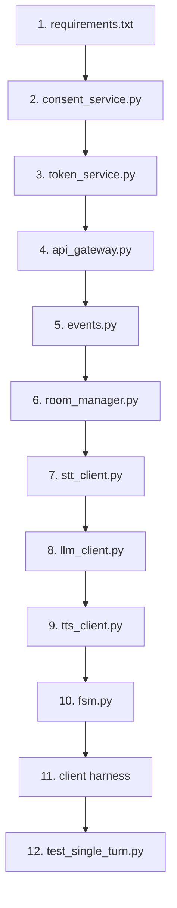
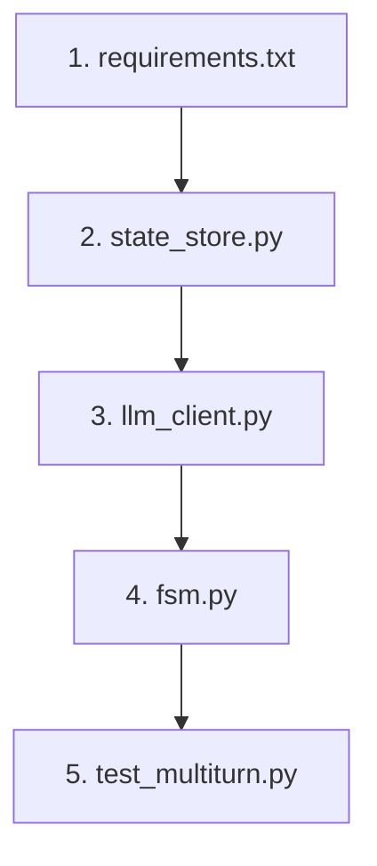

# 🛠️ Phase 0 Implementation Guide (Step-by-Step)

If you were to implement Phase 0 from scratch, this is the logical order of dependencies you should follow to build the system foundation.

---

## 1. Centralized Event Vocabulary

**File**

```text
common/events/event_names.py
```

### Purpose

Establishes a single source of truth for all log event names (e.g., `service_started`, `stt_final`, `tts_stopped`) across all microservices using a Python `StrEnum`.

### Why it matters

Ensures consistency across different services and prevents naming drifts (such as one developer logging `tts_stop` and another logging `tts_stopped`), which would break downstream telemetry engines like Loki.

---

## 2. Structured Logging Engine & Secret Scrubbing

**File**

```text
common/logging/logger.py
```

### Purpose

Defines the component-bound logger that formats all stdout prints into machine-parseable JSON lines. It dynamically tags each log line with the active phase and enforces recursive, case-insensitive scrubbing of credentials (replacing them with `[SCRUBBED]`) if:

1. A logging key matches terms like:
   - `api_key`
   - `secret`
   - `password`
   - `token`
2. A logging value contains the exact raw string of a credential loaded from your active environment variables.

### Why it matters

Prevents logs from leaking API secrets during normal operation or failure logs.

---

## 3. Environment & Configuration Settings

**File**

```text
common/config/settings.py
```

### Purpose

Loads settings from the `.env` file using `python-dotenv` into a typed `Settings` dataclass.

It implements **incremental validation** checking the `ACTIVE_PHASE` environment variable.

- For **Phase 0**, it validates basic environment stubs.
- Starting in **Phase 1**, it fails loudly (raising a `ValueError`) if credentials like `GROQ_API_KEY` or `LIVEKIT_URL` are missing.

### Why it matters

Prevents silent runtime failures downstream due to missing environment configurations.

---

## 4. Local Secrets Manager Stub

**File**

```text
services/edge-auth/secrets_manager.py
```

### Purpose

Implements:

```python
get_secret(name)
```

for retrieving credentials.

In Phase 0, it behaves as a **local stub**, reading from configuration settings, while logging secret access events (`secret_accessed`) showing **only the name of the secret**, never the value.

### Why it matters

Standardizes how microservices access keys, so that swapping to a production backend like **AWS Secrets Manager** or **HashiCorp Vault** (planned for **Phase 10**) only requires changing this file's internals, rather than editing downstream microservices.

---

## 5. Service Entry Points & Health Endpoints

**Files**

```text
services/orchestrator/main.py
services/media-gateway/main.py
services/task-worker/main.py
```

### Purpose

Entry point stubs for each of the microservices.

They run lightweight servers using Python's standard `http.server` library (avoiding web framework dependencies in Phase 0) and expose a:

```text
GET /health
```

endpoint returning:

- HTTP `200 OK`
- a `service_started` log event

### Why it matters

Establishes the boilerplate server routing and process initialization patterns.

---

## 6. Architecture Graph Port-Direction Validator

**File**

```text
scripts/validate_architecture.py
```

### Purpose

A command-line script that parses a system architecture JSON graph.

It:

- Resolves the directions of ports.
- Treats ports prefixed with `in-` as **INPUT**.
- Treats ports prefixed with `out-` as **OUTPUT**.
- Allows custom exceptions for generic ports such as database or gateway connections.
- Asserts that:
  - every edge source originates from an output port.
  - every edge target terminates at an input port.

### Why it matters

Prevents architectural rot.

Any updates to the graph structure must pass this script before being pushed to `main`.

---

## 7. Corrected Reference Architecture JSON

**File**

```text
docs/architecture/pivot.json
```

### Purpose

The corrected version of the system architecture graph.

It:

- Resolves all **22** misdirected port/edge connections from the legacy diagram.
- Successfully passes the architecture validator script with **0 violations**.

### Why it matters

Serves as the verified blueprint that the rest of the phases build against.

---

## 8. Phase 0 Test Verification

**File**

```text
tests/phase0/test_health.py
```

### Purpose

The validation gate.

It:

- Spins up all three microservices in background threads.
- Performs HTTP health checks.
- Validates the structured JSON log schema.
- Tests secret scrubbing filters.
- Asserts that the corrected architecture JSON passes validation.

### Why it matters

Proves the health and lock-in of Phase 0.

---

# 📦 `.env` Configuration & Testing Strategy

## 1. What credentials are required in `.env`?

To execute the live pipeline (**Phase 1 onwards**), copy:

```text
.env.example
```

to

```text
.env
```

and configure the following credentials.

### LiveKit

- `LIVEKIT_URL`
- `LIVEKIT_API_KEY`
- `LIVEKIT_API_SECRET`

**Purpose**

Backs the `media-gateway` service to manage voice rooms and audio transport.

---

### Deepgram

- `DEEPGRAM_API_KEY`

**Purpose**

Used by the STT client to transcribe user speech.

---

### Cartesia

- `CARTESIA_API_KEY`

**Purpose**

Used by the TTS client to generate real-time voice streaming responses.

---

### Groq

- `GROQ_API_KEY`
- `GROQ_MODEL`

**Purpose**

Backs the primary LLM client.

---

### OpenAI

- `OPENAI_API_KEY`
- `OPENAI_FALLBACK_MODEL`

**Purpose**

Backs the fallback failover LLM.

---

### Redis

- `REDIS_URL`

**Purpose**

Connects to the Redis database to store session and conversation history.

---

## 2. How are dummy placeholders handled in test runs?

To ensure developers can run the regression suite:

```bash
pytest tests/
```

without requiring real, active third-party credentials, the project follows the strategy below.

### 2.1 Deterministic Fixtures

Audio-based tests (such as STT/TTS validation) use fixed, local `.wav` files stored under:

```text
tests/fixtures/
```

rather than requesting access to a physical microphone.

This ensures tests remain:

- deterministic
- reproducible
- offline

---

### 2.2 Mocking External APIs

During test execution, network connections to the following providers are mocked:

- Groq
- OpenAI
- Cartesia
- Deepgram

This allows tests to verify:

- Correct request payloads are generated.
- Streaming logic handles token events correctly.
- Latency is monitored.

Because external services are mocked, tests pass successfully even when `.env` contains placeholder credentials such as:

```text
GROQ_API_KEY=dummy_val
```

---

### 2.3 Graceful Failure Strategy

#### During Tests

Mocks are injected, allowing the complete regression suite to run successfully without internet connectivity or valid provider credentials.

#### During Development or Production

The configuration loader (`common/config/settings.py`) validates environment variables according to the active phase.

If it detects a dummy or missing credential while starting a service directly, it immediately raises:

```python
ValueError(...)
```

This provides fast feedback, alerting the developer to update their `.env` before attempting manual smoke tests or deploying the service.


I will view the `services/edge-auth/api_gateway.py` file to understand the current stub and requirements.

Viewed api_gateway.py:1-48

I will view the `services/edge-auth/consent_service.py` file.

Viewed consent_service.py:1-41

I will view the `services/edge-auth/token_service.py` file.

Viewed token_service.py:1-29

I will view the `services/media-gateway/room_manager.py` file to see how rooms are managed.

Viewed room_manager.py:1-48

I will view the `services/media-gateway/events.py` file to see what it handles.

Viewed events.py:1-25

I will view `services/orchestrator/stt_client.py`.

Viewed stt_client.py:1-22

I will view `services/orchestrator/llm_client.py`.

Viewed llm_client.py:1-29

I will view `services/orchestrator/tts_client.py`.

Viewed tts_client.py:1-37

I will view `services/orchestrator/fsm.py`.

Viewed fsm.py:1-39

I will list the files in the `tests/phase1` directory to understand the test structure.

Listed directory phase1

I will view `tests/phase1/test_single_turn.py` to see the test specification.

Viewed test_single_turn.py:1-25

Here is the complete guide mapping out the files you need to implement, the order of writing them, the purpose of every component for **Phase 1 (Minimal Single-Turn Voice Agent)**, and how to configure the environment/testing suite.

---

# 🚀 Phase 1: Guided Development Roadmap

To implement the single-turn voice agent from scratch, write the files in this logical order to ensure dependencies are built first:



---

## 📂 Phase 1 Component Purposes

### 1. Environment Dependencies
* **File:** [`requirements.txt`](file:///c:/Users/DELL/Desktop/pivot/requirements.txt)
* **Purpose:** Uncomment the Phase 1 library dependencies (`fastapi`, `uvicorn`, `livekit-server-sdk`, `deepgram-sdk`, `cartesia`, `groq`) and run `pip install -r requirements.txt`. This loads the required web, streaming, and AI client libraries.

### 2. Consent Stub
* **File:** [`services/edge-auth/consent_service.py`](file:///c:/Users/DELL/Desktop/pivot/services/edge-auth/consent_service.py)
* **Purpose:** A mock helper that automatically approves recording and processing for this phase. It logs `consent_checked` with the outcome. This is a deliberate simplification for testing the pipeline before Phase 10 adds revocable user-consent databases.

### 3. Token Issuer
* **File:** [`services/edge-auth/token_service.py`](file:///c:/Users/DELL/Desktop/pivot/services/edge-auth/token_service.py)
* **Purpose:** Generates a secure JWT-signed **LiveKit Room Token** using the server's `LIVEKIT_API_KEY` and `LIVEKIT_API_SECRET`.
* **Why it matters:** Clients use this token to authenticate directly with the LiveKit room so they can publish audio streams.

### 4. API Gateway Routing
* **File:** [`services/edge-auth/api_gateway.py`](file:///c:/Users/DELL/Desktop/pivot/services/edge-auth/api_gateway.py)
* **Purpose:** Exposes a `POST /auth` REST API. It receives the client's auth request, calls the `consent_service` to confirm approval, calls `token_service` to issue a token, and returns the room token back to the client.

### 5. Media Events Wrapper
* **File:** [`services/media-gateway/events.py`](file:///c:/Users/DELL/Desktop/pivot/services/media-gateway/events.py)
* **Purpose:** Defines the standardized data shape for room events (such as room created, user joined, user started talking) sent to the orchestrator control plane.

### 6. Media Room Manager (LiveKit Glue)
* **File:** [`services/media-gateway/room_manager.py`](file:///c:/Users/DELL/Desktop/pivot/services/media-gateway/room_manager.py)
* **Purpose:** Handles the media streams:
  1. Subscribes to the client's incoming microphone track in LiveKit and forwards raw audio bytes to Deepgram STT.
  2. Receives synthesized audio bytes from the orchestrator and publishes them back to the LiveKit room.
  3. Broadcasts participant joins/leaves to the orchestrator FSM.

### 7. STT Client (Speech-to-Text)
* **File:** [`services/orchestrator/stt_client.py`](file:///c:/Users/DELL/Desktop/pivot/services/orchestrator/stt_client.py)
* **Purpose:** Connects to Deepgram's streaming transcription. It receives text partials and final sentences, logs `stt_partial`/`stt_final` events along with latency metrics, and passes final text to the FSM.

### 8. LLM Client (Primary brain)
* **File:** [`services/orchestrator/llm_client.py`](file:///c:/Users/DELL/Desktop/pivot/services/orchestrator/llm_client.py)
* **Purpose:** Submits the transcript to the primary Groq Llama model and streams back the text completion. It measures and logs `llm_first_token` and `llm_complete` latency.

### 9. TTS Client (Text-to-Speech)
* **File:** [`services/orchestrator/tts_client.py`](file:///c:/Users/DELL/Desktop/pivot/services/orchestrator/tts_client.py)
* **Purpose:** Streams text from the LLM to Cartesia Sonic, receives the synthesized audio bytes, and forwards them to the media gateway. It logs `tts_first_audio` and `tts_complete` latency.

### 10. Finite State Machine (Control Loop)
* **File:** [`services/orchestrator/fsm.py`](file:///c:/Users/DELL/Desktop/pivot/services/orchestrator/fsm.py)
* **Purpose:** Drives the single-turn conversational states: `idle` $\rightarrow$ `listening` (waiting for user speech) $\rightarrow$ `thinking` (LLM processing) $\rightarrow$ `speaking` (TTS audio output) $\rightarrow$ `idle`. It logs transitions to help debug behavior.

### 11. Minimal Web Client Harness
* **Directory:** `client/phase1_minimal_harness/`
* **Purpose:** A bare-bones HTML/JS page with a "Join" button. It calls the edge auth API to get a room token, connects to the LiveKit session, captures local mic stream, and plays back the agent's response.

### 12. Automated Integration Test
* **File:** [`tests/phase1/test_single_turn.py`](file:///c:/Users/DELL/Desktop/pivot/tests/phase1/test_single_turn.py)
* **Purpose:** Simulates a conversation by passing a pre-recorded WAV file ("What's the weather like on Mars?") into the STT client and asserting that it transcribes it, triggers the LLM, synthesizes TTS audio, and logs all events.

---

# 🔑 Environment & Testing Strategy

Here is exactly how credentials and placeholders are managed in the codebase:

### 1. What needs to be in your `.env` for Phase 1
Copy `.env.example` to `.env` (which is excluded from Git in `.gitignore`) and provide the keys:
* **`LIVEKIT_URL` / `LIVEKIT_API_KEY` / `LIVEKIT_API_SECRET`** (LiveKit account)
* **`DEEPGRAM_API_KEY`** (Deepgram account)
* **`CARTESIA_API_KEY`** (Cartesia account)
* **`GROQ_API_KEY`** (Groq account)

### 2. How tests pass with dummy credentials (Mocks)
If you run `python -m pytest tests/` in a clean environment or CI/CD where real keys are absent:
* **Pytest Fixtures:** The test suite intercepts calls to external services. Instead of connecting to live paid APIs, the test framework overrides `llm_client`, `stt_client`, and `tts_client` with **mock wrappers**.
* **Mock Output:** 
  * The mock STT client returns a predefined text transcript on receiving a fixture file.
  * The mock LLM client streams back a canned dummy response.
  * The mock TTS client outputs dummy silent audio bytes.
  * The mock LiveKit client simulates room connections.
* **Why this is critical:** It ensures that the test runner verifies that our FSM logic transitions correctly and logging sequences are fired in order, without incurring API costs, requiring internet connections, or failing if your `.env` contains dummy strings (like `GROQ_API_KEY=dummy_val`).

### 3. Graceful Failure Checks
* When starting the services **manually** for a live demo (e.g. running `python services/orchestrator/main.py`), the settings loader checks `ACTIVE_PHASE` and validates that keys are present and real.
* If keys are missing or set to placeholder strings, the service fails loudly immediately on startup with a clear `ValueError`, avoiding obscure errors when a user starts talking to the agent.


Here is the complete implementation guide for **Phase 2 (Multi-Turn Conversation State)**, explaining the files you will write, the recommended order of development, and the purpose of each component.

---

# 🧠 Phase 2 Guided Development Roadmap

To give the voice agent a memory that persists across multiple turns and process restarts, follow this development sequence:



---

## 📂 Phase 2 Component Purposes

### 1. Database Dependency
* **File:** [`requirements.txt`](file:///c:/Users/DELL/Desktop/pivot/requirements.txt)
* **Purpose:** Uncomment the `# redis` dependency to enable Redis server connectivity.
* **Why it matters:** Standardizes the package list so that when the agent is deployed to production, it automatically installs the Python Redis client libraries.

### 2. Redis State Store
* **File:** `services/orchestrator/state_store.py` **[NEW]**
* **Purpose:** Implements saving and retrieving conversation history. It exposes:
  * `save_conversation(session_id, messages)`: Serializes list of messages to JSON and saves them to Redis under a session key.
  * `load_conversation(session_id) -> list`: Loads the JSON list of messages from Redis, returning an empty list if it's a new session.
  * **Test Fallback (Mock):** Under `ENV=test` (or if `REDIS_URL` is unset), it falls back to a simple in-memory dictionary. This ensures tests can run completely offline without requiring a running Redis container.
* **Why it matters:** By offloading history to Redis, the orchestrator service becomes **stateless**. If the orchestrator container crashes or scales up, another instance can retrieve the exact conversation state and continue the call without interruption.

### 3. Context-Aware LLM Client
* **File:** [`services/orchestrator/llm_client.py`](file:///c:/Users/DELL/Desktop/pivot/services/orchestrator/llm_client.py) **[MODIFY]**
* **Purpose:** Modifies `call_primary` to accept a structured list of conversation messages (representing historical turns) instead of just a single raw prompt. It constructs the system prompt, prepends the conversation history, appends the new user query, and passes the entire payload to Groq.
* **Why it matters:** Ensures the LLM has access to the full context of the conversation so it can resolve pronouns (e.g. "What is the weather like on Mars?" followed by "How cold is **it**?").

### 4. Memory-Wired State Machine
* **File:** [`services/orchestrator/fsm.py`](file:///c:/Users/DELL/Desktop/pivot/services/orchestrator/fsm.py) **[MODIFY]**
* **Purpose:** Integrates the state store into the turn loop. At the start of a turn:
  1. It loads existing history from `state_store.load_conversation()`.
  2. Appends the new user transcript to the history list.
  3. Passes the updated history to `llm_client.call_primary()`.
  4. Appends the LLM's response to the history list.
  5. Saves the complete conversation back to `state_store.save_conversation()`.
* **Why it matters:** Integrates database reads and writes directly into the lifecycle of each conversation turn.

### 5. Multi-Turn Persistence Test Gate
* **File:** `tests/phase2/test_multiturn.py` **[MODIFY/NEW]**
* **Purpose:** Un-skips and implements the Phase 2 test gate. It simulates a 3-turn conversation script (e.g., Turn 1: "What is Mars?", Turn 2: "How far is it?", Turn 3: "Thank you").
* **Process Restart Simulation:** To prove that the state actually persists, the test **clears the in-memory FSM instance cache** between Turn 1 and Turn 2. The test asserts that the agent still remembers the context of Mars in Turn 2 by verifying that the mock LLM receives the history list populated in Turn 1.
* **Why it matters:** Proves the session persistence model under simulated process failures.