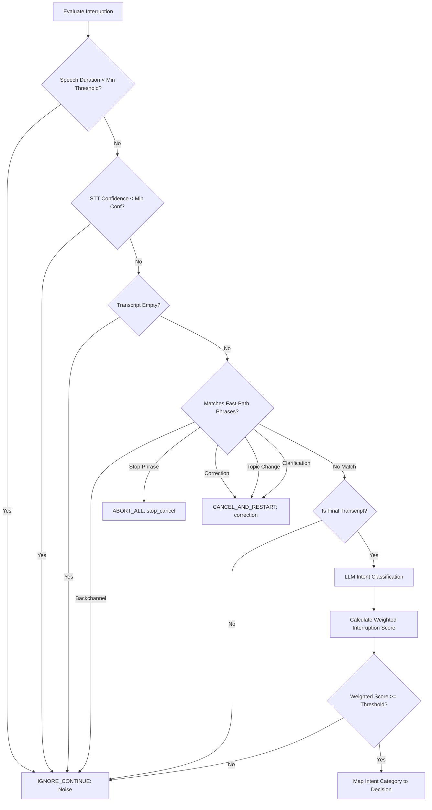
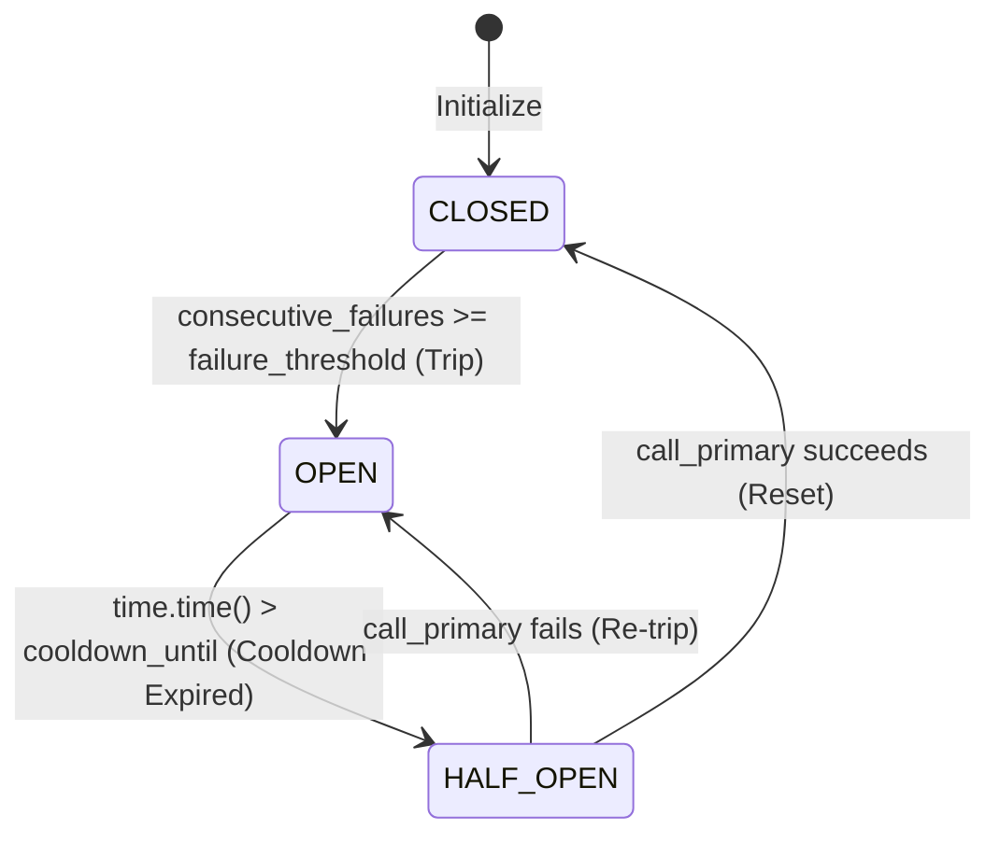
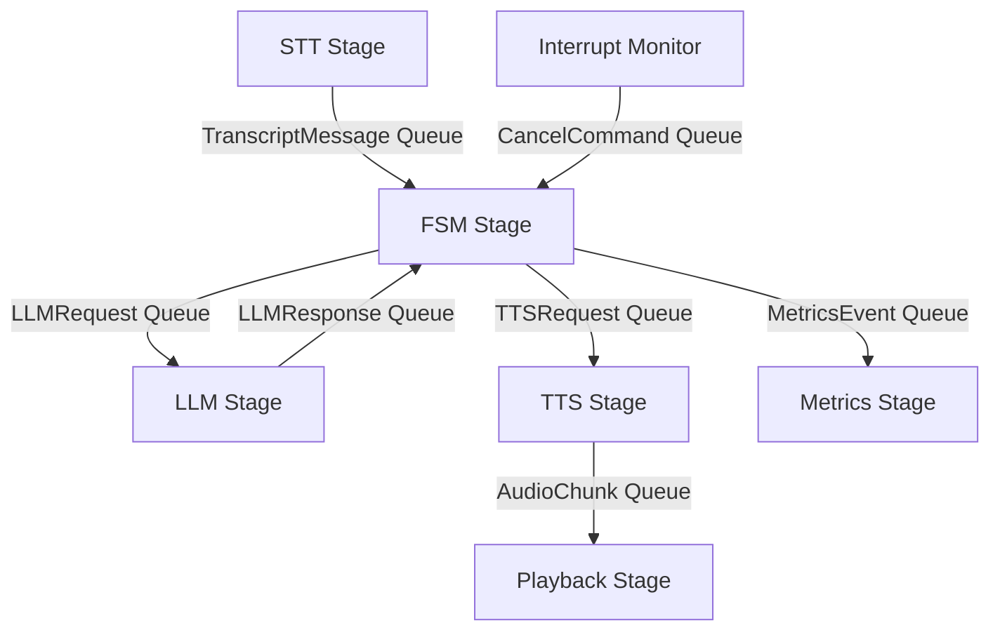

# Interruption-Aware Voice Agent (Pivot): Complete Technical Implementation Handbook

This handbook serves as the official production documentation and architectural blueprint for the Interruption-Aware Voice Agent (**Pivot**). Spanning **Phase 1 to Phase 7**, it covers all components, code flows, data structures, concurrency, edge cases, failure vectors, and integration logic in exhaustive detail.

---

## 1. System-Wide Request Lifecycle (Massive End-to-End Flow)

The following diagram illustrates the complete end-to-end traversal of a user turn through the system, displaying every decision point, cache hit/miss, fallback execution, Celery task lifecycle, interruption, and cancellation event.

```mermaid
sequenceDiagram
    autonumber
    actor User
    participant Browser as Client Browser (UI)
    participant GW as Media Gateway (WS)
    participant STT as STT Pipeline Stage
    participant FSM as Orchestrator FSM
    participant INT as Interruption Decision Engine
    participant Cache as Semantic Cache (Jaccard + LRU)
    participant LLM as LLM Client & Failover Router
    participant TM as Tool Manager
    participant CW as Celery Task Worker
    participant Ext as External APIs
    participant CM as Context Merge
    participant TTS as TTS Client (Cartesia)
    participant Redis as Redis State Store
    participant Tel as Telemetry/Logger

    User->>Browser: Speaks audio utterance
    Browser->>GW: WebSocket binary audio frame (raw WebM/PCM)
    GW->>STT: Write audio chunks to stream
    STT->>STT: Process & Transcribe
    STT->>FSM: TranscriptMessage (text, session_id, turn_id, is_final)
    
    rect rgb(220, 230, 245)
        Note over FSM,INT: Barge-in check (If FSM is SPEAKING / THINKING)
        FSM->>INT: evaluate_interruption(transcript, confidence, duration)
        INT->>INT: Apply fast-path config match (backchannel / stop / correction)
        alt Classification is Backchannel (e.g., "yeah")
            INT-->>FSM: decision = IGNORE_CONTINUE
            Note over FSM: Do NOT stop speech; continue streaming TTS
        else Classification is stop_cancel
            INT-->>FSM: decision = ABORT_ALL
            FSM->>GW: Emit "stop_audio" frame (cuts off Browser playback)
            FSM->>TTS: Call tts_kill(session_id) to abort generation
            FSM->>TM: on_interruption_during_call (Celery revoke)
            FSM->>Redis: Clear session turns
            FSM->>FSM: Transition to IDLE
        else Classification is correction / topic_change / clarification
            INT-->>FSM: decision = CANCEL_AND_RESTART
            FSM->>GW: Emit "stop_audio" frame
            FSM->>TTS: Call tts_kill(session_id)
            FSM->>TM: on_interruption_during_call (Celery revoke)
            FSM->>CM: resolve(session_id, spoken, unspoken, category)
            CM->>Redis: Update state history (truncate to spoken words)
            FSM->>FSM: Transition to THINKING (Trigger new turn)
        end
    end

    Note over FSM,Cache: Cache Lookup (If NOT cancelled)
    FSM->>Redis: load_history(session_id)
    Redis-->>FSM: Context history list
    FSM->>Cache: lookup(session_id, turn_id, query, system_prompt, model_name, messages)
    Cache->>Cache: Generate Cache Key (hashes + version strings)
    alt Cache Hit (Jaccard similarity >= threshold)
        Cache-->>FSM: Returns cached text response
    else Cache Miss
        Cache->>Cache: StampedeProtection: start_fetch(cache_key)
        FSM->>LLM: call_with_failover(session_id, turn_id, messages)
        LLM->>LLM: Check Circuit Breaker Status
        alt Circuit is CLOSED (Attempt Primary - Groq)
            LLM->>LLM: Call Groq API
            alt Groq Success
                LLM-->>FSM: Return text response stream
            else Groq Fails (Timeout / 5xx error)
                LLM->>LLM: Increment failures. Trip Circuit to OPEN
                LLM->>LLM: Route request to Secondary (OpenAI/Fallback)
                LLM-->>FSM: Return fallback text response
            end
        else Circuit is OPEN / HALF-OPEN
            LLM->>LLM: Bypass Groq -> Direct to Fallback
            LLM-->>FSM: Return fallback text response
        end
        FSM->>Cache: store(session_id, query, response, system_prompt, model_name, messages)
        Cache->>Cache: Evict LRU / Check TTL. Set key in Cache Store.
        Cache->>Cache: StampedeProtection: end_fetch(cache_key, response)
    end

    alt Tool Call Injected by LLM
        FSM->>TM: invoke_tool(session_id, turn_id, tool_name, params)
        TM->>Redis: Atomic transition using Lua -> QUEUED. Set idempotency key.
        TM->>CW: execute_tool_task.delay(session_id, turn_id, tool_call_id, ...)
        CW->>Redis: Atomic transition -> RUNNING
        CW->>CW: Periodically write heartbeat timestamps to Redis
        CW->>Ext: handle_api_request(tool_name, params)
        Ext-->>CW: API output
        CW->>Redis: Atomic transition -> COMPLETED (Write result JSON)
        CW-->>TM: Return completion payload
        TM-->>FSM: Return tool output
        FSM->>CM: resolve() / Merge results into history
    end

    FSM->>TTS: speak(session_id, turn_id, reply_text)
    TTS->>TTS: Generate PCM audio chunks (Cartesia SDK)
    TTS->>GW: Stream audio bytes (AudioChunk frames)
    GW->>Browser: Binary audio stream payloads over WebSocket
    Browser->>User: Renders audio via Web Audio API
    FSM->>Tel: Emit telemetry events (latencies, token counts, cache stats)
```

---

## 2. Voice Interruption Detection & Decision Engine

The voice interruption decision pipeline handles the critical logic of determining whether incoming user audio constitutes a deliberate barge-in or mere background noise/backchanneling.

### 2.1 Complete Audio Ingestion & Transcription Flow
1. **Audio Streaming**: Browser UI records user audio, packages WebM/PCM chunks, and sends them over WebSocket to `services/media_gateway/main.py`.
2. **STT Processing**: Gateway forwards the raw audio stream to the STT client (`stt_client.py`). It processes the stream and yields continuous partial (interim) transcripts, followed by a final transcript.
3. **FSM Intercept**: If FSM is in `SPEAKING` or `THINKING` state when a transcript arrives, the interruption engine is activated.

### 2.2 Decision Engine Evaluation Logic (`interruption_intelligence.py`)

Interruption decisions are processed through `InterruptionIntelligence.evaluate_interruption`. The evaluation pipeline runs the following checks in order:



### 2.3 Decision Variables & Heuristics
The evaluation utilizes a mixture of deterministic rule bases and machine classification:
* **Speech Duration**: `speech_duration_ms` is checked. If it is less than `timing.min_speech_duration_ms` (default `200ms`), it is flagged as noise.
* **STT Confidence**: If the transcript confidence falls below `stt_min` (default `0.5`), it is classified as noise and ignored.
* **Fast-Path Phrases**: The system compares the lowercase, stripped transcript against static phrase lists loaded from configuration (`interruption_config.py` / `voice_settings.yaml`):
  * **Backchannels**: `uh-huh`, `yeah`, `right`, `mm-hm`, `ok`, `yep`, `sure`, `yes`, `ah`, `oh`, `mm hm`, `okay`, `yup`, `got it`.
  * **Stop Phrases**: `stop`, `never mind`, `cancel`, `forget`.
  * **Correction Phrases**: `actually`, `no wait`, `no, actually`.
* **LLM Intent Classification Fallback**: If no fast-path rules match and `is_final` is true, the transcript is sent to `interruption_classifier.py:classify()`. This makes an LLM API call using `llama-3.1-8b-instant` with a JSON format instruction:
  ```json
  {"type": "correction" | "topic-change" | "clarification" | "stop_cancel" | "add_on" | "backchannel", "confidence": 0.95}
  ```
* **Weighted Interruption Score Calculation**:
  The score is computed using the following equation:
  $$\text{Score} = (W_t \times \text{Intent Confidence}) + (W_d \times \text{Duration Score}) + (W_{\text{conf}} \times \text{STT Confidence}) + (W_{\text{overlap}} \times \text{Overlap Score})$$
  Where:
  * $W_t = 0.4$, $W_d = 0.2$, $W_{\text{conf}} = 0.2$, $W_{\text{overlap}} = 0.2$.
  * $\text{Duration Score} = \min(1.0, \frac{\text{speech\_duration\_ms}}{\text{dur\_score\_divider}})$ (divider default: $1000.0$).
  * $\text{Overlap Score} = \min(1.0, \frac{\text{assistant\_speaking\_time\_ms}}{\text{overlap\_score\_divider}})$ (divider default: $2000.0$).
  * If $\text{Score} < \text{intent\_min}$ (default `0.6`), the interruption is ignored (`IGNORE_CONTINUE`).

### 2.4 Cancellation, Playback Sync, and Context Merge
* **Cancellation**: Once a valid interruption (`ABORT_ALL` or `CANCEL_AND_RESTART`) is determined, `cancellation_manager.cancel_session(session_id, category)` is invoked. This immediately cancels all registered asyncio Tasks.
* **Playback Sync**: A socket message `stop_audio` is pushed to the gateway, resetting client playout queues. TTS Client streaming is killed via `tts_client.py:kill()`.
* **Context Merge**: FSM invokes `context_merge.py:resolve()`. It compares what was spoken vs. what was unspoken. For corrections, clarification, and stop-cancels, it truncates the assistant's message in Redis to only the words actually spoken before the interruption. It saves any unspoken words for resumption in clarification turns.

---

## 3. Semantic Cache Architecture (`cache_client.py`)

The semantic cache provides a pluggable similarity caching layer designed to store user queries and system responses to save LLM tokens and lower latency.

### 3.1 Purpose & Trade-offs
* **Why it exists**: Reduces LLM invocation overhead for repetitive queries.
* **Production issues solved**: Prevents duplicate API calls during high-frequency traffic spikes (Cache Stampedes) and decreases response time from ~800ms to <10ms on cache hits.
* **Trade-off**: Requires local memory/Redis storage and introduces a slight Jaccard similarity computation overhead (~0.5ms). If the similarity threshold is set too low, it returns incorrect answers to subtly different questions.

### 3.2 Key Classes & Interfaces
* **`CacheStrategy` (Abstract)**: Defines `calculate_similarity(query1, query2) -> float`.
* **`JaccardSimilarityStrategy` (Concrete)**: Tokenizes inputs by splitting on alphanumeric characters, converts to lowercase sets, and returns:
  $$\text{Jaccard} = \frac{|\text{Tokens}_1 \cap \text{Tokens}_2|}{|\text{Tokens}_1 \cup \text{Tokens}_2|}$$
* **`CacheStore` (Abstract)**: Defines `get(key)` and `set(key, value, ttl)`.
* **`InMemoryCacheStore` (Concrete)**: Implements thread-safe cache storage. Employs a mutex lock (`threading.Lock`) for get/set operations, enforces key TTL expirations, and uses an access-order list (`access_order`) to evict the Least Recently Used (LRU) key when `max_size` is exceeded.
* **`CacheManager`**: Coordinates key generation, similarity checks, stampede protection, and eviction limits.

### 3.3 Cache Key Generation & Version Invalidation
The cache key is deterministic and generated as:
```python
cache_key = f"cache:{session_id}:{sys_hash}:{model_hash}:{hist_hash}:{version_hash}"
```
Where:
* `sys_hash` = MD5 hash of the system prompt.
* `model_hash` = MD5 hash of the active model name.
* `hist_hash` = MD5 hash of the string representation of the last two turns of conversation history.
* `version_hash` = MD5 hash of the version string combinations from settings:
  ```python
  version_hash_input = (
      vc_get("cache.prompt_template_version", "") +
      vc_get("cache.system_prompt_version", "") +
      vc_get("cache.output_format_version", "")
  )
  ```
If any prompt template, system prompt, or output format configuration is updated, the version hashes change, causing old cache entries to automatically be bypassed (invalidated).

### 3.4 Stampede Protection & Lock Safety
To prevent multiple concurrent identical queries from triggering parallel LLM calls, the `StampedeProtection` class is used:
* **`check_or_wait(cache_key, turn_id, session_id)`**: Checks if a lock event `threading.Event` is registered for the `cache_key`. If present, it blocks execution using `event.wait(timeout=10.0)` and returns the result produced by the first request.
* **`start_fetch(cache_key)`**: Registers a new `threading.Event` for the key.
* **`end_fetch(cache_key, result)`**: Stores the result and triggers `event.set()` to unblock all waiting threads.

### 3.5 Streaming & Tool Exclusions
* **Tool Exclusions**: The cache manager executes `is_cache_safe()`. If any message in the turn context contains keys like `"role": "tool"` or `"tool_calls"`, caching is skipped entirely. Tool-dependent flows are considered non-deterministic.
* **Streaming Responses**: Only complete generations returned after streaming completes are stored. Interrupted, cancelled, or partial response generations are discarded and never cached.

---

## 4. Circuit Breaker & Failover Router (`failover.py`)

The failover layer ensures high availability of LLM services by detecting failures in the primary LLM provider (Groq) and dynamically routing requests to the secondary provider (OpenAI).

### 4.1 Circuit Breaker State Machine

The `CircuitBreaker` class manages state transitions using consecutive failures and cooldown timers.



* **CLOSED State**: Primary provider is called.
* **OPEN State**: Primary provider is bypassed; all requests immediately failover to OpenAI.
* **HALF-OPEN State**: When the cooldown timer expires, a probe request is allowed to hit the primary provider. If it succeeds, the circuit transitions back to `CLOSED`. If it fails, the circuit re-trips to `OPEN`.

### 4.2 Error Classification & Failover Criteria
Not all errors trigger a failover. The router filters errors:
* **Failover Triggered**: Connection timeout (`groq.APITimeoutError`), Network disconnection (`groq.APIConnectionError`), and Server errors (HTTP Status $\ge 500$, `groq.APIStatusError`).
* **Bypassed / No Failover**: User validation errors, bad payloads, and authorization failures (HTTP Status $< 500$). These errors raise exceptions directly.

### 4.3 Thread Safety
All access and modifications to the circuit status variables (`consecutive_failures`, `cooldown_until`) are protected by a reentrant thread lock (`self.lock = threading.Lock()`).

---

## 5. Tool Manager & Async Celery Task Worker (`tools.py` & `worker.py`)

The tool subsystem provides asynchronous execution of external tools using Celery.

### 5.1 Purpose & Architecture
* **Why it exists**: Offloads slow or blocking external API calls (e.g., balance check, fund transfers) from the main voice thread.
* **Dependencies**: Redis acts as both the Celery message broker and the persistent status backend.
* **Registry**: `TOOL_REGISTRY` holds `ToolMetadata` defining execution timeouts, retry maximums, cancellation flags, and background execution support.

### 5.2 Atomic State Transitions (Lua Scripting)
To prevent race conditions between task completions, worker heartbeats, and user cancellation events, all tool status transitions are made atomic using a Redis Lua script:

```lua
local key = KEYS[1]
local target_status = ARGV[1]
local error_type = ARGV[2]
local result = ARGV[3]
local interruption_type = ARGV[4]
local timestamp = ARGV[5]

local current_status = redis.call('HGET', key, 'status')
if not current_status then
    if target_status == 'QUEUED' or target_status == 'RUNNING' then
        redis.call('HSET', key, 'status', target_status)
        if target_status == 'RUNNING' then
            redis.call('HSET', key, 'started_at', timestamp)
        else
            redis.call('HSET', key, 'created_at', timestamp)
        end
        redis.call('EXPIRE', key, 86400)
        return 1
    end
    return 0
end

if current_status == 'COMPLETED' or current_status == 'FAILED' or current_status == 'CANCELLED' or current_status == 'DISCARDED' or current_status == 'TIMEOUT' then
    return 0
end

redis.call('HSET', key, 'status', target_status)
if error_type and error_type ~= '' then
    redis.call('HSET', key, 'error_type', error_type)
end
if result and result ~= '' then
    redis.call('HSET', key, 'result', result)
end
if interruption_type and interruption_type ~= '' then
    redis.call('HSET', key, 'interruption_type', interruption_type)
end
if target_status == 'RUNNING' then
    redis.call('HSET', key, 'started_at', timestamp)
elseif target_status == 'COMPLETED' or target_status == 'FAILED' or target_status == 'CANCELLED' or target_status == 'DISCARDED' or target_status == 'TIMEOUT' then
    redis.call('HSET', key, 'completed_at', timestamp)
end
return 1
```

### 5.3 Complete Task Execution Lifecycle
1. **Invocation**: `invoke_tool` validates parameters, generates a `tool_call_id`, and runs an idempotency check against a Redis key hash: `session:{session_id}:dup:{tool_name}:{params}`.
2. **Dispatch**: Dispatches task to Celery via `execute_tool_task.delay()`. The tool's state transitions to `QUEUED` in Redis.
3. **Execution**: The worker updates the status to `RUNNING`, records start times, and executes `handle_api_request()`.
4. **Heartbeat**: The worker periodically updates `heartbeat` keys in Redis.
5. **Completion**: If successful, transitions status to `COMPLETED` and saves the serialized JSON result.

### 5.4 Cancellation & Interruption Policies
On user barge-in, `on_interruption_during_call` is triggered. Active task IDs are retrieved from the set `session:{session_id}:active_tool_ids` and processed according to the policy table:

| Interruption Category | Cancelable Tool | Non-Cancelable Tool | Action Taken |
| :--- | :--- | :--- | :--- |
| **stop_cancel** | Yes | - | Transition to `CANCELLED`, call `celery.control.revoke(terminate=True)` |
| **stop_cancel** | - | Yes | Transition to `DISCARDED`, let worker run to completion silently |
| **correction** | Yes | - | Transition to `CANCELLED`, terminate worker task |
| **correction** | - | Yes | Transition to `DISCARDED`, complete in background |
| **topic_change** | Yes | - | Transition to `CANCELLED`, terminate task |
| **topic_change** | - | Yes | Transition to `DISCARDED`, complete in background |
| **clarification** | - | - | Continue task execution in background (`RUNNING`), do not cancel |
| **add_on** | - | - | Continue task execution in background (`RUNNING`), do not cancel |

---

## 6. Pipeline Concurrency & Asynchronous Design

The system runs on a fully asynchronous pipeline model (`async_pipeline.py`) designed to segregate blocking SDK work from thread loops.



### 6.1 Worker Queue Wiring & Executors
* **Queues**: Workers communicate using `asyncio.Queue` objects.
* **Executors**: Deepgram, Groq, and Cartesia SDKs rely on blocking I/O calls. To prevent blocking the main event loop, all network calls are wrapped inside `loop.run_in_executor(None, sync_func, ...)` to run on worker threads.

### 6.2 Cancellation Token Mechanism
Cooperative cancellation is managed through thread-safe `CancelToken` structures (`_tokens: dict[str, CancelToken]`). 
* If VAD or barge-in is triggered, `CancelToken.cancel()` is called.
* Workers query `CancelToken.is_cancelled` before initiating API calls. If flagged, they discard the active task, clear their input queues, and return early.

---

## 7. State Management & Redis Schema

All conversation state, turns, tool metrics, and cache partitions are tracked in Redis.

### 7.1 Redis Key Registry

| Key Pattern | Data Type | Purpose | TTL |
| :--- | :--- | :--- | :--- |
| `session:{session_id}:history` | List | Stores serialized message turn payloads (role, content) | None |
| `session:{session_id}:active_tool_ids` | Set | Active tool execution call IDs | `86400s` |
| `session:{session_id}:tool:{tool_call_id}` | Hash | Tool metadata, status, times, and Celery task IDs | `86400s` |
| `session:{session_id}:tool:{tool_call_id}:cancelled` | String | Interruption cancellation flag | `3600s` |
| `session:{session_id}:dup:{tool_name}:{params_hash}` | String | Idempotency lock mapping to active tool IDs | `3600s` |

---

## 8. Failure Analysis

| Failure Point | Detection Method | Handling Component | Recovery / Fallback Action | Telemetry Event Emitted |
| :--- | :--- | :--- | :--- | :--- |
| **STT Connection Drop** | Stream write timeout | Media Gateway | Close connection. Force client client-side reconnect. | `websocket_disconnected` |
| **Redis Crash** | Connection timed out | `state_store.py` | Failover to local memory database wrapper `_memory_db`. | `state_store_connection_failed` |
| **LLM Timeout** | API timeout exception | Failover Router | Increment failures, route current turn to OpenAI fallback. | `llm_failover_triggered` |
| **TTS API Failure** | Exception during bytes stream | TTS Worker | Push empty end chunk to prevent pipeline lock. | `error` |
| **Celery Worker Crash** | Redis Heartbeat timeout check | Tool Manager | Transition status to `TIMEOUT` in state store. | `tool_timeout` |
| **API ValidationError** | Exception inside worker task | Celery Worker | Transition status to `FAILED`, remove from active tool list. | `tool_failure` |

---

## 9. Telemetry & Log Events

### 9.1 Logging Payload Standard
Logs are written to standard output as serialized JSON objects containing:
* `event_name`: Unique event identifier (e.g. `llm_complete`).
* `session_id` & `turn_id`: Correlation variables.
* `latency_ms`: Timing metrics (if applicable).
* `detail`: Component-specific debugging information.

### 9.2 Key Telemetry Metrics
* **Latency Tracks**: Time-to-first-token (`llm_first_token`), total LLM latency (`llm_complete`), TTS synthesis duration (`tts_complete`), and total turn duration (`turn_complete`).
* **Cache Metrics**: Cache hit rates (`cache_hit`), cache miss rates (`cache_miss`), and eviction counts (`cache_eviction`).
* **Budget Metrics**: Tracked through `TokenBudget` (`budget_pct`, `completion_tokens`, `prompt_tokens`).

---

## 10. Extensibility Guide

### 10.1 Adding a New LLM Provider
1. Open `services/orchestrator/llm_client.py`.
2. Define a new sync caller, e.g., `_call_new_provider()`.
3. Wrap execution in `loop.run_in_executor` in `async_pipeline.py`.
4. Integrate the new provider into the `call_with_failover` handler chain in `failover.py`.

### 10.2 Registering a New Tool
1. Register tool metadata in `TOOL_REGISTRY` (`services/orchestrator/tools.py`), specifying timeouts, retry limits, and cancellation flags.
2. In `services/external-apis-integration/client.py`, register the execution logic inside `handle_api_request()`.
3. Add any schema validation cases to the worker pipeline.
